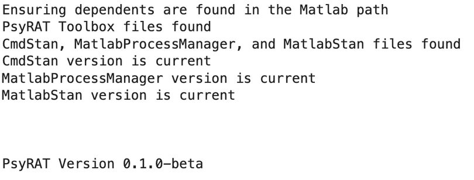
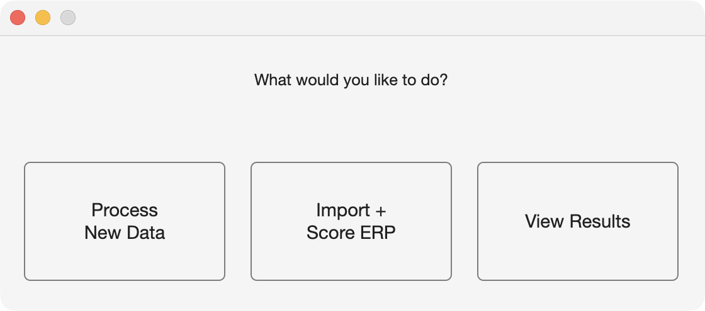
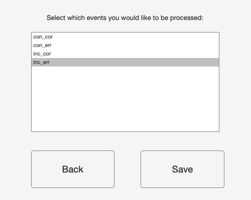
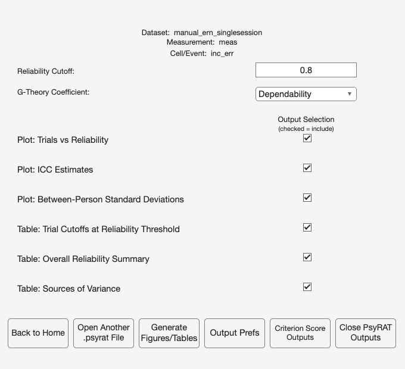
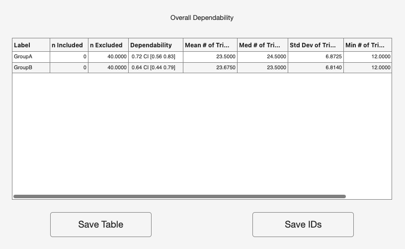

# 2. Quick start: your first analysis

This chapter runs one analysis end to end on data that ship with the toolbox.
You will click through five screens, wait for CmdStan, and read one coefficient
off a table. Nothing here is a scientific decision.
[Chapter 10](10_tutorial-single-session.md) makes the same run properly, with a
defensible choice at every step; this one is the shortest honest path to a
number.

## 2.1 Before you start

You need PsyRAT installed and on the MATLAB path, and you need CmdStan installed
and discoverable. [Chapter 3](03_installation.md) covers both, including the
guided installer.

The dataset is `test_data/manual_ern_singlesession.csv`, which ships with the
toolbox. It is a simulated flanker study: 80 participants in two independent
groups (GroupA and GroupB), one session, and four events crossing flanker
congruency with response accuracy (`inc_err`, `inc_cor`, `con_err`, `con_cor`).
There is one row per single trial, 8,908 rows in all, and the measurement column
holds ERN-like mean amplitudes in microvolts. Trial counts vary on purpose:
errors are scarce (12 to 36 per participant) and correct trials are plentiful (24
to 40), because unequal trial counts are the normal case and PsyRAT is built for
them. No participant data are involved. The file is fully simulated, and every
generating parameter is documented in the generator that produces it, which
[Chapter 10](10_tutorial-single-session.md) names.

## 2.2 Start the toolbox

At the MATLAB prompt, type:

```matlab
psyrat_start
```

A short banner prints before any window appears. It confirms that the toolbox
files are on the path, that CmdStan, MatlabProcessManager, and MatlabStan were
found, and that each dependency is at a version the toolbox has been tested
against. It prints the PsyRAT version you are running, which is the version to
quote in a bug report. PsyRAT also checks for a newer release at startup, and if
it finds one it raises a window you have to answer before you can go on. It
reads "You are using an old version of the PsyRAT Toolbox. It is recommended
that you update the toolbox. Would you like to do so now?" and offers Yes and
No.



If the dependency check fails, PsyRAT does not open the home screen at all. It
prints what is missing and offers to install it, which is
[Chapter 3](03_installation.md)'s territory. Come back once the banner reports
that CmdStan was found.

The home screen asks "What would you like to do?" and offers three buttons:
Process New Data, Import + Score ERP, and View Results. The first two labels
are drawn on two lines.



## 2.3 Load the data

Selecting the Process New Data button opens a file dialog titled Data, filtered
to the formats PsyRAT reads (`.xlsx`, `.xls`, `.csv`, `.dat`, `.txt`, `.ods`).
Choose `manual_ern_singlesession.csv` from `test_data/`. The console prints:

```
Loading Data...
This may take awhile depending on the amount of data...
```

For a file this size it does not. If you cancel the dialog instead of choosing a
file, PsyRAT returns to the home screen and raises a File Error dialog reading
"No data file was selected."

## 2.4 Specify Inputs

The Specify Inputs window names the loaded dataset across the top and lists each
PsyRAT input beside a popup of your file's column headers. PsyRAT preselects what
it can by matching header names, and this file uses the canonical names, so the
four rows that matter should already read:

- Participant ID: id
- Measurement: meas
- Group ID: group
- Event Type: event

Leave everything below them alone. Occasion ID, Dimension 1 (dynamic), Dimension
2 (dynamic), and Items per split (n_i) all read (none), which is how PsyRAT
encodes a facet that is not in play. Split type and Residual correlation are
inert without their facets. Estimation engine reads Automatic (recommended),
which uses CmdStan whenever CmdStan is installed.


VERIFY those four preselections before you click anything else. The auto-detect
matches header text first, and when no header matches it falls back to the last
numeric column no other role claims. In a long-format export that is usually
the score, but if your score column is not last (say `subjid, ern, trialnum`),
the fallback lands on the wrong numeric column and the run reports its
reliability. [Chapter 6](06_preparing-data.md) covers the naming conventions
that keep the auto-detect honest.

## 2.5 Process one event

Selecting the Select Events button opens Specify Which Events to Process. It asks
you to "Select which events you would like to be processed:" and lists the four
event labels alphabetically: `con_cor`, `con_err`, `inc_cor`, `inc_err`. All four
start selected. Click `inc_err` so that it is the only one highlighted, then click
Save.



One event is the simpler first run. PsyRAT fits a separate model for every
event, with group-specific variance components inside each one, so four events
across two groups means eight cells to read. That is a longer wait for no extra
insight the first time through. The incongruent-error cell is the ERN cell and the one the rest of the manual keeps
returning to. [Chapter 10](10_tutorial-single-session.md) adds the
incongruent-correct event and processes the two incongruent events.

Set the Event Type popup FIRST. If Event Type still reads (none) when you press
Select Events, PsyRAT sends you back to Specify Inputs and raises an Event Column
Not Defined dialog reading "No event column is selected."

Leave Select Groups alone. Both groups are processed by default, each with its
own variance components, which is what makes a later group comparison
interpretable at all.

## 2.6 Preferences

Selecting the Preferences button opens Specify Processing Preferences. Accept
every default on that screen and click Save. For the record, the settings that
matter for this run are, as control name and value:

- Number of Chains: 4
- Warmup iterations: 5000
- Sampling iterations: 5000
- Random seed: 12345
- Observation likelihood family: Gaussian
- Estimate subject-specific error variances: No
- Estimate internal consistency of difference scores: No


Those defaults are generous rather than minimal, and that is deliberate. Four
chains is one more than the fewest the toolbox will accept (it refuses fewer
than three). The 10,000 iterations per chain (5,000 warmup plus 5,000 sampling)
are set high enough that a one-facet fit like this one should not make you
think about sampling at all. If a model does not converge, PsyRAT offers to
rerun with warmup and sampling doubled. Starting generous mostly buys back that
second run. Test-retest designs are the ones that genuinely need long chains,
and the toolbox says so on screen when an occasion column is selected and the
total iterations sit below 10,000.

The seed is the reproducibility contract. Leave it at 12345 and this analysis
repeats exactly, for you and for anyone else holding the file. Change it and the
draws change, and so does the third decimal place of everything downstream.

## 2.7 Run it

Selecting the Analyze button checks your inputs and then asks where to save the
results, in a dialog titled Save output file as. It opens in the folder your data
file came from, and the output takes the `.psyrat` extension. Name it something
plain, such as `quickstart`, and type only that base name: the dialog supplies the
extension, and typing `quickstart.psyrat` over the preselected name saves the file
as `quickstart.psyrat.psyrat` on macOS.

> CAUTION. Choose a save location whose FULL path contains no spaces. CmdStan
> does not accept whitespace in filenames or paths, and PsyRAT checks both before
> it starts. If either contains a space you get a dialog titled Whitespace
> detected, reading "The selected filename/path contains whitespace." and
> "CmdStan does not support whitespace in filenames or paths.", and the save
> dialog reopens until you choose a path without one. A folder named My Data is
> enough to trigger it, and so is an account name with a space in it.

Once the location is accepted, PsyRAT closes the setup window and the console
takes over:

```
Processing measurement 1/1: meas

Preparing data for analysis...

Working on event 1 of 1

This may take a while depending on the amount of data

Model is being run in cmdstan
We have to compile the model first...
compile: --- Translating Stan model to C++ code ---
compile: bin/stanc  --o=...
compile: --- Compiling C++ code ---
compile: clang++ -std=c++17 ...
compile: --- Linking model ---
Stan is sampling with 4 chains...
```

CmdStan compiles a C++ program for this design before sampling starts, and the
`compile:` lines are that step. The compile happens on every run, not only the
first, because each run compiles under a fresh model name. It takes several
seconds per model, the `clang++` lines are the only output while it works, and a
pause after them is normal.

Sampling follows, and the shipped preferences show it. Verbose Stan output (print
each iteration) defaults to Yes, so each chain prints a progress line, prefixed
with its output file (`output-1.csv:` through `output-4.csv:`), as it counts
through 5,000 warmup and 5,000 sampling iterations. A line appears every 500
iterations, since PsyRAT sets the refresh interval to a tenth of the sampling
count. Two kinds of message appear before the iteration lines and neither is a
failure. Each chain first prints a CmdStan warning that its data file is being
read as an RDump file, a deprecated format; that is how PsyRAT hands the data to
CmdStan, and the warning has no bearing on the fit. Some chains then print
"Informational Message: The current Metropolis proposal is about to be rejected"
with an exception naming a location parameter that is not finite. In this run two
of the four chains did so, several times each, and every one of those messages
came before that chain's "Iteration: 1 / 10000" line: they are the sampler trying
random starting values during initialization, not sampling going wrong. A message
that appears with an iteration number attached is the one to read, and messages
from early warmup are adaptation finding its footing rather than a failure.

When the chains have converged the console says so, and the results are written:

```
Model converged

Saving Processed Data...
```

> CAUTION. When estimation finishes, PsyRAT may raise a dialog titled Estimation
> diagnostics before the results window opens. It appears when the fit failed to
> converge, when sampling produced divergent transitions, or both, and the
> toolbox WAITS for you to dismiss it. It is not always drawn in front of the
> MATLAB desktop. If the cursor looks busy and nothing further happens, MATLAB is
> not hung: the dialog is sitting behind another window. Bring it forward and
> click it. Until you do, the results window will not open.

If the chains do not converge you get a different window instead, headed "Chains
did not converge" and asking whether to rerun with more iterations. Clicking
Rerun doubles warmup and sampling and starts over. Clicking Do Not Rerun saves
the non-converged fit, which is occasionally useful for diagnosis and never
useful as a result.

## 2.8 Read the result

The View Results Setup window opens by itself with the new file already loaded.
It names the dataset and the measurement column, shows a Cell/Event row reading
`inc_err` because one event was processed, and offers a Reliability Cutoff box
(0.8), a G-Theory Coefficient popup (Dependability), and an Output Selection
column of checkboxes, all of them checked.



Confirm that Table: Overall Reliability Summary is checked, leave the rest as
they are, and click Generate Figures/Tables.

Several windows open at once. The one to read now is titled Dependability
Analyses and headed Overall Dependability. It carries one row per group, because
only one event was processed. The columns give the label, the numbers of
participants included and excluded at your cutoff, the coefficient, and a summary
of trial counts.



The Dependability cell for GroupA reads .72, with a 95% credible interval of
[.56, .83]. Read it this way. Of the variance in GroupA's mean
incongruent-error scores, computed at the average number of
error trials its participants actually have, roughly that proportion reflects
stable differences between participants rather than measurement error. The
interval says how precisely the proportion is known. GroupB has its own row and
its own answer, which is the whole point of estimating the groups separately.

Notice the n Included column: it reads 0 for GroupA, because the trial cutoff
the next paragraph reports lies beyond every participant's error-trial count,
so nobody is retained. When a group retains nobody at the cutoff, the
coefficient is evaluated at the mean trial count of ALL its participants, so it
describes the file as collected rather than a retained sample.

The trial cutoff is where this dataset earns its keep. PsyRAT reports the
smallest number of trials at which the dependability point estimate reaches the
0.8 you left in the Reliability Cutoff box, and error trials here are scarce. In
this file the cutoffs come back as 38 trials for GroupA and 55 for GroupB, and
no participant supplied more than 36, so PsyRAT says so in a dialog titled Extrapolation beyond
data. It reads "Not enough trials are present in the current data" and "Cutoffs
represent an extrapolation beyond the data", and the trial-cutoff table (the
window titled Results of Increasing the Number of Trials on Dependability)
carries -1 where the coefficient at the cutoff would go. A value of -1 indicates
that an appropriate cutoff could not be realistically found given the threshold
you specified. That is a finding about your data rather than a malfunction, and
[Chapter 10](10_tutorial-single-session.md) takes it seriously: at the .70
threshold that chapter argues for, the cutoffs land inside the data.

Selecting Save Table opens a dialog headed "Where would you like to save table?"
offering Excel and comma-separated formats. The saved file carries a header block
above the table with the toolbox version, the dataset name, the cutoff to four
decimal places, and the run's provenance (seed, estimation engine, convergence
status). Keep it. [Chapter 17](17_reporting.md) says which of those lines belong
in a manuscript.

Selecting Close PsyRAT Outputs closes the figures and tables PsyRAT drew and
leaves every other MATLAB figure alone. Your results are already on disk in the
`.psyrat` file, and the View Results button on the home screen reopens them
without refitting anything.

Success! You have a dependability estimate with a credible interval, a trial
cutoff, and a saved analysis you can reopen.

## 2.9 What just happened

PsyRAT read your table, split it by event, and fit one Bayesian multilevel
model per event in CmdStan, with a separate set of variance components for
each group inside it. That fit is the G-study: it partitioned the variance in
single-trial scores into a between-person component, a trial component, and
residual error, and returned posterior draws for each. The D-study then took
those draws and projected them onto the score a researcher actually analyzes,
which is an average over n trials, producing a coefficient for every value of n.
That projection is the curve in the trials plot. It also produces the trial
cutoff, by walking n upward until the point estimate reaches your threshold, and
the single number in the summary table, evaluated at the mean trial count of the
retained participants (or, as in this run, of all participants when a group
retains nobody at the cutoff). Because the projection runs on draws rather than
on point estimates, every coefficient carries a credible interval instead of a standard
error borrowed from an asymptotic argument. [Chapter 4](04_gtheory.md) does all
of this properly, with the formulas.

## 2.10 Where to go next

[Chapter 10](10_tutorial-single-session.md) reruns this analysis carefully, with
the incongruent-correct event added, and interprets what comes out. After that,
[Chapter 11](11_tutorial-test-retest.md) covers test-retest,
[Chapter 12](12_tutorial-difference-scores.md) covers difference scores, and
[Chapter 13](13_tutorial-splits.md) covers reliability from data splits. If you
would rather have the theory before the practice, read
[Chapter 4](04_gtheory.md). If anything above failed,
[Chapter 18](18_troubleshooting.md) lists the errors by their literal text.
