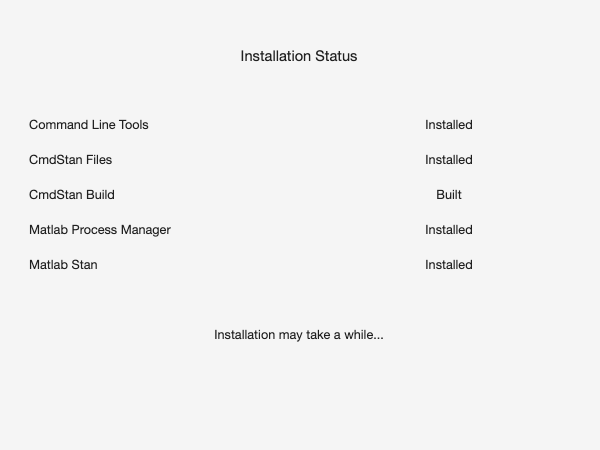

# 3. Installation and dependencies

PsyRAT itself is plain MATLAB code, and MATLAB code needs no installing. What
needs installing is CmdStan, which does the Bayesian estimation, and the C++
toolchain CmdStan needs to compile each model. That is the whole problem. This
chapter is deliberately short on click-by-click steps, because the ones I wrote
for the predecessor toolbox ran to pages and then rotted with the operating
systems they described. Requirements keep. Dialogs do not.

If the toolbox is already working on your machine, skip to
[Section 3.4](#34-verify-the-installation) and confirm it.

## 3.1 What you need

| Component | Version | Where it comes from |
|---|---|---|
| MATLAB | Tested on R2025b (Update 5) | You install it |
| CmdStan | 2.26 or newer; 2.38.0 is the targeted and tested release | The guided installer, or you |
| MatlabStan (PsyRAT fork) | 2.15.1.0 | Ships with the toolbox |
| MatlabProcessManager | 0.5.1 | Ships with the toolbox |
| C++ toolchain | make and a C++ compiler | Your platform (see below) |
| Statistics and Machine Learning Toolbox | Conditional, see below | MathWorks |
| Deep Learning Toolbox | Optional | MathWorks |

**MATLAB.** The tested release is R2025b (Update 5), and every release claim for
the toolbox rests on runs made on the author's own machine. No minimum release is
enforced anywhere in the code, and the precise minimum has not been pinned.
The effective floor is R2022a: the dynamic-reliability surface plot calls
`clim`, introduced in that release, and the export code calls `exportgraphics`
and `writetable` with `WriteMode`, introduced in R2020a, all without fallback.
Beyond those the toolbox relies on `table`, `string`, `categorical`, and the
`matlab.unittest` framework, all of which are old features by now. Between
R2022a and R2025b, the honest answer is that nobody has checked.

**CmdStan.** CmdStan is not bundled and must be installed separately. The
generated Stan models use the `array[N] T name;` declaration syntax introduced in
Stan 2.26, so anything older cannot compile them. Version 2.38.0 is the version
the guided installer fetches and the version used for the accuracy and
integration runs. If you already have a CmdStan on your machine, it is checked at
startup: an installed version below 2.26 produces a warning when the toolbox
opens and a hard error before the first model is compiled. The check is
deliberately permissive, so a CmdStan whose version cannot be read is allowed
through rather than blocked.

**The two bundled dependencies.** MatlabStan and MatlabProcessManager ship inside
the toolbox in `bundled_dependents/`, and there is nothing to install for either.
The bundled MatlabStan is a patched fork, not the upstream release, and the
patches are load-bearing: they add CmdStan auto-discovery and within-chain
threading, they remove three Statistics and Machine Learning Toolbox calls
(two in the fit reader, which is the pair that would otherwise have made the
toolbox mandatory on the default path, and one in a separately licensed
subpackage), and they repair an indexing bug in the draw extraction. Use the
bundled copy. If a different MatlabStan is on your MATLAB path ahead of it, the
startup check says so.

**C++ toolchain.** CmdStan compiles every model with make and a C++ compiler, so
one has to be present before CmdStan can be built or used. On macOS that is the
Xcode Command Line Tools, and the installer offers to trigger the Apple installer
for you. On Windows it is GNU make plus g++, both on the PATH; Rtools provides
them, and the installer cannot install them for you. On Linux it is make plus
g++, from `build-essential` on Debian and Ubuntu or the Development Tools group
on Fedora and RHEL.

**Statistics and Machine Learning Toolbox.** For most analyses you do not need
it. Three designs need it even on the default CmdStan path: the gamma (scaled
chi-square) family combined with concurrent difference scores, which is analysis
7 (two-event difference), analysis 8 (its subject-level variant), and analysis 10
(two-facet test-retest difference). Those three read their results through a
Gaussian copula that calls `normcdf` and `gaminv`, and neither function has a
base-MATLAB equivalent. Both dispersion parameterizations are affected. The
failure is late and expensive, because extraction runs after sampling has
finished: without the toolbox you lose a completed fit to an undefined-function
error rather than being stopped before the run. If you plan to use those designs
(see [Chapter 15](15_advanced-designs.md)), confirm the toolbox is installed
first. Whether other designs have a similar dependency has not been settled.
The toolbox is also required by both native estimation engines, which are the
CmdStan-free fallbacks described in [Chapter 5](05_choosing-an-analysis.md).

**Deep Learning Toolbox.** Optional. It supplies automatic-differentiation
gradients for the native HMC engine, which runs without it on numeric gradients
instead.

## 3.2 Install

FIRST, get the toolbox. Download a release from
[the PsyRAT repository](https://github.com/peclayson/PsyRAT), or clone it.

Put it somewhere whose full path contains no spaces. CmdStan does not accept
whitespace in paths or filenames, and the toolbox enforces that on the files it
writes: choose an output folder or an output filename containing a space and you
get a Whitespace detected dialog rather than a failed run. Nothing enforces it on
the folder you unpack the toolbox into, or on the folder CmdStan is built in, so
that one is on you. `~/Documents/MATLAB/PsyRAT` is a safe choice.
`~/My Lab Stuff/PsyRAT` is not.

Then run this in MATLAB, once, from inside the toolbox folder:

```matlab
psyrat_start
```

That is also the installation step. `psyrat_start` adds its own directories to
the MATLAB path (the toolbox root, `subroutines/`, and `bundled_dependents/`) and
saves the path, so later sessions find it from anywhere. Do not
`addpath(genpath(...))` the whole repository. Doing so also adds tooling and
artifact folders, and a stale copy of a function inside one of those will shadow
the real file with no warning at all.

If the Stan dependencies are missing, `psyrat_start` prints a warning that they
are not in the MATLAB path, stops before the home screen, and raises a small
window offering two buttons: Install Dependents and Exit. Selecting Install
Dependents runs the guided installer, which you can also run directly with
`psyrat_installdependents`.

The installer asks one question first, in a save dialog headed "Where would you
like to save the directory for the dependents?". Answer it with a folder whose
path has no spaces. The installer creates a folder called PsyRATDependents there
and puts everything inside it. Choose `~/Documents/MATLAB` if you have no
preference, because that is one of the locations the toolbox searches on its own
later (Section 3.3), and a PsyRATDependents folder somewhere else is then found
only through the saved MATLAB path.

From there the installer works down a checklist and shows its progress in a
window named Installation Summary.



The window lists five rows: Command Line Tools, CmdStan Files, CmdStan Build,
Matlab Process Manager, and Matlab Stan. Each carries a status of Installed or
Not Installed (Built or Not Built for the build row), and each is redrawn as the
step behind it completes. The same status text also goes to the Command Window,
which is where to look if something fails, because the failure message is printed
there and not in the window. The line at the bottom reading "Installation may
take a while..." is not a figure of speech. Building CmdStan compiles a large
amount of C++, takes several minutes on a current laptop, and uses all but one
of your cores while it does (all of them on a two-core machine).

What the installer actually does: it checks for a C++ toolchain, downloads the
CmdStan release tarball for the targeted version from the Stan project's GitHub
releases, unpacks it into PsyRATDependents, builds it with `make`, copies the
bundled MatlabStan and MatlabProcessManager in beside it, points MatlabStan at
the CmdStan it just built, adds the whole PsyRATDependents tree to the MATLAB
path, saves the path, and relaunches `psyrat_start`.

On macOS it inserts one extra step. If the Xcode Command Line Tools are not
present, the installer starts Apple's own installer and then waits behind a
window reading "Please indicate when the XCode installation is complete", with a
single button labeled Installation Complete. Click it when Apple's installer has
finished, not when it has started. The toolbox rechecks the install location
rather than taking the button press as proof, so clicking early produces an
error telling you to install the command line tools manually.

On Windows the installer cannot set up the toolchain. If GNU make and g++ are not
already on the PATH it stops with a message pointing you at Rtools, and you have
to install that yourself before rerunning. Windows is not part of the test
matrix: the toolbox follows the general MatlabStan and CmdStan support there,
but no Windows run has been verified by the author.

On Linux the installer runs, and it is EXPERIMENTAL. That branch mirrors the
macOS path (check for make and g++, download the CmdStan tarball, build it), and
it has not been verified on a Linux machine by the author. It announces this with
a warning when it starts. Estimation itself is fine on Linux once CmdStan is
discoverable. If the automatic install fails, install CmdStan yourself and point
the toolbox at it as described next.

## 3.3 Installing or pointing at CmdStan yourself

You do not have to use the guided installer. A CmdStan you built yourself, or one
that came with another Stan interface, works as long as the toolbox can find it
and it meets the minimum version.

Discovery happens in a fixed order, and the first candidate that looks like a
real CmdStan root (a `makefile` and a `bin` directory) is the one used:

1. The environment variables `STAN_HOME`, `CMDSTAN_HOME`, and `CMDSTAN`, in that
   order. (One further name, checked ahead of these, is reserved for the test
   harness.)
2. A `cmdstan-*` folder inside `PsyRATDependents` under your home directory:
   `Documents/MATLAB/PsyRATDependents`, `Documents/PsyRATDependents`, or
   `MATLAB/PsyRATDependents`. A `cmdstan-*` folder directly in your home
   directory is checked too. Where one location holds several versioned
   folders, the newest version wins; pin an older one with an environment
   variable if you need it.
3. Whatever is reachable on the MATLAB path.

An environment variable therefore always beats a toolbox-managed install, which
is what you want when you are deliberately testing against a different CmdStan.
The home-directory install beats a MATLAB path entry, which is also what you
want, since it keeps an unrelated CmdStan that happens to be on the path from
displacing the one built for the toolbox.

The startup check in `psyrat_start` uses this same discovery order, so any
CmdStan the list above can find, including one named only by an environment
variable, satisfies it. There is no need to add the CmdStan root to your
MATLAB path just to get past the launch check. (Earlier versions checked the
MATLAB path alone, and an environment-variable-only setup produced a spurious
missing-dependencies report at launch; that behavior is gone.)

For building CmdStan itself, follow the Stan project's own instructions at
<https://mc-stan.org/users/interfaces/cmdstan> rather than anything reproduced
here. Those steps are maintained by people who test them on every release, which
is more than can be said for a printed manual.

## 3.4 Verify the installation

Run `psyrat_start` and read the Command Window before you touch the buttons. A
working installation prints six lines:

```
Ensuring dependents are found in the Matlab path
PsyRAT Toolbox files found
CmdStan, MatlabProcessManager, and MatlabStan files found
CmdStan version is current
MatlabProcessManager version is current
MatlabStan version is current
```

Three blank lines later comes the banner, reading "PsyRAT Version" followed by
the version string of your installation. Report that string in any bug report. The
second line reads "Directories for PsyRAT Toolbox files added to Matlab path"
instead on the first launch after installing, which is the toolbox putting itself
on the path, and it reverts to the line shown above afterward.


The three version lines are advisory. For CmdStan and MatlabProcessManager, a
dependency behind the version the toolbox targets produces a line saying a new
version is available with an offer to update, and one ahead of it produces a
warning that it is newer than the version the toolbox was tested with. The
offer is a window naming the dependents that are behind, reading "It is
recommended that you update the dependents. Would you like to do so now?"
with a warning that updating deletes the old dependents directories, and it
offers Yes and No. The
MatlabStan line reports something different: whether the copy in use carries
the patches PsyRAT ships, with a third outcome when the patch level cannot be
determined. When the copy in use is the bundle PsyRAT ships inside its own
folder and its stamp does not match this release, the line instead reads
"PsyRAT's bundled pinned copy is in use (updated with the toolbox, not the
dependents)": the bundle cannot be replaced by the dependents updater, so no
update is offered for it, and updating the toolbox itself is what refreshes
it. Estimation is not blocked in any of these cases.

You may also see a message from the release check, and on a beta build you should
expect one. The toolbox asks GitHub for the latest published release and compares
it against the version you are running. When there is no published stable release
to compare against, or when your version is ahead of the newest one, it says so
and recommends caution. That message is informational, and it reports nothing
about whether your installation works.

The last check is a real fit. Run the analysis in
[Chapter 2](02_quick-start.md) and let it finish. Every estimation starts by
compiling the generated Stan model to a binary before sampling, which adds
about 8 s per generated model on top of the sampling itself (the toolbox
names each generated model uniquely, so the compile happens on every run, not
just the first). The binaries land in a folder named PsyRAT_CmdStan on your
Desktop, or in the current MATLAB directory when there is no Desktop folder,
and the folder is safe to empty between sessions. If that first run finishes
and produces a results window, everything downstream of this chapter is
working.

One thing worth knowing before you start it: the models run in C++, not in
MATLAB, so interrupting MATLAB with ctrl+c stops MATLAB waiting for the sampler
rather than stopping the sampler.

Success! CmdStan is installed and discoverable, the bundled MatlabStan is talking
to it, and the toolbox is on your MATLAB path and will still be there in your
next session. If any of the checks above failed instead, the symptom-by-symptom
fixes are in [Chapter 18](18_troubleshooting.md).
