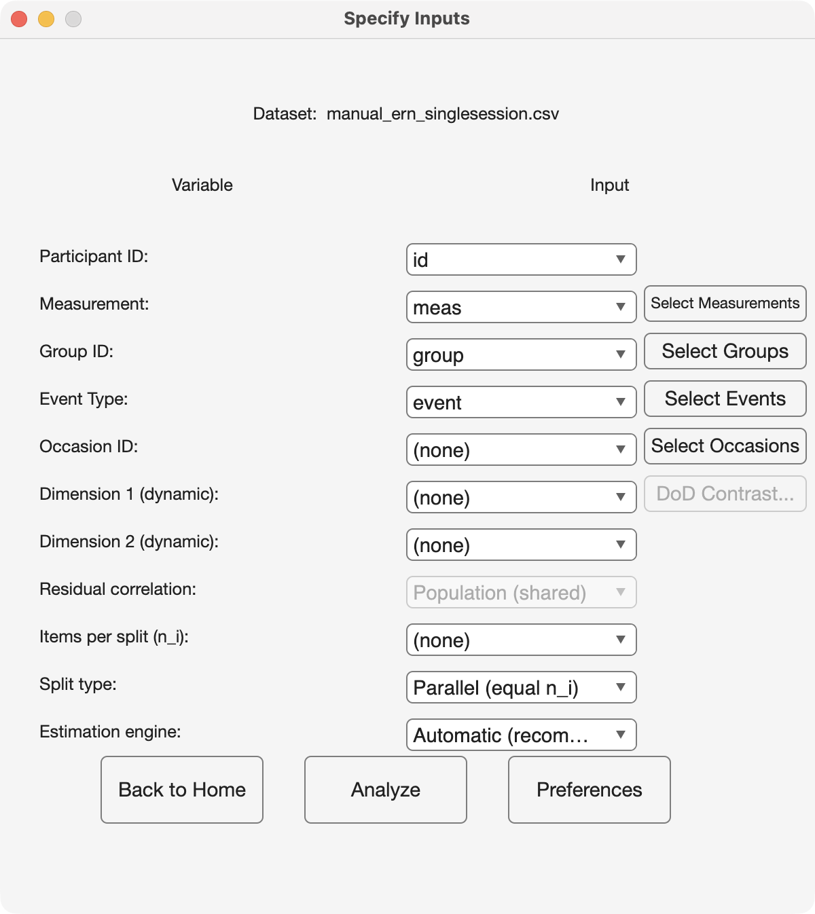
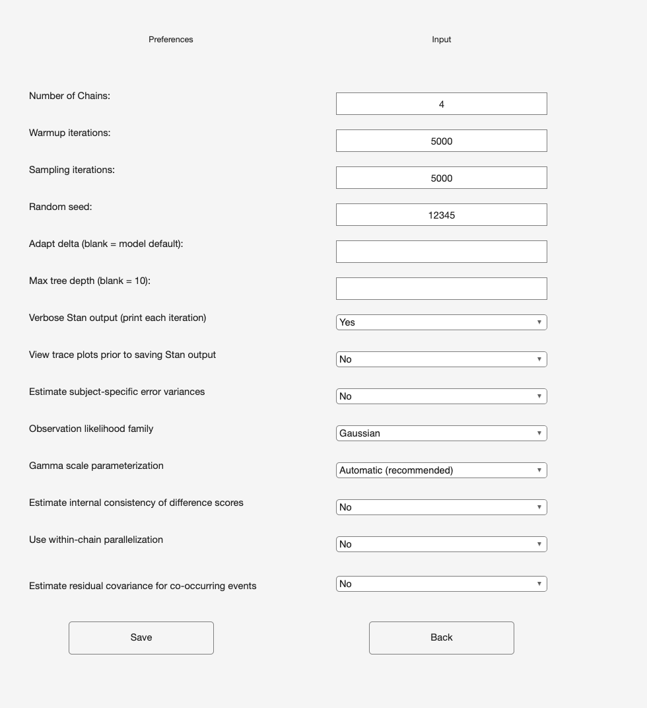

# 5. Choosing an analysis

PsyRAT never asks you to name an analysis. You describe your data (which column
holds the participant, which holds the score, and which optional columns hold
groups, events, occasions, dimensions, or split sizes), you set a few
preferences, and you click Analyze. The toolbox reads that description and
routes the run to one of 29 numbered analyses. [Chapter 16](16_analysis-reference.md)
holds one reference card for each of them.

This chapter is about the description rather than the click sequence. Six
choices decide the routing, and every one of them is a question you would
answer in a methods section anyway. [Chapter 6](06_preparing-data.md) covers the
file format those choices assume, and [Chapter 7](07_processing.md) walks the
screens they live on.

## 5.1 The six design axes

### Facets: one occasion, or two

A facet is a source of measurement error you deliberately sampled. Every PsyRAT
analysis treats trials as a facet. The Occasion ID popup on Specify Inputs
decides whether there is a second one. Leave it on none and you get a one-facet
design (persons crossed with trials), which is the internal-consistency case:
all the data come from one session, and the question is how well a
participant's score generalizes over the trials that produced it. Select an
occasion column and you get a two-facet crossed design (persons by trials by
occasions), which adds the question of how well the score generalizes over
occasions. The second facet is expensive in a specific way. Occasion-level
variance components are estimated from as many levels as you have occasions,
which is usually two, so those components stay wide no matter how many trials
or participants you collected.

### Score type: single, difference, or difference of differences

Set this with Estimate internal consistency of difference scores, in
Preferences. No treats the measurement column as the score, one row per trial.
Yes: 2-event difference models both conditions jointly and reports the
reliability of their difference (error minus correct, incongruent minus
congruent, and so on), which requires exactly two event types in the data.
Yes: 4-event DoD reports the reliability of a contrast between two differences
(a difference of differences, DoD), (ERP_1 - ERP_2) - (ERP_3 - ERP_4), which
requires exactly four. The four-event
option also requires you to say which event plays which role, on the Configure
DoD Contrast screen, before Analyze will run. Difference scores are not a
post-hoc subtraction of two separately estimated coefficients. The constituent
scores are modeled together so that their covariance enters the universe-score
variance, which is the whole reason a difference can be far less reliable than
either score it is built from.

### Error level: one error variance, or one per participant

Estimate subject-specific error variances, in Preferences, decides whether the
residual is a single population quantity or a separate quantity for each
participant. No gives the group-level estimand: one dependability coefficient
describing the sample, which is what most published generalizability-theory
work reports. Yes fits a location-scale model in which each participant carries their own
residual standard deviation, so the output is a coefficient per participant
alongside the group summary. Use it when the question is who is measured well
rather than how well the measure performs, and expect a longer fit: the model
adds one scale parameter per participant, and per-participant scale is harder to
identify than a pooled one.

### Moderation: static, or reliability as a function of a dimension

The Dimension 1 (dynamic) popup turns on dynamic reliability, the
conditional-reliability model of Rast and Clayson (in press). Selecting a
continuous, between-person column (one value per participant, such as a
questionnaire total) makes both the mean and the residual scale functions of
that standardized dimension, so the reported coefficient becomes a curve rather
than a number: reliability at low, average, and high values of the dimension.
Dimension 2 (dynamic) adds a second predictor and its interaction with the
first. This is the axis to reach for when you suspect the measure works better
in one part of the sample than another, which is a common worry when a
clinical range and a comparison range are pooled in one dataset. Leave both
popups on none for a static analysis, which is the default.

### Residual coupling: independent, shared, or per-participant

When the two events of a difference score are recorded on the same trial
(ipsilateral and contralateral windows, or two electrodes scored from one
epoch), their residuals are not independent, and pretending otherwise distorts
the difference-score error variance. Estimate residual covariance for
co-occurring events, in Preferences, turns that covariance on. No fixes it to
zero, which is right when the two conditions come from separate trials. Yes
estimates it. For dynamic subject-level designs a third choice opens up: the
Residual correlation popup on Specify Inputs offers Population (shared), one
correlation for the sample, or Per-subject, a separate correlation for each
participant. That popup is greyed out until difference scores, subject-specific
error variances, and residual covariance are all switched on, because it means
nothing anywhere else. The four-event contrast never takes a residual
covariance in any configuration; all six of its pairwise residual covariances
are fixed at zero by the estimand it reports.

### Splits: single trials, parallel splits, or nonparallel splits

The toolbox normally expects one row per single trial. If your rows are split
means instead (odd trials against even trials, or four random subsets of the
trials), select the column holding the number of items averaged into each split
in the Items per split (n_i) popup, and declare the splits with Split type.
Parallel (equal n_i) says every split holds the same number of items. That case
reuses the ordinary one-facet and test-retest machinery unchanged, with the
split mean as the score and the number of splits in place of the trial count,
so the output looks exactly like a single-trial run with the word trial
replaced by split. Nonparallel (unequal n_i) fits the weighted observed-design
model instead, and it is identified only by variation in n_i across splits.
Equal counts under that setting are rejected before the run starts. Nonparallel
splits report the design you actually observed, with no projection to other
split counts and no trial-count cutoff, because split means have already lost
the item-level partition a projection would need.

## 5.2 Two more choices, crossed with all six

The observation likelihood is set by Observation likelihood family in
Preferences. Gaussian is the default and is what ERP amplitudes want, negative
values included. Gamma fits a scaled chi-square (Gamma with a log link) and
suits strictly positive, right-skewed scores such as single-trial
time-frequency power; non-positive values are rejected under it. The gamma
family covers most, not all, of the design grid, and it always runs on CmdStan.
Gamma scale parameterization decides what the dispersion submodel is built on,
and Automatic (recommended) picks correctly for the design you asked for. The
two settings under it are different estimands rather than two views of one fit,
so leave it on Automatic unless you have a reason to do otherwise and are
willing to say which one you used.

The Estimation engine popup on Specify Inputs picks how the model is fit.
Automatic (recommended) uses CmdStan whenever it is installed, which is the
configuration everything in this manual assumes. The popup is reachable only
once CmdStan is found, because `psyrat_start` stops at its dependency check
without it ([Chapter 18](18_troubleshooting.md)); from a script, `psyrat_run`
with the `engine` option at its automatic default falls back to the first
native MATLAB engine that implements your design, preferring
native HMC (Hamiltonian Monte Carlo, a genuine Bayesian fit, though not
bit-identical to CmdStan) over native fitlme (restricted maximum likelihood,
REML, with a parametric bootstrap, whose intervals are approximate and not
credible intervals). Which engine is legal depends on the
design, not on your preference: the plain one-facet designs and the nonparallel
splits are fitlme-only, the location-scale and multivariate designs are
HMC-only, plain test-retest is the one design both native engines can fit, and
several designs have no native implementation at all. Every card in
[Chapter 16](16_analysis-reference.md) names its engines, and
[Chapter 3](03_installation.md) covers what each one needs installed. One
dependency is worth knowing before you plan a gamma run: the concurrent gamma
difference designs need the Statistics and Machine Learning Toolbox even on the
CmdStan path, and the failure comes after sampling finishes rather than before
it starts.

## 5.3 Working through it

Answer the questions in this order and you land on a card number. The first
question is the one people skip, so it is first.

- **Are your rows split means rather than single trials?**
  - Yes, and every split holds the same number of items. Declare Parallel; the
    run reuses analyses 1 to 5 with trial relabeled as split (see the parallel
    splits card).
  - Yes, and the counts differ. Declare Nonparallel: analysis 23 with one
    occasion, analysis 24 with an occasion column.
  - No. Continue.
- **Do you want reliability reported as a function of a continuous participant
  characteristic?**
  - No. Take the static branch below.
  - Yes. Select Dimension 1 and take the dynamic branch.

### Static branch

- **A single score.**
  - One occasion, one error variance for the sample: analysis 1; analyses 2,
    3, and 4 once a group column, an event column, or both are selected.
  - One occasion, an error variance per participant: analysis 6.
  - Two occasions, one error variance for the sample: analysis 5.
  - Two occasions, an error variance per participant: analysis 25.
- **A two-event difference score.**
  - One occasion, group level: analysis 7 (the same number with residual
    covariance switched on).
  - One occasion, per participant: analysis 8.
  - With an occasion column: analysis 10, group level only.
- **A four-event difference of differences.** Analysis 9. One occasion, group
  level, no residual covariance.

### Dynamic branch

- **A single score.** One facet: analysis 11 at the group level, 26 per
  participant. With an occasion column: analysis 14 at the group level, 27 per
  participant.
- **A two-event difference score, one facet.**
  - Group level: analysis 12, or 17 with residual covariance.
  - Per participant: analysis 13; with residual covariance, 19 for a shared
    correlation and 21 for a per-participant correlation.
- **A two-event difference score, with an occasion column.**
  - Group level: analysis 15, or 18 with residual covariance.
  - Per participant: analysis 16; with residual covariance, 20 for a shared
    correlation and 22 for a per-participant correlation.
- **A four-event difference of differences.** Analysis 28 with one occasion, 29
  with an occasion column. Both are person-specific and non-concurrent, so
  subject-specific error variances must be on and residual covariance must be
  off.

Combinations that are not in those lists are rejected, with a dialog naming the
setting to change. The rejection happens before sampling starts in almost every
case. The exception worth planning around is the gamma extraction dependency
named above, which fires after the fit.

Every analysis in those lists can be launched from the Analyze step. A few
options have no screen control and are set only from a script: custom priors
([Chapter 15](15_advanced-designs.md)) and the gamma copula
residual-dispersion option (`dispersion`) are passed as `psyrat_run`
arguments. [Chapter 14](14_scripting.md) covers scripted runs in general.

You do not have to remember which analysis a set of settings produced. Every
run writes a `*_runconfig.json` sidecar next to its `.psyrat` output, recording
the seed, the sampler settings, the column mapping, and every design flag on
this page, and every exported table carries the same information in its header.
That sidecar is what makes a methods section reproducible, and it is what to
read first when you come back to a result six months later.

## 5.4 What is supported, and what carries a caveat

Most of the grid is supported in the plain sense: covered by the unit and
accuracy suites and, where a live recovery test exists, checked against known
variance components in a live CmdStan run. The rest carries a label. The
experimental arm says so in the header of every table it exports but nowhere on
screen; the tractability-checked arm says in its export header that its one
check established tractability, not robustness; the development-only cell says
so nowhere at all. All of them are stated here and in the CHANGELOG's design
maturity table, which uses the same five labels.

| Designs | Configuration | Status |
|---|---|---|
| One-facet and test-retest reliability, subject-level error variances, non-concurrent two-event difference scores, the four-event difference of differences, reliability from splits, the dynamic family apart from analysis 20 under gamma, and the person-specific dynamic difference of differences | Gaussian throughout, and gamma wherever gamma is offered | Supported |
| Two-event difference scores with correlated residuals (analyses 7, 8, and 10) | Gamma, with a separate dispersion parameter for each participant (`dispersion` 1, the only gamma arm analysis 8 has) | Experimental |
| Two-event difference scores with correlated residuals (analyses 7 and 10) | Gamma, one global dispersion parameter (`dispersion` 2, the default for these two) | Tractability checked, robustness not |
| Two-facet subject-level concurrent dynamic difference (analysis 20) | Gamma, location-scale | Development-only |
| Analyses 15, 16, 17, 18, 21, and 22 under gamma; every splits design under gamma; residual covariance on the four-event difference of differences in any family | any | Not implemented: requesting them stops with a message |

Supported does not mean that every cell has a live CmdStan recovery test of its
own. The Gaussian four-event difference of differences (analysis 9) is recovered
live only through the native HMC engine; the Gaussian subject-level dynamic
designs (analyses 26 and 27) share the fits of analyses 11 and 14 and have no
recovery test of their own; the gamma arm of analysis 19 is checked only by a
replay of an external reference fit; and the splits designs (analyses 23 and 24)
have no independent-oracle row. The CHANGELOG records the same list.

Experimental means one specific thing here. Convergence for those fits has not
been established in this release: an in-repo subject-level fit reached an R-hat
of about 2.5 with an effective sample size of about 2, and it did not improve
when the simulated participant and trial counts were raised. Treat any estimate
from that configuration as unverified until you have read its own convergence
verdict, divergent-transition count, and per-parameter diagnostics. Analysis 8
has no alternative under gamma, because a per-participant coefficient needs a
per-participant dispersion parameter. Analyses 7 and 10 default instead to a
single dispersion parameter for the sample, which converged cleanly on one
simulated one-facet dataset at one choice of sampler settings, while the
two-facet check still produced divergent transitions. That is a statement
about tractability, not about robustness, and its own disclosure text says so.

Development-only is stronger. The two-facet configuration of analysis 20 under
gamma has no empirical anchor at all, so nothing outside the toolbox has ever
been reproduced with it. Do not report from it.

Two more disclosures belong with these. Analyses 19 and 20 under the gamma
family are fitted by a modular cut workflow: the margins are fitted first
without the residual coupling, and the coupling is estimated afterward. The
result is a cut posterior rather than a full Bayesian one, and the exported
provenance says so. Analyses 28 and 29 are explicitly not cut posteriors, since
they have no dependence module to cut.

All of the Gaussian arms named in those rows are unaffected. If you are running
ERP amplitudes with the default family, none of this applies to your run.

## 5.5 Why the version carries -beta

The label is about the interface, not about the arithmetic. The public
argument names, the shape of the exported tables, and the layout of the saved
result are still moving between releases, so a script written against this
version may need edits against the next one. It is not a statement that the
estimates are provisional, and the design maturity table above is per-design
for exactly that reason.

There is a second, narrower reason, and it deserves saying plainly. The
concurrent gamma difference designs ship with their convergence unvalidated in
this repository. Shipping them at all is a judgment call I made in favor of
letting people run them with the caveat attached rather than withholding them
until the sampler problem is solved. The suffix is part of that bargain: it
says the toolbox is usable and honest about which corner of it is not yet
settled.
