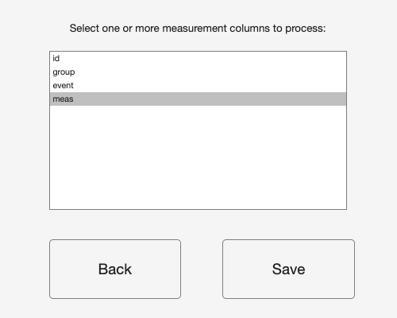
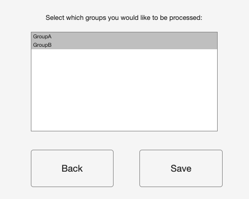
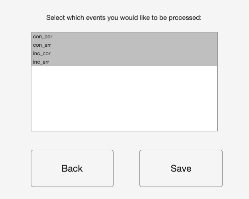
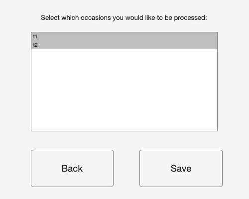
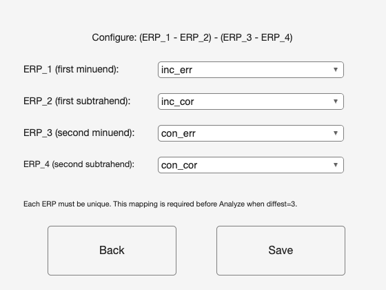
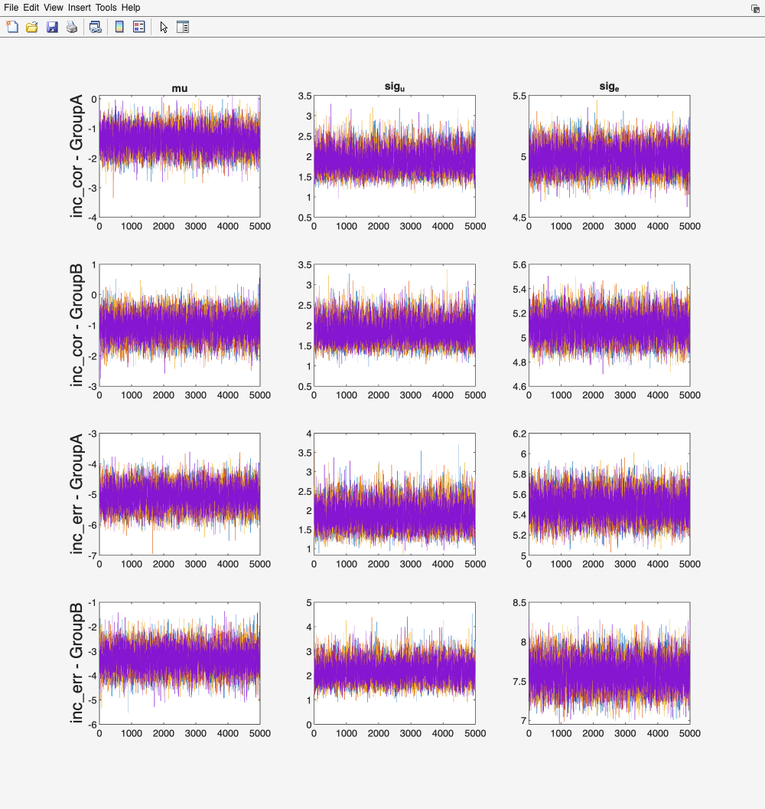

# 7. Processing data, screen by screen

Running `psyrat_start` prints a startup banner to the MATLAB Command Window and
opens the home screen. This chapter follows the Process New Data route from that
screen to a saved result, one window at a time. The tutorials in Part IV point
back here rather than repeating any of it, so if a tutorial says "set the
Occasion ID popup" and you want to know what that popup does, this is where the
answer lives.

Read [Chapter 6](06_preparing-data.md) first. Every screen below assumes a file
that already meets the input contract.

## 7.1 The home screen

This is the whole launcher. Three buttons, and each one starts a workflow that
runs to completion on its own.

Process New Data: loads a table of ERP measurements and runs estimation, which
is the route this chapter documents.

Import + Score ERP: imports ERP waveform files, defines component scoring, and
exports a validated single-trial table, covered in
[Chapter 8](08_import-score.md).

View Results: opens a `.psyrat` file produced by an earlier run and displays its
figures and tables, covered in [Chapter 9](09_viewing-results.md).

## 7.2 Choosing a data file

Selecting the Process New Data button opens a file picker before it opens
anything else. Its default filter, All Readable Files, matches `.xlsx`, `.xls`,
`.csv`, `.dat`, `.txt`, and `.ods`, and the file-type popup offers a separate
filter for each of those types. Section 6.6 lists the extensions the reader accepts beyond
the filter.

The Command Window prints `Loading Data...` and a note that this may take a
while. Large single-trial files take a moment, and no window reports progress
while it happens.

If you cancel the picker, PsyRAT returns you to the home screen and raises a
File Error dialog saying no data file was selected. Nothing is lost. Click
Process New Data again.

Loading at this stage only reads the file into a table. None of the data checks
in Section 6.5 have run yet.

## 7.3 Specify Inputs

The window is titled Specify Inputs, and it names your file at the top
(`Dataset:` followed by the filename). Two columns run down the screen: Variable
on the left, Input on the right. Each row assigns one of your source columns, or
one processing mode, to a PsyRAT role. The buttons along the right edge open
sub-screens for narrowing what gets processed.

Everything on this screen is a declaration about your data. Everything in
Preferences (Section 7.4) is a declaration about the fit. The two interact,
which is why some controls here are greyed out until Preferences is saved.

### The eleven popups

Participant ID: the column holding the participant identifier, one level per
person. Required, and preselected to the first column when no header matches.
Every participant contributes one clustering unit to the model, so an identifier
that repeats across genuinely different people silently pools them.

Measurement: the numeric column holding the single-trial score. Required. This
popup lists your columns for a single selection; when you have chosen more than
one measurement through the Select Measurements button it collapses to the words
`multiple measurements` instead of a column name. Confirm this one every time.
A run on the wrong numeric column completes normally and reports the reliability
of whatever you pointed at.

Group ID: the column holding a between-person grouping, such as a diagnostic or
task group. Optional. Estimation fits a separate model per group, so choose this
when you want group-specific variance components rather than one pooled set.
Leave it on `(none)` when the sample is one group.

Event Type: the column holding condition or event labels, such as correct and
error trials. Optional for a plain reliability analysis, and required for every
difference-score analysis. Choose it when reliability differs by condition, which
for error-related measures it usually does.

Occasion ID: the column holding session or occasion labels. Optional. Selecting
it turns the analysis into a test-retest design, which changes the model, the
coefficients reported, and the iteration count you should expect to need.
Leave it on `(none)` for single-session data. Once an occasion column is
selected, opening Preferences with fewer than 10,000 total iterations raises a
Recommended Iteration Increase advisory; Section 7.4 explains it.

Dimension 1 (dynamic): the first continuous between-person covariate for dynamic
(conditional) reliability. Optional, and selecting it is what enables the
dynamic-reliability analysis. The column must be numeric and constant within
participant (Section 6.4). Leave it on `(none)` for a standard analysis.

Dimension 2 (dynamic): a second continuous between-person covariate, adding its
main effect and its interaction with Dimension 1. Optional, and usable only
alongside Dimension 1. Selecting Dimension 2 on its own is rejected at Analyze
rather than silently ignored.

Residual correlation: whether the residual correlation in the subject-level
concurrent dynamic difference design is shared across participants (Population
(shared)) or estimated separately for each participant (Per-subject). The
default is Population (shared). This popup is greyed out unless three
Preferences are all set: difference scores on Yes: 2-event difference,
subject-specific error variances on Yes, and residual covariance for co-occurring
events on Yes. It is inert for every other run, and a stale Per-subject
selection on a run that does not support it is reset rather than carried
through.

Items per split (n_i): the column holding the number of items averaged into each
split mean. Optional, and selecting it declares that each row of your file is a
split rather than a single trial, which switches the analysis to reliability from
data splits. Leave it on `(none)` for single-trial input. Section 6.3 covers the
format this expects.

Split type: whether the splits are Parallel (equal n_i) or Nonparallel (unequal
n_i). The default is Parallel (equal n_i). This popup is consulted only when an
items-per-split column is selected. Declare what your splitting procedure
produced, because the two choices fit different models: Parallel reuses the
standard one-facet or test-retest machinery with the split mean as the score,
while Nonparallel fits the weighted observed-design model, which is identified
only by variation in n_i.

Estimation engine: which engine estimates the variance components. Automatic
(recommended) is the default and uses CmdStan whenever it is installed, falling
back to a native MATLAB engine only when it is not. The other three choices,
CmdStan only, Native HMC, and Native fitlme, force one engine and error clearly
at run time if that engine is missing or cannot handle the design. A native
option whose required toolbox is absent is annotated on screen with
`(toolbox not installed)`. Leave this on Automatic (recommended). The native
engines (HMC is Hamiltonian Monte Carlo; fitlme is MATLAB's linear mixed-effects
fitter, which uses restricted maximum likelihood, REML) are not bit-identical to
CmdStan, and the fitlme intervals are approximate frequentist bootstrap
intervals rather than Bayesian credible intervals, so a forced native engine
changes what your numbers mean.

### The `(none)` sentinel

Group ID, Event Type, Occasion ID, both Dimension popups, and Items per split all
carry an extra final entry reading `(none)`, which means the facet is not used.
The parentheses are load-bearing. MATLAB coerces every header it reads into a
valid variable name, and `(none)` is not one, so no column of yours can ever
carry that label and the sentinel is unambiguous by construction. A column
literally named `none` in your file stays selectable and behaves like any other
column.

The sentinel is also the trap under the selection buttons. Clicking Select
Groups, Select Events, or Select Occasions while the matching popup still reads
`(none)` raises an error dialog naming the missing column, because there is no
column to list levels from. Set the popup first, then click the button.

### Select Measurements

Clicking Select Measurements opens Specify Which Measurements to Process, a
multi-select list of every column in your file, prompted "Select one or more
measurement columns to process:". Save records the selection and returns you to
Specify Inputs; Back discards it.

Selecting more than one column runs a batch: PsyRAT fits each measurement in turn
and writes one output file per measurement (Section 7.6). Use it when you have
scored several components or several electrodes into one file. Saving with
nothing selected raises a Measurement Not Defined dialog.

### Select Groups

Clicking Select Groups opens Specify Which Groups to Process, a multi-select list
of the distinct values found in your Group ID column, prompted "Select which
groups you would like to be processed:". Everything is selected the first time.
Deselect the groups you want left out of this run.

You do not have to open this screen at all. When you never touch it, PsyRAT
processes every group it finds. Changing the Group ID popup to a different column
resets the selection to all levels of the new column.

### Select Events

Clicking Select Events opens Specify Which Events to Process, the same list
behavior applied to your Event Type column, prompted "Select which events you
would like to be processed:". This is the screen that matters most for difference
scores, which require exactly two selected events, and for the four-event
difference-of-differences (DoD) contrast, which requires exactly four.

Saving here can discard work elsewhere. If the saved event set differs from the
previous one, or if the event column itself changed, a configured
difference-of-differences contrast is cleared and a modal DoD contrast cleared
warning tells you so. Reconfigure the contrast before running. A save that leaves
the same set of events selected, in any order, keeps the contrast intact.

### Select Occasions

Clicking Select Occasions opens Specify Which Occasions to Process, prompted
"Select which occasions you would like to be processed:", and behaves exactly as
the group and event screens do. Use it to drop a third session from a design you
want analyzed as two occasions.

### DoD Contrast...

Clicking DoD Contrast... opens Configure DoD Contrast, which assigns your four
event labels to the four terms of the contrast printed across the top of the
window, `(ERP_1 - ERP_2) - (ERP_3 - ERP_4)`. Four popups do the assigning:
ERP_1 (first minuend), ERP_2 (first subtrahend), ERP_3 (second minuend), and
ERP_4 (second subtrahend). Each ERP must be a different event, and Save refuses a
mapping that repeats one.

The button is greyed out until you set Estimate internal consistency of
difference scores to Yes: 4-event DoD in Preferences and click Save there. It
also refuses to open until an Event Type column is chosen and exactly four events
are selected, naming whichever precondition is unmet. The button's tooltip
reports the current state: `Needs event column`, `Needs exactly 4 selected
events (current: N)`, `Not configured`, or `Configured:` followed by the
assembled contrast.

The mapping is required. A four-event run reaching Analyze without one is
rejected before the save dialog opens, so nothing is lost but the click.

### The three action buttons

Back to Home: closes Specify Inputs and returns to the home screen, and
discards everything you set on the way, including saved Preferences, the
column assignments, the subset selections, and any configured DoD contrast.
The next Process New Data run starts from the defaults. If you want to keep
your settings, run the analysis or leave the window open.

Analyze: validates every selection on this screen, asks where to save, and starts
estimation. Section 7.5 follows what happens next.

Preferences: opens Specify Processing Preferences, carrying your current column
assignments with it.

## 7.4 Specify Processing Preferences

Clicking the Preferences button opens Specify Processing Preferences. Fourteen
rows, then Save and Back. Save writes the settings and redraws Specify Inputs;
Back returns without writing. Nothing on this screen touches your data file.
The settings live for the current MATLAB session only: PsyRAT rebuilds its
defaults every time it starts, so a changed chain count or family has to be
entered again after a restart. The settings a run actually used are recorded in
its run-config sidecar (Section 7.6), which `psyrat_run` can replay.

The defaults are the ones I run, and the entries below say where a default is a
considered choice and where it is a convention I inherited.

Number of Chains: how many independent Markov chains CmdStan runs. The default is
4, and 3 is the enforced minimum. Anything below 3 is refused with an Invalid
Number of Chains dialog, because the convergence check compares chains against
each other and needs enough of them for the comparison to mean anything. Four is
also the number most desktop machines can run in parallel without contention.

Warmup iterations: how many adaptation iterations each chain runs before draws
are kept. The default is 5,000. Warmup draws are discarded, so this number buys
adaptation quality rather than posterior precision.

Sampling iterations: how many post-warmup draws each chain keeps. The default is
5,000, giving 20,000 retained draws across four chains. That is generous for the
one-facet models and, in my experience, about right for the test-retest ones. Use
as many iterations as you need to get your model to converge.

If an occasion column is selected on Specify Inputs and the total (warmup plus
sampling) is under 10,000, opening this screen raises a Recommended Iteration
Increase advisory over the finished window. It is worded as advice, not as a
refusal, though MATLAB draws it in the same style as an error dialog. At the
defaults it never appears, because 5,000 plus 5,000 is exactly 10,000.

Random seed: the random number generator (RNG) seed handed to CmdStan. The
default is 12345. Reusing the
same seed on the same data at the same settings reproduces the same draws and
therefore the same estimates to the last digit, which is what makes a PsyRAT
analysis reproducible rather than merely repeatable. Record it. The sidecar in
Section 7.6 records it for you. Changing it is a legitimate robustness check and
should be reported as one.

Adapt delta (blank = model default): the target acceptance rate of the
No-U-Turn Sampler (NUTS). Leave it blank, which is the default. Blank means the
model's own default: most designs carry a tuned value (0.90 to 0.98, chosen per
model rather than picked once), and the plain one-facet designs (analyses 1
through 4) run at CmdStan's default of 0.80. Enter a value between 0 and 1, typically 0.95 or 0.99, to
reduce divergent transitions at the cost of slower sampling. A malformed entry is
refused with an Invalid Adapt Delta dialog.

Max tree depth (blank = 10): the NUTS maximum tree depth. Leave it blank, which
is the default and means CmdStan's own default of 10. Raise it to 12 or 15 when a
hard posterior is terminating trajectories early. Both this and adapt delta
change step-size adaptation during warmup, so a run that sets either one does not
reproduce a run at the same seed that did not.

Verbose Stan output (print each iteration): whether CmdStan's raw console log is
echoed into the MATLAB Command Window. The default is Yes. If yes, you see
iteration counts and can tell a slow run from a stalled one. If no, the Command
Window goes quiet for the length of the fit, which on a long model is
indistinguishable from a hang.

View trace plots prior to saving Stan output: whether trace plots are drawn
before the result is saved, with a chance to rerun. The default is No, and the
limitation is worth stating plainly: plots are rendered only for the plain
one-facet internal-consistency analysis. For every other analysis, setting this
to Yes prints a console line saying trace plots are not supported or not
rendered for that analysis, and continues without plotting. Section 7.5 covers
what you see when plots are rendered.

Estimate subject-specific error variances: whether the model estimates a separate
residual variance per participant, which is what subject-level reliability
estimates are computed from. The default is No. Turning it on costs sampling time
and constrains which designs are available: with an occasion column present, it
is supported for the non-difference test-retest design and for the
dynamic-reliability designs, and it is not supported for non-dynamic difference
scores in a test-retest workflow.

Observation likelihood family: the likelihood for the single-trial scores. The
options are Gaussian and Gamma, and the default is Gaussian. Gaussian suits ERP
amplitudes, which are routinely negative. Gamma is the scaled chi-square,
log-linked family for strictly positive, right-skewed data such as single-trial
time-frequency power, it is available for a specific subset of designs, and it
always runs on CmdStan. Non-positive scores are rejected under Gamma before
estimation starts. [Chapter 15](15_advanced-designs.md) sets out which designs
accept it.

Gamma scale parameterization: which quantity the Gamma dispersion submodel is
built on. The options are Automatic (recommended), Log-nu (relative dispersion /
CV), and Location-scale (absolute residual SD), and the default is Automatic
(recommended). Leave it there. Automatic lets the analysis choose location-scale
on every design that supports it and log-nu on the rest, which is the choice you
want when output is read as precision or compared against a Gaussian analysis.
The two parameterizations are different estimands rather than two views of one
fit, so results are not comparable across the setting. Under the Gaussian family
this control is not gated: Automatic and Log-nu are ignored, but Location-scale
is rejected and stops the run.

Estimate internal consistency of difference scores: whether reliability is
estimated for a difference score, and of which kind. The options are No, Yes:
2-event difference, and Yes: 4-event DoD, and the default is No. Yes: 2-event
difference estimates the reliability of X minus Y and needs exactly two selected
events. Yes: 4-event DoD estimates the four-event contrast and needs exactly four
selected events plus the mapping from the DoD Contrast... screen (Section 7.3).
Difference-score modes are available for single-session data, with the
dynamic-reliability designs as the documented exception.

Use within-chain parallelization: whether CmdStan splits each chain's likelihood
across threads. The default is No. If yes, PsyRAT picks threads per chain
automatically so at least two CPU cores stay free after chains times threads. If
no, each chain runs single-threaded. Turning it on helps most on large datasets
and least on small ones, where the threading overhead can outweigh the gain.
Threaded runs are not bit-reproducible: the partition of the likelihood sum is
chosen at run time, so the same seed does not guarantee the same draws
([Chapter 18](18_troubleshooting.md)). The thread count a run resolved to is
recorded in its sidecar and in every exported table header.

Estimate residual covariance for co-occurring events: whether the within-person
residual covariance between two co-occurring events (ipsi and contra recordings
of the same trial, say) is estimated. The default is No, which fixes that
covariance at zero. Turn it on when the two events are literally the same trial
scored twice, because forcing their residuals to be independent then misstates
the error variance of the difference. It is not available for the four-event
contrast in any family, and requesting both is rejected at Analyze.

## 7.5 What happens when you click Analyze

Clicking Analyze runs a gauntlet of checks, asks where to save, and only then
starts estimation. The order matters, and it is not the order most people expect.

### The checks you can still fail

Every check below runs before the save dialog opens, so a failure here costs
you a click and nothing else. Most test your selections; the numeric-column and
event-count checks read the loaded table. The remaining data checks (section
6.5) run later, after you have named the output; those later checks can also
raise the non-fatal Preflight warnings dialog described there, which waits for
OK and then lets estimation start. Each dialog names its remedy on a "How to
fix" line. The table gives the dialog title and the condition.

| Dialog title | What tripped it | How to fix |
|---|---|---|
| Measurement Not Defined | No measurement column selected | Select one or more numeric data columns for Measurement. |
| Dynamic reliability | Dimension 2 selected without Dimension 1 | Select a Dimension 1 column, or set both to `(none)`. |
| Dynamic reliability | Four-event DoD under dynamic reliability without subject-level error variances | Set subject-specific error variances to Yes, choose a different difference-score mode, or clear the Dimension columns. |
| Reliability with splits | Splits combined with dynamic reliability, difference scores, or subject-specific error variances | Turn off the conflicting option, or set Items per split (n_i) to `(none)`. |
| Unique variable names not provided | One source column assigned to two roles | Assign unique columns for ID, Group, Event, Occasion, Dimension, and Items-per-split. |
| Measurement column conflict | A selected measurement column is also serving as a facet | Remove the overlapping column from the Measurement selection. |
| Measurement data not numeric | A selected measurement column is text | Choose only numeric columns for Measurement. |
| Single-subject error variance not supported for retest | Subject-specific error variances plus difference scores plus an occasion column, outside dynamic reliability | Turn off subject-level estimation, remove the occasion facet, or turn off difference scores. |
| Difference score reliability is not supported for retest | Difference-of-differences plus an occasion column, outside the dynamic person-specific design | Use a two-event difference score, set difference scores to No, or remove the occasion facet. |
| Event column not specified | Difference scores requested with no Event Type column | Choose the column that stores event labels. |
| Only 1 event / Only 2 events for difference score | Not exactly two events selected for a two-event difference | Select exactly two events. |
| Need 4 events for difference-of-differences / Need exactly 4 events for difference-of-differences | Fewer than four events selected for the DoD contrast (first title) or more than four (second) | Select exactly four events. |
| Residual covariance not supported for DoD | Residual covariance requested with the four-event contrast | Set Estimate residual covariance for co-occurring events to No. |
| Configure DoD contrast before Analyze | Four-event mode with no saved ERP_1 to ERP_4 mapping | Click DoD Contrast... and assign four unique events. |

Read one row to see the pattern. Unique variable names not provided lists the
offending column by name and puts the cursor back on the first popup that claims
it, so the fix is one click away rather than a hunt.

### Naming the output, and the whitespace rule

Once the checks pass, a save dialog titled Save output file as opens on the
folder your input file came from, filtered to `*.psyrat`. Choose a name and a
folder. Cancelling raises a File Error dialog and leaves you on Specify Inputs
with nothing lost.

THE PATH MUST CONTAIN NO WHITESPACE, filename and folders alike. CmdStan does not
accept whitespace in filenames or paths, so PsyRAT checks the pick and, if it
finds a space, raises a Whitespace detected dialog reading "The selected
filename/path contains whitespace." and reopens the save dialog. It will keep
reopening until you give it a clean path or cancel, so it is worth setting up an
analysis folder without spaces in its name before you start rather than
discovering the rule at the save dialog. On macOS,
`~/Documents/ERP Analyses/` fails and `~/Documents/erp_analyses/` works.

If you selected several measurements and set the four-event contrast, a modal
notice tells you that this mode processes one measurement at a time and names the
one it will use, which is the first in your selection. You must dismiss it before
the run starts.

### The run itself

There is no progress bar. PsyRAT reports progress to the MATLAB Command Window
and nowhere else, so the only place to look is the console. You will see
`Preparing data for analysis...`; then, for multi-event and multi-group
designs, a `Working on event 1 of 4` line (or `Working on group ...` or
`Working on event/group ...`, depending on the design) as each chunk starts;
then `Model is being run in cmdstan`, repeated per chunk (most designs precede
it with a warning that this may take a while; some print the announcement
alone). With Verbose Stan output on you also get CmdStan's own per-iteration
log.

Every run includes a compilation step. PsyRAT generates a Stan model specific
to your design and names it uniquely per run, and CmdStan compiles that model
to C++ before it can sample, so the console sits at the compile step for
several seconds per generated model (about 8 s was measured on the capture
machine; a run over several events compiles one model per event) with nothing
else to show. This happens on every run, not just the
first ([Chapter 18](18_troubleshooting.md) lists it among the expected slow
points).

MATLAB will report itself as busy for the whole fit, and it genuinely is. Do not
click into the MATLAB window expecting a response.

Two families of CmdStan message appear with verbose output on, and both are
expected. Runs of the location-scale, difference-score, dynamic-reliability, and
residual-correlation designs print repeated
`Informational Message: The current Metropolis proposal is about to be rejected`
lines mentioning `lkj_corr_cholesky_lpdf`, early in warmup. Those designs
estimate a correlation matrix through its Cholesky factor, an occasional
early-warmup draw pushes a diagonal element to zero, and the sampler discards
that proposal and continues. CmdStan may also print a warning that the data file
is being read as an `RDump` file and that the format is deprecated. Neither
message affects the reported variance components, coefficients, SEMs, or
convergence diagnostics. [Chapter 18](18_troubleshooting.md) collects the console
messages that DO mean something.

> CAUTION. Terminating MATLAB's processing with ctrl+c does not terminate the
> models. They run in C++, as separate CmdStan processes, one per chain.
> Interrupting MATLAB leaves those processes sampling in the background,
> consuming cores and writing output nobody will read. To stop a run for real,
> interrupt MATLAB and then kill each CmdStan process yourself in Activity
> Monitor on macOS or Task Manager on Windows. There will be one per chain, so
> at the default four chains, four processes.

### Convergence, and the rerun offer

When sampling finishes, PsyRAT checks convergence on every monitored parameter.
Two conditions must hold: no potential scale reduction factor (R-hat) may reach
1.1, and no effective sample size may fall below ten times the number of chains.
Failing either one marks the fit as not converged.

Divergent transitions are counted separately and reported in the console when
there are any. They never trigger a rerun on their own, and they never block
saving, but they do signal possible bias in the posterior even when R-hat looks
healthy. The console message that reports them says as much and recommends more
warmup iterations or stronger priors; raising adapt delta is the other standard
lever. Treat a non-trivial divergence count as a reason to refit, not as noise.

If the fit did not converge, this dialog appears, on two lines: "Chains did not
converge" and "Would you like to rerun with more iterations?", with two
buttons, Do Not Rerun and Rerun. Clicking Rerun DOUBLES both warmup and
sampling and fits again from scratch (a doubled total below 1,000 is raised to
500 warmup and 500 sampling instead). The offer repeats after each attempt, so a run that starts at 5,000 and
5,000 and needs three reruns ends at 40,000 and 40,000, and takes correspondingly
longer each time. Clicking Do Not Rerun saves the non-converged result and prints
a console line saying so; closing the dialog with the window's close box counts
as Do Not Rerun. That result is still written to disk, and it is still not
trustworthy.

### Trace plots

If View trace plots prior to saving Stan output is set to Yes and the analysis is
the plain one-facet internal-consistency one, a window titled Trace Plots of Stan
Parameters opens before saving. Each panel plots one parameter's draws against
iteration number, with one line per chain. What you want is a dense, stationary
band in which the chains overlap each other and neither drifts across the
x-axis. Wandering, or one chain sitting apart from the rest, means the fit has
not settled, whatever R-hat said.

A second prompt follows, "Would you like to rerun with more iterations?", with
the same Do Not Rerun and Rerun buttons and the same doubling behavior. This is
the one place the toolbox lets you refit on visual evidence rather than on the
convergence rule alone.

For every other analysis, setting this to Yes prints a console line instead of
plotting: family-specific text for the test-retest, subject-level,
difference-score, and dynamic-reliability designs, and a generic line naming
the analysis for anything else. The run then continues to saving.

### After the run

The console prints `Saving Processed Data...` and the result is written. For a
single measurement that succeeded, PsyRAT opens the viewer for you.

One thing on that path looks like a hang and is not. The viewer raises up to two
notices before it draws anything: one titled Native estimation engine, when a
native MATLAB engine rather than CmdStan produced the fit, and one titled
Estimation diagnostics, when the fit failed to converge or produced divergent
transitions. Each blocks until dismissed.

> CAUTION. The post-run notice, titled Estimation diagnostics, blocks MATLAB
> until it is dismissed, and it can open behind another window or on a second
> display. MATLAB then reads as busy at near-zero CPU with the output file
> already written, which looks exactly like a hang. It is not one. Check your
> other windows and displays for the dialog, click OK, and the viewer opens.

## 7.6 What gets saved

### The `.psyrat` file

The result is a MAT-file carrying the `.psyrat` extension, holding one variable,
`psyrat_data`. Everything the viewer needs is inside it: the loaded data, the
column mapping, the posterior draws for every variance component, the convergence
tables, and the reliability output. You can load it from the command line with
`load('myrun.psyrat','-mat')` if you want to work with the draws directly.

Expect it to be large. A one-facet single-session fit runs from a few hundred
kilobytes to a few megabytes. A test-retest fit runs to a few megabytes. The
subject-level dynamic-reliability designs reach tens of megabytes, and the
four-event difference-of-differences designs are the extreme case: recorded runs
of the person-specific contrast have produced files of roughly 150 MB
single-occasion and 300 MB with an occasion facet. Size scales with the number of
retained draws times the number of monitored parameters, so doubling iterations
through the rerun dialog roughly doubles the file. Plan disk accordingly before a
DoD run.

A temporary directory named `psyrat_stan_` plus a random suffix appears next to
your output while CmdStan works, and is removed when the run finishes. That is
the other reason the save folder must be writable and free of whitespace.

### The run-config sidecar

Alongside every result PsyRAT writes `<name>_runconfig.json`, a
human-readable JSON file recording what produced the fit. This is the file to
keep with a manuscript, and the file to attach to a bug report.

It records the schema version, a UTC timestamp, the PsyRAT, MATLAB, and
detected CmdStan versions, and the source revision of the toolbox tree that
ran. It records the analysis that ran and the output location. Under `columns`
it stores your source column names for every role,
including the dimension and items-per-split columns, plus the group, event, and
occasion selections. Under `data` it stores the input file name, a SHA-256 hash
of that file, a content hash of the loaded table, and the number of rows that
entered estimation. Under `estimation` it stores the seed, chains, warmup,
sampling, total iterations, verbose and within-chain settings, adapt delta, max
tree depth, the bootstrap and gradient settings the native engines use, and
both the requested engine and the engine that actually ran. Under `design` it
stores every design flag: subject-level estimation, difference-score mode,
residual covariance, dynamic reliability, splits, residual-correlation
parameterization, dispersion, likelihood family, gamma scale parameterization,
and the DoD mapping. Under `view` it stores the coefficient selectors in
effect. Under `priors` it stores the complete prior set the run fit (a partial override is
merged over the defaults before fitting, and the merged result is recorded).

That is enough to replay the run. `psyrat_run('config', '<name>_runconfig.json')`
reads it back and re-executes the same settings; see
[Chapter 14](14_scripting.md). Two honest limits. The viewer block is
record-only, because the scripted runner exposes no options for it, and it
captures the viewer settings in effect AT ESTIMATION TIME, so changing a
coefficient in the viewer afterwards is not re-recorded. Writing the sidecar is
also best-effort: if it fails, the console says so and your results are kept
regardless.

### Batches, failures, and error reports

Selecting several measurements runs them in sequence, and each gets its own
output file. The names are built from the one you typed by appending the
measurement's column name, sanitized for filesystem use, so saving as
`study.psyrat` with `ERN` and `Pe` selected produces `study_ERN.psyrat` and
`study_Pe.psyrat`, each with its own sidecar.

A measurement that fails does not stop the batch. PsyRAT catches the failure,
writes a `.txt` error report next to where the output would have gone, and moves
to the next measurement. The console prints the measurement name, the reason, and
the report path. The report itself records the measurement, the requested output
filename, a timestamp, the error identifier, the full message, and the stack
trace, which is exactly what makes a bug report actionable.

When the batch ends, a Processing Complete box reports how many runs completed,
how many succeeded, how many failed, and the folder they went to. If every
measurement failed, an All Measurements Failed dialog points you at the `.txt`
reports instead. A single-measurement run that succeeds skips the summary box
and opens the viewer directly, which is the ordinary single-measurement path
Section 7.5 describes.
