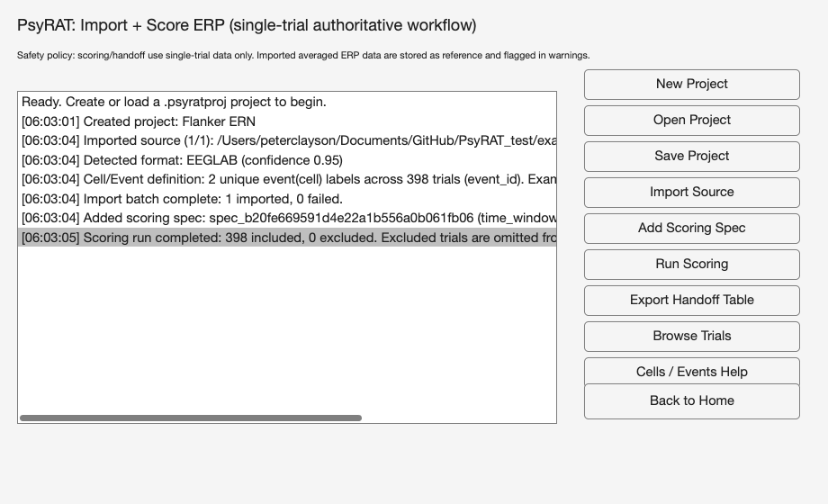

# 8. Importing and scoring ERP data

Everything in [Chapter 7](07_processing.md) starts from a long-format table of
single-trial scores. Some readers arrive with epoched ERP files and no table at
all. For them the toolbox will read those files, measure a component on every
trial, and hand back a table the processing workflow accepts.

## 8.1 When to use this workflow

If your single-trial scores are already in a spreadsheet, you do not need this
chapter at all. [Chapter 6](06_preparing-data.md) describes the columns PsyRAT
expects, and [Chapter 7](07_processing.md) walks the processing screens. Bring
your own table whenever you have one. Most labs already score components in
EEGLAB, ERPLAB, or a local script, and there is no advantage to re-measuring
the same waveforms here.

Use the import workflow when the scores do not exist yet. You have epoched
single-trial files, you know the component window and the channels, and you
would rather not write the export loop yourself. The workflow reads the
waveforms, applies one measurement rule to every trial, and builds the table
for you.

The workflow does not replace preprocessing. Filtering, re-referencing,
artifact rejection, epoching, and baseline correction all happen upstream in
your usual pipeline. Single trials that arrive here are assumed to be already
baseline-adjusted, and the scorer performs no baseline correction of its own.
(There is deliberately no baseline field on the scoring form. If your epochs
are not baseline-corrected, correct them before importing, or the amplitudes
you get will carry whatever offset the raw epoch had.) Artifact rejection has
to be carried out, not only marked: the importer reads every epoch in a file
and scores all of them, and it does not read EEGLAB's rejection marks
(`EEG.reject`) or ERPLAB's artifact flags, so an epoch that was flagged but not
removed is scored and enters the reliability estimate. Remove rejected epochs
from the dataset before importing.

### Projects

Work in this screen lives in a project, saved as a `.psyratproj` file. A
project holds the imported sources (recorded by path and content hash), the
canonical single-trial data assembled from them, the trial metadata table, your
scoring specifications, every scoring run's per-trial results, and an audit log
of what happened and when. Saving and reopening a project resumes an import
session where you left it.

Three buttons manage that file. New Project opens a one-field dialog (Project
name:) and creates an empty project in memory, with nothing on disk yet. Open
Project browses for an existing `.psyratproj` file, validates its structure,
and refuses a file whose schema major version does not match this build. Save
Project writes the current state, prompting for a location the first time and
overwriting the same file after that.

Project files are large. The canonical single-trial array holds every imported
trial at every channel and sample, and it is saved along with everything else,
so a project covering a full study is measured in gigabytes rather than
megabytes. Save it somewhere with room.

### Opening the screen

From the PsyRAT home screen, click Import + Score ERP. The window that opens
is titled PsyRAT: Import + Score ERP.



The heading reads PsyRAT: Import + Score ERP (single-trial authoritative
workflow), and one line under it states the safety policy that governs the
whole screen (Section 8.2). The large listbox on the left is the status log.
Every action appends a timestamped line, newest at the bottom, and the box
scrolls to the newest line on its own. Read it after every click; it is where
the toolbox reports what it detected, what it warned about, and what it
counted.

The buttons on the right run the workflow from top to bottom:

- New Project: create an empty project in memory.
- Open Project: load an existing `.psyratproj` file.
- Save Project: write the current project to disk.
- Import Source: read one or more ERP source files into the project.
- Add Scoring Spec: define a measurement method and its parameters.
- Run Scoring: score every included trial with the selected spec.
- Export Handoff Table: build the process-data table and send it to the
  workspace.
- Browse Trials: open the Trial Browser on the imported single trials.
- Cells / Events Help: explain how event (cell) labels were assigned.
- Back to Home: close this screen and return to the home screen.

Save Project, Import Source, Add Scoring Spec, Run Scoring, Export Handoff
Table, and Browse Trials all report the same error when no project is loaded,
naming New Project or Open Project as the fix. Create the project first.

## 8.2 What the toolbox reads

### The safety policy

The line under the heading states the rule the rest of the screen follows:

> Safety policy: scoring/handoff use single-trial data only. Imported averaged
> ERP data are stored as reference and flagged in warnings.

That is the whole policy, and it is enforced in code rather than by
convention. Averaged waveforms are kept in the project as reference data and
flagged, and the scoring routine refuses to run at all when a project holds no
single-trial data. Generalizability theory partitions variance across trials.
An average has already spent the trial variance, so there is nothing left to
partition.

### The three adapters

Three readers are registered, and the file extension decides which one runs.

EEGLAB `.set` is the format that supports the full workflow. A dataset whose
data array is three-dimensional with more than one epoch is read as
single-trial data: trials, channels, and samples, with the time axis taken from
`EEG.times` (or reconstructed from `EEG.srate` and `EEG.xmin` when `times` is
absent) and channel labels taken from `EEG.chanlocs`. A `.set` file that was
never epoched, or that holds a single epoch, contributes averaged reference
data instead and warns that it cannot be used for scoring or handoff. Reading
a `.set` requires EEGLAB on the MATLAB path; without `pop_loadset` the import
stops with a message saying so.

ERPLAB `.erp` is always reference-only. An ERPset stores bin-averaged
waveforms (channel by sample by bin), not single trials, so the adapter
imports it as averaged data with a warning and the scoring pipeline then
refuses it. This is not a limitation the toolbox can work around. If you need
single-trial scores from an ERPLAB pipeline, import the epoched `.set` the
ERPset was averaged from.

EP Toolkit `.mat` and `.ept` files are read from the `EPdata` struct (or from
the first struct in the file carrying a `data` field alongside `chanNames` or
`timeNames`). The file is treated as single-trial when its `dataType` field
says `single_trial`, and otherwise whenever it holds more than one
wave-by-participant slice. That second condition is a heuristic, so check the
trial count reported in the status log against what you expect. Extra factor,
reliability, or frequency dimensions are not read; only the first slice of each
is used, and a warning says so.

### Detection, confidence, and alternates

Selecting the Import Source button will bring up a file dialog titled Import
ERP Source(s), filtered to Supported ERP Sources (*.set, *.erp, *.mat, *.ept),
with multi-select enabled. Once you choose files, every registered adapter is
asked how well it recognizes each one. The results are sorted by confidence,
the winner reads the file, and the rest are kept as alternates in the import
report.

Confidence is driven by the extension and, for `.mat` and `.ept` files, by the
variables inside. A `.set` scores .95 for EEGLAB and a `.erp` scores .95 for
ERPLAB. A file containing a variable named `EPdata` scores .98 for the EP
reader, other variable names suggesting EP content score .45, and a generic
`.mat` file scores .15 (.05 when its variable list cannot be read at all). The
status log prints the winner in the form
`Detected format: EEGLAB (confidence 0.95)`. Import stops with an
unsupported-format error only when no adapter scores above zero.

That floor of .15 has a consequence worth knowing. Since the EEGLAB and ERPLAB
adapters both score zero on a `.mat` file, any `.mat` you select is routed to
the EP reader, even one that has nothing to do with EP Toolkit. It will fail
there with a message about not locating an EP Toolkit-like struct, which is
correct but arrives one step later than you might expect.

### Merging several files

Import Source accepts several files at once, and you can also click it
repeatedly to add more sources to the same project. Each file is imported in
turn and merged into one canonical single-trial store, which is what makes a
multi-participant dataset possible. A merge is refused unless the incoming
file matches the existing data on time axis, sampling rate, and channel labels.

A file that fails is reported and skipped rather than aborting the batch. The
log ends with a line counting successes and failures, and adds a note naming a
time-axis, sampling-rate, or channel mismatch as the usual cause. A skipped
file leaves the project exactly as it was, so nothing partial is carried
forward.

### Where the trial metadata come from

Each imported trial carries metadata that later becomes the facet structure of
your table. From an EEGLAB source, `subject_id` comes from `EEG.subject`, and
falls back to the file name without its extension when that field is empty.
`group_id` comes from `EEG.group` and `occasion_id` from `EEG.session`, both
empty when absent.

The event (cell) label is the time-locking event of each epoch, resolved as the
event whose latency is closest to zero rather than the first event listed. That
distinction matters whenever an epoch captures more than one event, for example
a preceding stimulus or a response falling inside the baseline. Taking the
first listed event in that case assigns the wrong condition to the trial and
feeds the wrong label into the event facet of every downstream estimate. When
an epoch holds several events and no usable latency list, the first event is
used and the affected epochs are counted in a warning telling you to verify the
labels.

From an EP Toolkit source, `subject_id` comes from `subNames` and the event
(cell) label from `cellNames`; no group or occasion is assigned. After each
import batch the status log summarizes what it found, counting the unique event
(cell) labels across all trials and previewing up to five of them.

## 8.3 The seven scoring methods

Add Scoring Spec asks for the method first, in a picker whose prompt reads
Select scoring method:. The seven entries appear in this order.

**absolute_peak_amplitude.** The amplitude of the largest deflection anywhere
in the window (the maximum for positive polarity, the minimum for negative, the
largest absolute value for both). Use it when the component is a sharp,
reliably present peak and you want peak amplitude rather than mean amplitude.

**local_peak_amplitude.** The most extreme sample in the window (largest for
positive polarity, smallest for negative, largest in absolute value for both)
that is also an extremum relative to a fixed number of neighboring samples on
each side. Use it when a plain peak search would be captured by monotone drift
toward the edge of the window; a trial with no qualifying local peak is
excluded rather than scored.

**time_window_mean_amplitude.** The mean amplitude across the window. Use it as
the default for single-trial amplitude, since a mean over a window is far less
sensitive to single-trial noise than a peak is, and its statistical behavior is
better understood.

**peak_latency.** The latency of the window extremum, located exactly as
absolute_peak_amplitude locates it. The score itself is the latency in
milliseconds, so a table exported from this method holds latencies in `meas`,
not amplitudes.

**centroid_latency.** The amplitude-weighted mean latency of the window, with
weights taken from the positive part, the negative part, or the absolute value.
It is nonstandard for ERP component timing, and I would reach for
fractional_area_latency instead for anything you plan to publish; it is kept
because the weighted centroid is occasionally the quantity someone wants.

**fractional_area_latency.** The latency at which the cumulative area of the
polarity-selected waveform reaches a specified fraction of the total window
area, interpolated between samples. At the default fraction of .5 this is the
conventional 50% area latency, and it is the timing measure to prefer. Set
polarity to the component's own polarity; `both` rectifies the waveform and
mixes lobes across a zero crossing.

**integrated_area_amplitude.** The time integral of the polarity-selected
waveform over the window, in microvolt-milliseconds. Use it when you want area
rather than mean amplitude, and remember that it is sensitive to the baseline
your epochs already carry.

### The parameter form

Choosing a method opens a form titled Scoring Spec. Five fields are always
present, in this order:

- Spec name: a label for this measurement, shown wherever specs are listed.
- Window start (ms): the earliest sample included, in milliseconds.
- Window end (ms): the latest sample included, in milliseconds.
- Channel selector (index/label; comma-separated ROI allowed): one channel or
  several.
- Polarity (positive/negative/both): which direction of deflection counts.

Three methods add one field each. local_peak_amplitude adds Neighborhood
samples (local peak), defaulting to 3, which sets how many samples on each side
a candidate must beat; a window holding fewer than twice that many samples plus
one can contain no local peak at all, and every trial is then excluded.
centroid_latency adds Centroid weight mode
(positive_only/negative_only/absolute), defaulting to absolute.
fractional_area_latency adds Area fraction (0-1; fractional area latency),
defaulting to 0.5.

The channel selector takes numeric indices or channel labels, separated by
commas. A single entry such as `FCz` or `1` scores that channel. Several
entries such as `FCz,Cz,Fz` define a region of interest, and each channel is
scored separately before the per-channel scores are averaged into the trial's
score (latencies are averaged the same way). A label that matches no channel in
the data stops the scoring run with an error naming the label, so check your
spelling against the labels the file actually carries.

One consequence of the region-of-interest rule deserves its own paragraph.
Consider this example: you score a three-channel region of interest with
local_peak_amplitude, and on one trial two channels find a local peak while the
third does not. That trial is excluded entirely rather than scored from the two
surviving channels. Averaging a different subset of channels on different
trials would let the spatial sampling vary trial to trial, which adds nuisance
variance to exactly the quantity being estimated. The exclusion reason names
each failing channel.

Windows are checked strictly. A window extending past either end of the
available time axis stops the run with a message printing both the requested
window and the axis. Ties within a window resolve to the earliest sample. When
absolute_peak_amplitude or peak_latency places the extremum on the first or
last sample of the window, a warning counts the affected trials and suggests
the window is too narrow, which is usually right (the other peak and latency
methods do not emit this warning). That warning goes to the MATLAB Command
Window, not to the status log, so look there after a peak-based run.

Polarity has no effect on time_window_mean_amplitude. The mean is taken over
the signed samples in the window whatever you enter in that field, so a
negative-going component scored this way returns a negative number, as it
should. The field is still on the form because the form is shared.

## 8.4 A worked walkthrough

Follow this walkthrough with any epoched single-trial `.set` of your own. The
capture behind it imports one epoched EEGLAB `.set` file of response-locked ERP
data recorded during a flanker task, scores ERN as the mean amplitude from 0 to
100 ms at a frontocentral channel, and inspects the result trial by trial. That
file is not distributed with the toolbox, so substitute your own window and
channel. The clicks are the same either way.

**1. Open the screen.** From the home screen click Import + Score ERP.

**2. Create the project.** Click New Project. A dialog titled New PsyRAT
Project asks for Project name:, prefilled with Untitled PsyRAT ERP Project.
Type a name you will recognize later and click OK. The status log reports
`Created project: <your name>`. Nothing is on disk yet.

**3. Import the file.** Click Import Source, then choose your `.set` file in
the Import ERP Source(s) dialog. The log then records the file that was
imported and its position in the batch, the detected format and its confidence
(`Detected format: EEGLAB (confidence 0.95)`), any warnings the adapter raised,
a summary of the event (cell) labels found, and a closing count of imports and
failures. In the capture shown above the file yielded 398 trials carrying 2
unique event (cell) labels, with one file imported and none failed.

Check the event labels in that summary before going on. They become the event
facet, and a label that looks wrong here will look exactly as wrong three
screens later.

**4. Define the spec.** Click Add Scoring Spec. The picker titled Select
scoring method: lists the seven methods; select time_window_mean_amplitude
(third in the list) and click OK. The Scoring Spec form then opens with five
fields. Fill them in as:

- Spec name: `ERN`
- Window start (ms): `0`
- Window end (ms): `100`
- Channel selector (index/label; comma-separated ROI allowed): `FCz`
- Polarity (positive/negative/both): `negative`

Click OK. The log reports `Added scoring spec:` followed by the generated spec
id (a `spec_` prefix and a hexadecimal token) and the method name. If your
montage labels the frontocentral site differently, enter that label instead;
the selector is matched against the channel labels in the file, case
insensitively.

**5. Run the scoring.** Click Run Scoring. With one spec defined there is no
picker, and the spec runs directly. The log reports the run as

```
Scoring run completed: N included, M excluded. Excluded trials are omitted from final handoff dataset.
```

The capture shows 398 included and 0 excluded. Time-window mean amplitude
excludes a trial only when the window holds no finite samples, so a nonzero exclusion count here points at bad epochs rather
than at a bad window.

**6. Inspect trials.** Click Browse Trials.


The axes plot the current trial in microvolts against time in milliseconds, and
the title names the trial, the channels being drawn, and the active spec. When
the spec selects one channel you see that channel alone; when it selects
several you see each channel in its own color with their mean overplotted in
black. The shaded band marks the scoring window, which is the fastest way to
confirm that the window you typed sits where you meant it to.

Check the channels named in the title. A channel label that matches nothing in
the data falls back to the first channel here without complaint, so an
unexpected channel in the title means the label in your spec did not match.
(Run Scoring is stricter and stops with an error naming the label, which is why
you are unlikely to see this after a successful run.)

Four controls move between trials. Trial # is an edit box: type a number, press
Enter, and the browser jumps there (out-of-range numbers clamp to the ends).
Prev and Next step one trial. The slider under them drags through the whole
set, one trial per arrow click and up to fifty per page click. The arrow keys
step too: right and down move forward, left and up move back.

Three text lines sit under the axes. The first repeats the trial position as
`Trial 1 of N`. The second gives the metadata in the form

```
subject=<subject_id> | event(cell)=<event_id> | occasion=<occasion_id> | group=<group_id> | uid=<trial_uid>
```

An empty field prints its label with nothing after it, which is what you will
see for occasion and group in a single-session import. A third line reports the
score: `Score: value=<v> | status=ok` for a method with no latency, `Score:
value=<v> | latency=<t> ms | status=ok` when a latency was measured, and
`Score: EXCLUDED | status=failed | reason=<why>` for a trial that failed. For
the first trial of the capture that line reads `Score: value=3.41604 |
status=ok`.

The browser takes a snapshot of the project when it opens. Scores computed
after that do not appear in an already-open browser, so run the scoring first,
and close and reopen the browser after any re-scoring. This failure is silent:
an open browser keeps showing the scores from the run that was current when it
opened, with nothing to mark them as stale. (Before any scoring run at all,
every trial instead reads `Score: not available (run scoring to see
trial-level results). [trial index N]`.)

**7. Export and save.** Click Export Handoff Table, then Save Project. Success!
The project on disk now contains the imported waveforms, the ERN spec, the
per-trial scores, and the audit trail, and the workspace contains a table ready
for [Chapter 7](07_processing.md).

## 8.5 Export Handoff Table

Export Handoff Table converts the scored trials into the long-format table
[Chapter 6](06_preparing-data.md) specifies. If the project holds more than one
spec, a picker whose prompt reads Select scoring spec to export: appears with
the active spec preselected; with one spec it exports that spec without asking.

Only the most recent run of the chosen spec is exported, regardless of which
spec you scored last. Re-running a spec marks its earlier results stale, and
stale rows are dropped here. Within that run, a trial reaches the table only
when its status is `ok` and it was not excluded, so every trial that failed to
score is left out and counted.

### What lands in the workspace

Two variables are assigned in the base workspace:

- `psyrat_import_proc_table`: the process-data table itself.
- `psyrat_import_handoff_meta`: the accompanying metadata.

The metadata record the project, spec, and run identifiers, the UTC timestamp,
the number of input, included, and excluded trials, a tally of exclusion reasons
with their counts, and the full preflight report. The status log prints the
included and excluded counts and then the name of the table variable. It does
not print the metadata variable name, and it does not print preflight warnings;
those live in `psyrat_import_handoff_meta.preflight.warnings` and are worth
reading, because that is where a warning about too few participants or thin
trial counts will be sitting.

### The column mapping

The table is built with these columns, in this order:

| Column | Source | Present when |
|---|---|---|
| `id` | `subject_id` from the trial table | always |
| `meas` | the scored value for the trial | always |
| `group` | `group_id` | any trial has a nonempty `group_id` |
| `event` | `event_id`, the event (cell) label | any trial has a nonempty `event_id` |
| `time` | `occasion_id` | any trial has a nonempty `occasion_id` |

`id`, `group`, `event`, and `time` are text; `meas` is numeric. A facet column
whose values are empty on every trial is left out entirely rather than shipped
as a column of blanks, which is why a single-session import with no group
information produces a three-column table (`id`, `meas`, `event`). That is the
correct shape for a one-facet design.

Three guards run before the table is returned. Scores computed from data that
no longer match the project's canonical single-trial store are refused, with a
message telling you to recompute. A table in which every trial was excluded is
refused rather than returned empty. Any non-finite or missing value in `meas`
is refused, since PsyRAT requires complete measurements. The table then goes
through the same preflight validation the processing workflow uses, and a
blocking error there stops the export with that error's own message.

Note what the table does not contain. There is no items-per-split (`n_i`)
column, so the data-splits analyses in [Chapter 13](13_tutorial-splits.md) need
a table you build yourself. There is also nothing in the export that groups
trials, so if your design has a group facet it has to come from the source
files (`EEG.group`), not from this screen.

### Continuing into Process New Data

Process New Data reads a data file rather than a workspace variable, so write
the table out first:

```matlab
writetable(psyrat_import_proc_table, '/path/to/ern_scores.csv')
```

Then return to the home screen (Back to Home), click Process New Data, and
select that file. From there [Chapter 7](07_processing.md) takes over: you
assign the columns, choose the analysis, and set the estimation preferences.

If you would rather stay in code, `psyrat_run` accepts the table directly, with
no intermediate file:

```matlab
psyrat_data = psyrat_run('data', psyrat_import_proc_table, ...
    'savepath', '/path/with_no_spaces', 'savename', 'ern_study.psyrat');
```

[Chapter 14](14_scripting.md) covers the rest of the arguments.

### Cells / Events Help

The Cells / Events Help button opens a reference panel explaining where event
(cell) labels come from, since that is the field people most often need to
check. It states that `event(cell)` is the trial-level condition label stored
in the canonical trial table's `event_id`; that EEGLAB imports take it from the
time-locking event of each epoch (falling back to the first listed event when
no latency is available); that EP Toolkit imports take it from the EP cell
names; and that ERPLAB `.erp` imports are averaged and reference-only, with no
single-trial event cells to score. It closes by listing the handoff mapping
(`subject_id` to `id`, `event_id` to `event`, `occasion_id` to `time`,
`group_id` to `group`) and restating the safety policy.

### Limits

Scoring operates on single-trial data, and only on single-trial data. Averaged
ERP input, which is every `.erp` file plus any `.set` or EP file the adapter
reads as averaged, is stored for reference and flagged, and Run Scoring refuses
a project that holds nothing else. Browse Trials refuses it too, naming a
single-trial import as the fix. One nuance about the flag: every single-trial
import also stores a derived average for reference, so the averaged-data
notice appears on ordinary imports as well; on its own it is not a sign that
scoring will be refused.

Two smaller limits follow from how sources are merged. Files must agree on time
axis, sampling rate, and channel labels to join one project, so datasets
epoched with different windows have to be re-epoched before they can be
analyzed together. And because `subject_id` falls back to the file name, a
batch of `.set` files without an `EEG.subject` field will be identified by
their file names, which is fine as long as the file names are unique and
meaningful. Occasions have the same shape without the fallback: `occasion_id`
comes from `EEG.session`, and when that field is empty every file lands in one
occasion, so two sessions imported from files without `EEG.session` produce a
single-occasion table and a single-session analysis rather than a test-retest
one. Set `EEG.session` before importing when you intend a test-retest design.
One file gives you one participant, and one participant is not a
reliability study; import every participant's file into the same project before
exporting. If an import or a scoring run fails,
[Chapter 18](18_troubleshooting.md) lists the messages by symptom.
