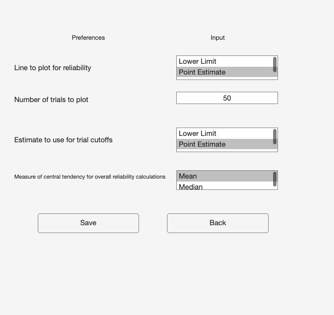
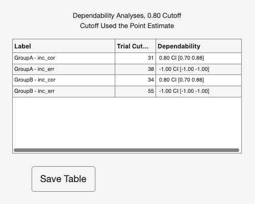
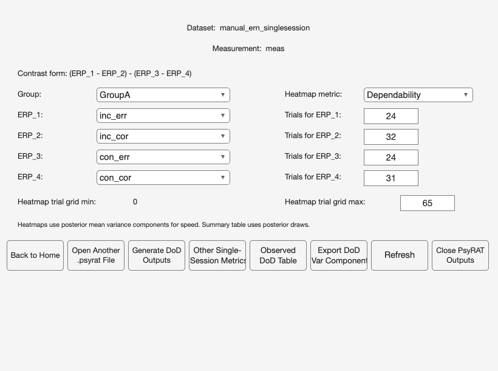
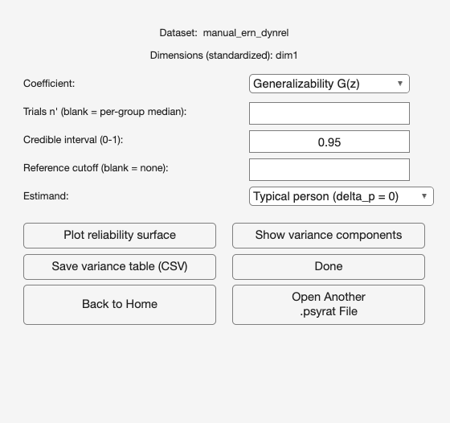
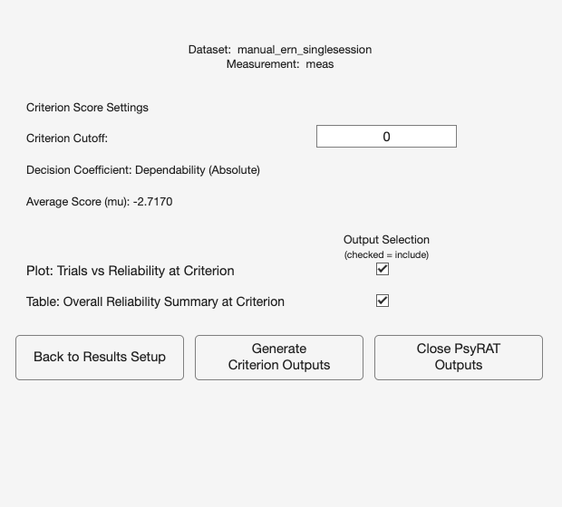
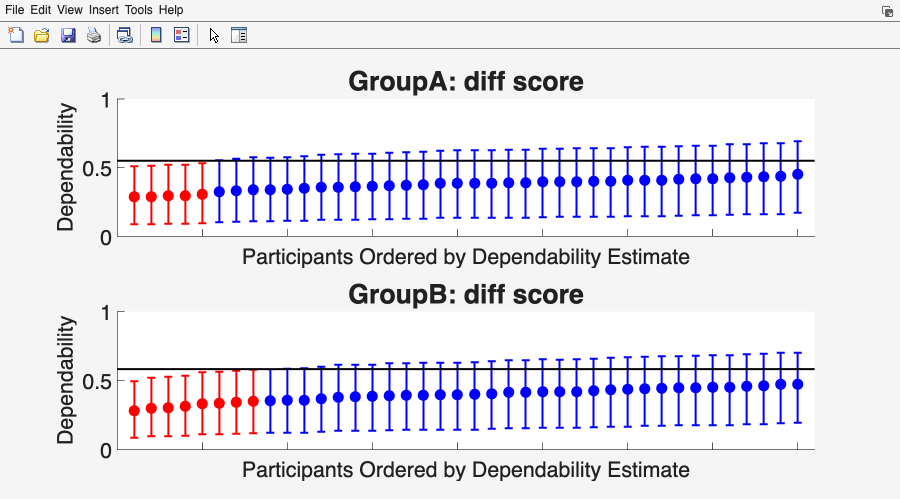
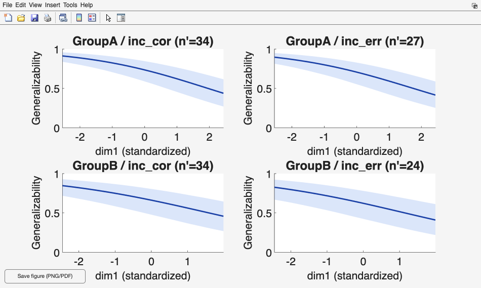
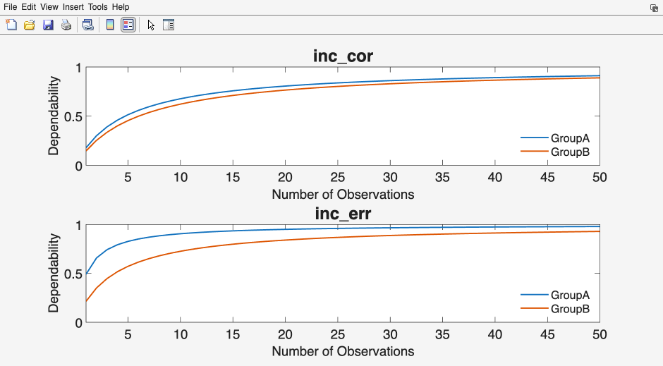

# 9. Viewing results

Estimation leaves you with a single `.psyrat` file. Everything in this chapter
reads that file back and turns it into figures and tables. Nothing here
re-estimates anything. You can reopen the same results file as often as you
like, try a different reliability threshold, save a table, and close the windows
again without disturbing the fit.

If you have not run an analysis yet, [Chapter 7](07_processing.md) covers
processing, and [Chapter 2](02_quick-start.md) walks the shortest path from raw
data to a first set of results.

## 9.1 What every viewer has in common

### Opening a results file

Selecting View Results on the home screen brings up a file picker titled Data,
filtered to PsyRAT Toolbox files (\*.psyrat). Choose the file you want. If you
cancel the picker instead, the toolbox reopens the home screen and shows a File
Error dialog saying that no PsyRAT results file was selected. That is a
notification, not a failure, and clicking View Results again picks up where you
left off.

Loading prints a short `Loading Data...` line in the MATLAB Command Window,
then opens one of five setup screens.

### Which viewer opens, and why you do not choose it

The results file records the design that produced it, and the toolbox routes on
that record. Five viewers exist, one per analysis family:

- Single-session (one-facet) results open View Results Setup.
- Test-retest (two-facet) results open View Results Setup, with extra controls.
- Difference-of-differences results open DoD Reliability Setup.
- Dynamic reliability results open Dynamic Reliability: View Results.
- Nonparallel data-splits results open Data-Splits Reliability: View Results.

The routing is not a preference and no control overrides it. A difference-score
result opens the single-session viewer because a difference score in a single
session is a one-facet design, not because anything guessed. If a results file
carries a design label the toolbox does not recognize, no viewer opens at all
and you are returned to a bare prompt, which happens only with a file written
by a different version or edited by hand. One route does cross families on
purpose: the DoD viewer can build a single-event or two-event view out of a DoD
model and hand it to the single-session viewer ([section
9.4](#94-difference-of-differences-results)).

Parallel data splits are a separate case. They reuse the single-session and
test-retest viewers, with every trial-labeled control relabeled to split (Plot:
Splits vs Reliability, Table: Split Cutoffs at Reliability Threshold, and so
on). Only nonparallel splits get their own viewer.
[Chapter 13](13_tutorial-splits.md) explains the difference between the two.

### Two notices that may appear before the viewer does

Some results files raise a warning dialog on open. Dismiss it and the viewer
opens.

The first is titled Native estimation engine. It appears when the fit came from
a native MATLAB engine rather than CmdStan, and its wording depends on which
one. A native HMC fit is described as genuine Bayesian posterior draws that are
not bit-identical to a CmdStan run. A native `fitlme` fit is described more
sharply, because its intervals are approximate frequentist intervals rather than
Bayesian credible intervals. Both notices tell you to re-run with CmdStan for a
definitive analysis, and I would take that literally. Use the native engines to
get a pipeline working. Report from CmdStan.

The second is titled Estimation diagnostics. It appears when the run recorded a
convergence failure, one or more divergent transitions, or both, and it names
which. Non-convergence means at least one measurement failed the R-hat and
effective-sample-size criteria. Divergences are reported independently of that
verdict, because sampling can diverge on a fit whose R-hat looks fine. In both
cases the fix is another run with more warmup and sampling iterations, and
sometimes stronger priors. [Chapter 18](18_troubleshooting.md) covers the
diagnostics.

Both notices block. The toolbox waits for the click before it draws the viewer,
which is deliberate: a non-blocking warning would be covered by the setup screen
a fraction of a second later and never read. The side effect is that MATLAB can
look hung while a notice waits, especially if the dialog opened behind another
window. If the toolbox appears frozen just after you selected a `.psyrat` file,
look for a warning dialog before you reach for ctrl+c.

Neither notice appears for a clean CmdStan run, and neither appears for results
saved before these fields existed. Silence on open means there was nothing to
flag, not that nothing was checked.

### View Preferences

The Output Prefs button on the single-session and test-retest screens opens
View Preferences. Four rows, then Save and Back:

- Line to plot for reliability: which of the three posterior summaries is drawn
  as the curve in the reliability-versus-trials figure. The choices are Lower
  Limit, Point Estimate, and Upper Limit.
- Number of trials to plot: how far the x-axis of that figure extends.
- Estimate to use for trial cutoffs: which posterior summary is compared
  against the Reliability Cutoff when the toolbox searches for the trial count
  that meets your threshold. Same three choices.
- Measure of central tendency for overall reliability calculations: Mean or
  Median.

The defaults are Point Estimate, 50, Point Estimate, and Mean. The cutoff
estimate is the one to think about. Choosing Lower Limit there is the
conservative reading, since it requires the whole credible interval to clear
your threshold, and it will generally demand more trials than the point estimate
does. That is a defensible choice and I use it when a decision hangs on the
result. It is also a different estimand, so say in your methods which one you
used. Fifty trials, meanwhile, is a plotting range and not a claim about your
data. If your task delivers 200 usable trials, raise it, or the curve will stop
before it reaches the part you care about.

To save the preferences click Save. To leave them as they were click Back.
Either way you land back on the setup screen. Entering fewer than two trials to
plot raises a dialog titled Invalid plot trial count and keeps you here, because
a one-point curve is not a curve.

### Table windows and what a saved table carries

Every table the single-session, test-retest, criterion, and DoD viewers draw
opens in its own window with a Save Table button at the bottom. Clicking it
opens a save dialog offering Excel File (.xlsx) and Comma-Separated Value File
(.csv); both write on every platform. (The dynamic-reliability and data-splits
table windows carry no Save button of their own; you export those tables from
the Save buttons on their setup screens.)

Above the table itself, a saved file carries a header block. The table-specific
part records when the table was generated, the toolbox version, the dataset file
name, the reliability cutoff you set (to four decimal places, since the cutoff
is an input you may need to reproduce exactly), and which posterior summary the
cutoff was applied to.

Under that comes a standard provenance block, written by the same routine for
every export. It records the estimation seed, the analysis design label, the
estimation engine, whether the priors were the toolbox defaults or customized,
the convergence verdict, and the divergent-transition count. Designs that need
more get more: a test-retest export names which of the three coefficients
produced the numbers, a non-Gaussian likelihood is labeled, and the designs with
unusual estimands carry a sentence saying so. Anything the file does not record
is written as "not recorded" or "not assessed" rather than guessed, so an old
results file still exports and its header is never fabricated.

The block exists so a saved table can be interpreted a year later without the
session that produced it. Keep the header when you circulate a table. Stripping
it leaves a column of coefficients with no design attached.

### Save IDs, and what it decides for you

The overall summary window (titled Dependability Analyses or Generalizability
Analyses after the coefficient you selected, with Including All Trials and the
occasion estimand appended on the test-retest viewer) carries a second button,
Save IDs, next to Save Table. It writes two columns, Good IDs and Bad IDs, listing the participants
whose data met your reliability threshold and those whose data did not. The
same file formats are offered.

Two behaviors are worth knowing before you use that list.

The first is the all-events inclusion rule. When a group has more than one
event, a participant reaches the Good IDs column only by meeting the threshold
in every event. Falling short in one event is enough to move that participant
into Bad IDs for the whole group, even where their data in the other events
were fine. The rule has no exceptions: an event in which no participant clears
the threshold empties the group's Good IDs entirely. Whenever an event empties
a group this way, on any design, the console prints a line, the affected
group's n Included reads 0, and the summary still opens, so the per-event rows
stay available for diagnosis. Group-level difference coefficients keep
rendering whenever a group ends up retaining nobody, whether through this
rule or, on the difference routes, through the difference-score threshold
itself; the coefficient is then evaluated at the full sample's mean (or
median, per the central-tendency choice) trial counts. The per-event rows of a
group that retained nobody are rendered the same way: their coefficient and
trial-count columns describe the full sample, printed beside an n Included of
0, so read them as diagnostics rather than as the retained sample's
reliability. The test-retest
difference route uses the full sample's counts at every retention level.

Consider this example: a flanker analysis with error and correct trials, where
a participant has 90 correct trials and 4 errors. The correct
condition clears the threshold comfortably and the error condition does not, so
the participant appears once, in Bad IDs. That is the right default for an
analysis that uses both conditions, including any difference between them. It
is the wrong default if you meant to screen each condition on its own, and the
per-event lists are not what Save IDs writes.

The second is the -1 sentinel, which you will meet in the trial-cutoff table
(the window titled Results of Increasing the Number of Trials on Dependability)
rather than in the ID file. When no trial count anywhere in the projected range
reaches your threshold, the toolbox stores -1 for that cell's trial cutoff and
for the reliability point estimate and interval at the cutoff. A value of -1
indicates that an appropriate cutoff could not be realistically found given the
specified reliability threshold. It is a flag, not a count, and averaging it
into anything produces nonsense. When it appears, every participant in that
group is placed in Bad IDs, since no attainable trial count qualified anyone.
You will also see a dialog titled Cutoff not calculable saying the data are too
variable or there are not enough trials. Lower the threshold, or accept that
these scores do not support the decision you wanted to make with them.

A related dialog, Extrapolation beyond data, means the opposite problem: a
cutoff was found, but only past the largest trial count anyone actually has.
The number is an extrapolation from the model, and treating it as an observed
result overstates what the data show.

Note one asymmetry. Save Table writes the full provenance block. Save IDs
writes the shorter header (generation date, version, dataset, cutoff, cutoff
estimate, and the iteration line) without it. If you archive an ID list, archive
the summary table alongside it.

## 9.2 Single-session results

The one-facet viewer is titled View Results Setup. Its top rows are read-only:
Dataset, Measurement, and, when the analysis is not a difference score and
covers exactly one event, Cell/Event.

Two settings sit above the checkboxes.

- Reliability Cutoff: the reliability threshold used to retain data.
  Participants without enough trials to meet it are recommended for exclusion.
  The default is .8.
- G-Theory Coefficient: which coefficient the outputs report. Dependability
  uses absolute error variance, generalizability uses relative error variance.

The .8 default is conventional rather than derived, and I would not defend it as
a universal standard. Pick the threshold your decision needs and state it.

The coefficient control changes with the design. On a plain one-facet run and on
a subject-level run the label reads G-Theory Coefficient; on a subject-level run
its tooltip names the absolute coefficient phi_s and the relative coefficient
G_s, which is the same distinction at the participant level. On either
difference-score analysis the label instead reads Difference-Score Coefficient,
and the choice governs the difference score. Only one coefficient control is
shown at a time, and it is the one the summary actually consumes.

Below the Output Selection heading (marked "(checked = include)") sit six
checkboxes, all on by default:

- Plot: Trials vs Reliability
- Plot: ICC Estimates
- Plot: Between-Person Standard Deviations
- Table: Trial Cutoffs at Reliability Threshold
- Table: Overall Reliability Summary
- Table: Sources of Variance

Table: Sources of Variance is the one that carries the within-person terms. It
reports between- and within-person standard deviations, standard errors of
measurement, and ICCs in one window. The between-person standard deviations also
get their own figure; the within-person ones do not.

Three of those labels change on a subject-level run. Plot: Trials vs
Reliability becomes Plot: Subject-Level Reliability, Plot: ICC Estimates becomes
Plot: Subject-Level ICC Estimates, and Table: Trial Cutoffs at Reliability
Threshold becomes Table: Subject-Level Reliability. The change is not cosmetic.
A subject-level analysis estimates a per-participant residual, so a curve
projecting the group's reliability over trial counts is not a quantity it
produced, and the toolbox offers the per-participant outputs instead. On split
data every "Trials" in these labels reads "Splits".

One route keeps the table as well. On the subject-level difference-score
analysis the trial-cutoff table still opens alongside the subject-level
outputs, and this screen offers no control over it: the relabeled checkbox
governs the subject-level table instead, so the table appears whenever
results are viewed here. Its contents there are observed quantities rather
than projections: the per-event rows report the smallest trial count among
the participants that event included at the threshold (or across everyone,
when that event included nobody) next to the group-level coefficient, and
the diff score row reports the observed-design difference coefficient with
a --- placeholder in its count column, because this analysis runs no
trial-cutoff search.

Six buttons run along the bottom:

- Back to Home
- Open Another .psyrat File
- Generate Figures/Tables
- Output Prefs
- Criterion Score Outputs
- Close PsyRAT Outputs

Generate Figures/Tables draws everything you checked, each in its own window.
Close PsyRAT Outputs closes those windows and leaves your own MATLAB figures
alone, which matters after the fourth or fifth pass through different settings.

Criterion Score Outputs is the one button that is not always there. It appears
only for a plain one-facet analysis whose estimated universe-score mean is
available. Subject-level analyses and one-facet difference scores do not show
it, and neither does a view built from a DoD model that parameterizes a per-cell
log mean instead of an observed-scale mean. When it is absent the row closes up
and shows five buttons, which is the suppression working rather than a rendering
fault. [Section 9.7](#97-criterion-score-outputs) covers the screen it opens.

Entering a reliability cutoff that is not numeric or not between 0 and 1 turns
on a red line under the box reading "Reliability cutoff must be numeric and
between 0 and 1 (inclusive)" and returns the cursor to the field. Nothing is
generated until you fix it.

## 9.3 Test-retest results

The two-facet viewer carries the same title, View Results Setup, and the same
Reliability Cutoff, G-Theory Coefficient, output checkboxes, and buttons. Read
[Section 9.2](#92-single-session-results) first. What follows is what
test-retest adds.

- Type of Reliability Coefficient: which coefficient to report. Equivalence is
  the internal-consistency coefficient, Stability is the test-retest
  coefficient, and Equivalence + Stability combines both. The default is
  Equivalence.
- Test-Retest Occasion Score: whether the reported coefficient describes a
  score from one occasion or a score averaged over several. The choices are
  Single-occasion (n'_o = 1) and Multi-occasion composite (n'_o = k).
- \# Occasions in Composite (k): how many occasions the composite averages.

The three coefficients are not near-neighbors, and on real data they can differ
by more than the gap between an acceptable result and an unusable one. Choose on
the basis of the score you actually intend to use, then name the choice in your
write-up. The exported provenance block records it, so a saved table is
unambiguous even when the manuscript is not.

The occasion control needs the same care. Single-occasion is the toolbox's
default estimand: the reliability of a score from one session, generalizing over
the occasion facet. Multi-occasion composite reports the reliability of a score
averaged across k occasions, which is a different quantity and almost always the
larger of the two. Use it when your analysis really does average across
sessions. Do not use it to make a single-session score look better than it is.

The k box is enabled only when Multi-occasion composite is selected, and greys
out again the moment you switch back. It defaults to the number of occasions in
your data. A blank, fractional, or negative entry falls back silently to that
observed count rather than erroring, so check what you typed if a composite
result looks unfamiliar.

Two-facet difference scores add a fourth control, Difference-Score Coefficient,
choosing dependability or generalizability for the difference itself. It is
independent of the per-condition G-Theory Coefficient above it.

The test-retest screen also adds two subject-level plot options and a
subject-level table (Plot: Subject-Level Reliability, Plot: Subject-Level ICC,
and Table: Subject-Level Reliability), inserted after Plot: ICC Estimates and
before Plot: Between-Person Standard Deviations, for nine checkboxes in all.

Subject-level test-retest data gate five of those outputs. On such a run, Plot:
Trials vs Reliability, Plot: ICC Estimates, Plot: Between-Person Standard
Deviations, Table: Trial Cutoffs at Reliability Threshold, and Table: Overall
Reliability Summary are unchecked and disabled, and hovering over any of them
shows the reason: "Not available for subject-level test-retest data: this design
estimates a per-participant residual, not the group-level reliability, ICC and
variance terms this output needs." The subject-level outputs stay on. They are
disabled rather than offered and then silently skipped, which is a distinction
you notice the first time a checkbox produces no window.

Criterion Score Outputs appears on the test-retest screen only for the plain
test-retest analysis. On subject-level test-retest data and on two-facet
difference-score data the button is not offered, because the cut score
computation needs group-level components those designs do not estimate; the
row closes up to five buttons, the same behavior the single-session viewer
shows for its subject-level and difference designs (Section 9.2).

## 9.4 Difference-of-differences results

DoD results open a screen titled DoD Reliability Setup, and it works differently
from the two above. There are no output checkboxes. Each button produces one
kind of output directly.

Under the dataset and measurement lines, the screen states the contrast form it
will build: (ERP_1 - ERP_2) - (ERP_3 - ERP_4). Everything else on the screen
fills in that expression.

- Group: which group the contrast is evaluated in. Shown as a popup when there
  is more than one group, and as the fixed text "Group: none" otherwise.
- Heatmap metric: Dependability or Generalizability, for the two heatmaps only.
- ERP_1 through ERP_4: four popups assigning one event to each slot of the
  contrast.
- Trials for ERP_1 through Trials for ERP_4: four boxes giving the trial count
  each slot is evaluated at.
- Heatmap trial grid min: fixed at 0 and shown for reference.
- Heatmap trial grid max: how far the two heatmap axes extend.

The four ERP popups default to the mapping you declared during processing when
the file records one, and the four trial boxes default to the rounded mean
recorded trial count for the selected group. Those trial defaults describe your
data, so they are a reasonable starting point, but they are editable because the
interesting question is usually what a different design would buy you.

The four slots must name four different events. Repeating one raises a dialog
titled DoD mapping requires four unique events. Trial counts and the grid
maximum must be whole numbers of at least 0, and the grid maximum must not
exceed 300, since the heatmaps evaluate the coefficient at every cell of a
square grid and a larger one takes long enough to feel broken.

A line above the buttons states a difference you should carry into your
reporting: heatmaps use posterior mean variance components for speed, and the
summary table uses posterior draws. The table gives you a coefficient with a
credible interval from the full posterior. The heatmaps give you a fast map of
point estimates evaluated at a single plug-in value of each variance component,
with no interval anywhere on them. Read a heatmap for shape and the table for
numbers. Quoting a heatmap cell as a point estimate with the table's interval
attached would be wrong.

Eight buttons run along the bottom:

- Back to Home
- Open Another .psyrat File
- Generate DoD Outputs
- Other Single-Session Metrics...
- Observed DoD Table
- Export DoD Var Components
- Refresh
- Close PsyRAT Outputs

Generate DoD Outputs opens one window titled DoD Reliability Outputs. It holds
the group, the contrast written out with your event names, the trial counts you
entered, the heatmap metric, a summary table of both coefficients with credible
intervals and ICCs, and the two heatmaps. The ICC columns are computed at a
single observation, which the window says on its face, so they do not move when
you change the entered trial counts. If any entered count is 0, a red line notes
that summary reliability is reported as 0 for that reason.

Observed DoD Table opens a window titled Observed Difference-of-Differences
Reliability, holding one row evaluated at the mean recorded trial counts rather
than at whatever you typed. It has its own Save Table button. Use it as the
description of the design you ran, and the main outputs as the description of
designs you might run.

Export DoD Var Components goes straight to a save dialog. No window opens
first. It writes the DoD contrast variance components with point estimates and
credible intervals, then the two coefficients and their ICCs, at the observed
mean trial counts.

Refresh rebuilds the screen from the current selections and resets the four
trial counts to the selected group's defaults, which is how you get the trial
defaults to follow a group change. The ERP mapping, the heatmap metric, and the
grid maximum are kept as selected.

Other Single-Session Metrics... opens a small window titled DoD: Other
Single-Session Metrics. It routes one group's DoD model into the standard
single-session outputs. Mode offers Single-event reliability or 2-event
difference reliability; Event 1 is always shown, and Event 2 appears only in
difference mode. Open Standard Output GUI builds the requested view and hands it
to the single-session viewer described in
[Section 9.2](#92-single-session-results). Two different events are required in
difference mode.

If any quantity that has to be a variance came out negative, a dialog titled
Coefficient is not interpretable as a reliability appears after the output is
drawn. Nothing was clipped or adjusted to produce the numbers on screen. The
dialog explains them. A coefficient reported under that warning is not a
reliability and should not be reported as one.

## 9.5 Dynamic reliability results

Dynamic reliability results open a screen titled Dynamic Reliability: View
Results. Under the dataset line it lists the standardized dimensions the surface
is drawn over. Like the DoD screen, it has no output checkboxes.

- Coefficient: Generalizability G(z) or Dependability D(z). The default is
  Generalizability G(z).
- Trials n' (blank = per-group median): the trial count the surface is
  evaluated at. Left blank, each stratum uses its own median.
- Credible interval (0-1): the interval width, defaulting to 0.95.
- Reference cutoff (blank = none): a reliability value to mark on the figure.
  Left blank, nothing is drawn.
- Estimand: Typical person (delta_p = 0) or Population average (lognormal).

I would keep the blank defaults on a first pass. A per-stratum median describes
each stratum's own data instead of imposing one count on all of them, and the
export header labels it as the default.

The Estimand control is enabled only for the non-difference variants. On every
difference variant it is greyed out, because the reported surface is the
typical-person reference and no population-average difference estimand is
computed. That disabled control is the toolbox declining to imply a quantity it
does not have.

Two-facet dynamic designs add two controls:

- Reliability coefficient: Equivalence (occasion fixed), Stability (trial
  fixed), or Equivalence + stability (both random). The default is the third.
- Occasions n': 1 occasion or Observed occasions. The default is 1 occasion.

Buttons come in pairs. Plot reliability surface draws the figure. Show variance
components opens a table of per-stratum components with credible bounds. Save
variance table (CSV) exports it. Done closes the viewer. Back to Home and Open
Another .psyrat File sit at the bottom. Subject-level variants add Show
per-participant table and Save per-participant table (CSV), giving each
participant's own coefficient at their own dimension value.

The save buttons say CSV, and both offer Excel file (\*.xlsx) first with CSV
second. The label is narrower than the behavior. Either format writes the same
header, naming the credible interval, the estimand, and the n' each stratum's
surface was evaluated at, with the n' line saying whether that came from your
override or from the per-stratum median default. That last line matters more
than it looks: without it, an override is invisible in the file.

Some designs disclose an extra line on screen, under the variance-components
table, and it belongs in any write-up of those results. A modular cut-posterior
run states that the copula residual correlation is estimated conditionally on
the retained margin draws with no copula feedback, so its intervals are not
full joint-posterior credible intervals. A nonconcurrent
difference-of-differences run states that the four constituents are treated as
if measured on distinct trials, with all six conditional residual covariances fixed to zero by
assumption, and that the result is neither a concurrent reliability nor a cut
posterior. Both notes point at the exported header for the full provenance.
Neither appears for designs it does not apply to.

The surface figure carries its own Save figure (PNG/PDF) button in the bottom
left corner. The button hides itself while the image is written, so it does not
appear in the saved file.

## 9.6 Data-splits results

Nonparallel data-splits results open a screen titled Data-Splits Reliability:
View Results. Under the dataset line sit two banners. The first names the
analysis unit and states that each score is the mean of n_i items. The second is
the caveat this design turns on:

> Dependability is exact; generalizability is a downward-biased lower bound.

That sentence is the toolbox's documented convention, and its reason is worth
understanding rather than memorizing. When the input is split means rather than
single trials, the only thing the model observes is the split-level score. The
item-level partition inside each split is gone, so the item main effect cannot be
separated from the residual and collapses into the split-level error term.
Absolute error already includes that item variance, so dependability is
unaffected and exact. Relative error is supposed to exclude it and here cannot,
so the relative error variance is too large and the generalizability coefficient
it produces is too small. The reported value is therefore a lower bound on the
true generalizability, and the relative SEM correspondingly an upper bound. The
generalizability-theory framework this rests on is developed in Rocha et al.
(2026); the bound statement is the toolbox's convention for reporting what a split-mean design can
and cannot identify.

The practical rule: quote dependability as an estimate and generalizability as a
bound, in those words. The column headers help, since the coefficients table
names its columns Dependability and Generalizability (lower bound), with SEM
(abs) and SEM (rel, upper bound) beside them.

Three settings:

- Credible interval (0-1): the interval width, defaulting to 0.95.
- Splits n' (blank = observed median): the number of splits per person the
  coefficients are reported at. Blank uses each stratum's observed median.
- Occasions n' (blank = observed): the number of occasions, shown only for the
  multi-occasion design.

Five buttons: Show coefficients, Show variance components, Save coefficients
(CSV), Save variance table (CSV), and Done. As on the dynamic screen, the save
dialogs offer Excel file (\*.xlsx) first and CSV second despite the labels.

There is no reliability-versus-trials plot here and no trial-cutoff table,
because there is no D-study projection to draw. Unequal items per split make the
splits nonparallel, and a projection over hypothetical item counts would require
the item-level partition that split means discarded. The viewer reports the
observed design only: the coefficients, their SEMs, and the variance components,
at the split and occasion counts your data have. A projection over trial counts
needs single-trial input, which is the analysis
[Chapter 10](10_tutorial-single-session.md) runs.

The coefficients window repeats the bias note under the table, and every export
writes it into the header, so the caveat travels with the numbers.

This screen has no Back to Home or Open Another .psyrat File button. Done closes
it and returns you to the MATLAB prompt; run `psyrat_start` for the home screen.

## 9.7 Criterion Score Outputs

Everything above evaluates reliability for relative decisions or for absolute
ones against the whole scale. Criterion Score Outputs evaluates it against a
specific score. If your question is whether a participant falls above or below
some value, the relevant quantity is reliability at that value, and it is not
the same number as the overall coefficient.

The Criterion Score Outputs button on the single-session or test-retest screen
opens Criterion Score Outputs Setup. Its top rows show the dataset and the
measurement.

- Criterion Cutoff: the score threshold to evaluate. This is a value on the
  measurement scale, in microvolts or whatever your measurement column holds,
  and it is not a reliability threshold.
- Decision Coefficient: Dependability (Absolute). Fixed text, not a control.
- Average Score (mu): the mean score across the loaded data, shown to four
  decimal places. Also fixed text.
- Type of Reliability Coefficient: Equivalence, Stability, or Equivalence +
  Stability. Shown only when the results are test-retest.

Then two checkboxes under the Output Selection heading, both on by default:

- Plot: Trials vs Reliability at Criterion
- Table: Overall Reliability Summary at Criterion

Then three buttons: Back to Results Setup, Generate Criterion Outputs, and
Close PsyRAT Outputs.

The Criterion Cutoff box opens at 0, not at the mean; the Average Score (mu)
shown just above it is display text, and it marks the worst case. The
criterion coefficient adds the squared distance between the mean and the cut
score to both the numerator and the denominator, so a criterion sitting exactly
at the mean adds nothing and reduces to the ordinary dependability, and every
criterion further out returns a higher value. Enter the value your decision
actually uses, and do not read either the 0 default or the displayed mean as a
recommendation. A non-numeric entry turns on a red line reading "Criterion
cutoff must be numeric" and nothing is generated.

Dependability is not a choice here, and the fixed wording is not an oversight. A
cut score is an absolute decision by construction, so the relative coefficient is
not a valid quantity for it, and asking for one raises an error further down. On
test-retest data the criterion outputs are computed at one occasion, and the
windows say so on their face. The route is offered only for the designs that
estimate the components it needs: the plain one-facet analysis and the plain
test-retest analysis. The subject-level and difference-score designs do not
show the button (Sections 9.2 and 9.3).

Criterion Score Outputs is available only through the GUI. There is no scripted
equivalent: `psyrat_run` and the headless report writer described in
[Chapter 14](14_scripting.md) produce no criterion outputs, and no argument
turns them on. If you need criterion results in a reproducible pipeline, the
honest workflow is to generate them here, save the table, and record the
criterion cutoff you used. The exported header writes that cutoff to four
decimal places for exactly that reason.

## 9.8 A gallery of output figures

Each figure below is described the same way: what the axes are, then what to
look for.

### Reliability versus trials

The x-axis is the number of observations, running from 0 to the plotting range
you set in View Preferences. The y-axis is the coefficient you selected,
dependability or generalizability, on the full 0 to 1 scale. One curve is drawn
per group, labeled by a legend when there is more than one, and one panel per
event. The dotted blue horizontal line is your Reliability Cutoff. The curve
itself is whichever posterior summary you chose, so a plot of the lower limit
sits below a plot of the point estimate throughout.

Read where the curve crosses the dotted line, and how steeply. The crossing is
the trial count the trial-cutoff table reports, but only when Line to plot for
reliability and Estimate to use for trial cutoffs are set to the same summary.
They are separate preferences, and with the line on the point estimate and the
cutoff on the lower limit the table will report a larger trial count than the
crossing you see. A curve that crosses early and then flattens says the
design has headroom, and collecting more trials will not move reliability much.
A curve still climbing steeply at the right edge says the opposite, and it also
says your plotting range is too short to answer the question. A curve that
never reaches the line is the -1 case from [Section 9.1](#91-what-every-viewer-has-in-common),
and it will be accompanied by the Cutoff not calculable dialog.

### ICC estimates

Events are listed down the left, one row per event with one series per group,
and the intraclass correlation coefficient runs along the bottom. Each point is
a posterior point estimate and the bar through it is its credible interval.

Read the intervals before the points. A tight interval well away from zero says
the between-person variance is estimated precisely and the measure separates
people. A wide interval means the data did not pin the ICC down, and the point
estimate on its own would mislead. Comparing groups, look at whether the
intervals overlap rather than at whether the points differ. The figure is not a
test, and a gap between two point estimates is not a group difference.

### Between-person standard deviations

Same layout as the ICC figure. Events are listed down the left and the
between-person standard deviation runs along the bottom, in the units of your
measurement.

Reading this alongside the ICC figure usually explains a disappointing
coefficient. Reliability can be low because within-person error is large or
because between-person differences are small, and those call for different
responses. A small between-person standard deviation with a tight interval says
the sample is homogeneous on this measure, and no number of extra trials will
fix that. The within-person standard deviations that complete the picture appear
in the Sources of Variance table rather than as a plot.

### Subject-level reliability

One panel per stratum (per group, per event, or both). The x-axis is
participants, ordered by their own estimate, with the tick labels suppressed
because the ordering carries the information. The y-axis is the subject-level
coefficient on the 0 to 1 scale. Each participant is one point with a credible
interval. The solid black horizontal line is the group-level estimate, and
participants whose interval excludes that line are drawn in red.

The color coding is the thing to read. When any participant's interval fails to
cover the group estimate, the plot splits: those participants are drawn in red
and the rest in blue. When every interval covers the group estimate, no split
occurs and the points are drawn in the default single color. So red marks
participants whose reliability is credibly different from the group's, and a
figure with no red at all is a figure saying the group estimate describes
everyone reasonably well.

Beyond the colors, look at the spread. A near-flat band of points across the
line is the picture of a homogeneous sample. A long tail of red at the low end
identifies specific participants whose scores carry more error than the group
number implies, which is a screening result, not a diagnosis. The companion
subject-level ICC plot has the same layout with ICC on the y-axis.

### Dynamic reliability surface

With one dimension, the x-axis is that standardized dimension and the y-axis is
the coefficient from 0 to 1. A solid line is the point estimate, the shaded band
around it is the credible interval, and a dotted blue horizontal line marks the
Reference cutoff if you set one. With two dimensions the figure becomes a filled
contour over both standardized predictors, with the coefficient on the color
bar and the reference cutoff drawn as a white contour. One panel per stratum,
titled with the stratum label and the n' the surface was evaluated at.

Read the slope first. A surface that is flat across the dimension says
reliability does not depend on it, which is the assumption every ordinary
coefficient makes. A surface that falls off at one end says the measure works
better for some people, or in some conditions, than in others, and a single
pooled coefficient is averaging over a real difference. Then read the band. A
surface that slopes within a wide band has not established that dependence.
Where a reference cutoff is drawn, the region of the dimension on the wrong side
of it is the part of your sample the measure does not serve, and that is a
sample-composition finding worth reporting.

### Difference-of-differences heatmaps

Two heatmaps sit side by side under the summary table. On the left, the axes are
the trial counts of ERP_1 and ERP_2, with the trial counts of ERP_3 and ERP_4
held fixed at the values you entered. On the right, the reverse. Both run from 0
to your Heatmap trial grid max. Color is the selected metric, dependability or
generalizability, and each panel carries its own color bar, autoscaled to that
panel's range, so read values off the bars rather than comparing shades across
the two panels. A caption under each panel names the counts held fixed.

Read the gradient direction. Where the color changes fastest is where extra
trials buy the most, and that is rarely symmetric: a rare condition usually
dominates one axis. A plateau in the upper right corner tells you the design
saturates, so the additional trials you were considering would be spent for
almost nothing. Use these to choose a design, then take the coefficient and
interval from the summary table above them, since the heatmaps carry point
estimates from posterior means and no intervals at all.

### Reliability at a criterion score

The x-axis is the number of observations and the y-axis is dependability at your
criterion cutoff, from 0 to 1. One curve per group, one panel per event. The
window title records the criterion cutoff to three decimal places, which is
worth keeping in the screenshot when you circulate one.

Compare this curve against the corresponding reliability-versus-trials figure
rather than reading it alone. The criterion curve can never fall below the
ordinary dependability curve; it meets it when the cut score equals the mean
score and rises above it as the cut score moves away. So a criterion curve
sitting barely above the overall curve is telling you that your cut score falls
near the middle of the distribution, which is the hardest place to classify
people reliably. That is a finding about your decision rule rather than about
your data quality, and moving the cut score is a legitimate response to it.

### Trace plots

Trace plots belong to the processing stage rather than to any viewer. They
appear at the end of a one-facet run when the trace-plot preference is on, and
[Chapter 7](07_processing.md) covers the prompt that offers them. They are
included here because they are the figure you will want when a viewer greets you
with the Estimation diagnostics notice.

The x-axis is the number of samples and the y-axis is the sampled value of one
parameter, with one panel per parameter (mu, the between-person variance, the
within-person variance, and so on) and all chains overplotted.

What you want is dense, stationary, thoroughly mixed noise with the chains
indistinguishable from one another. That is, these plots should look like a
"fat, hairy caterpillar" (Lunn et al., 2012).
What you do not want is a chain drifting across the panel, a chain sitting in a
band the others never visit, or a slow wandering that never settles, all of
which mean the sampler has not converged and the reliability estimates built
from those draws should not be reported. More warmup and sampling iterations are
the first response. [Chapter 18](18_troubleshooting.md) covers the rest.

## 9.9 Where to go next

Reading these outputs scientifically, and reporting them in a manuscript, is
[Chapter 17](17_reporting.md). Producing the same tables without the GUI is
[Chapter 14](14_scripting.md). The four tutorials in Chapters 10 to 13 walk one
complete pass through the viewers for each of the main designs, with the numbers
you should expect to see.
