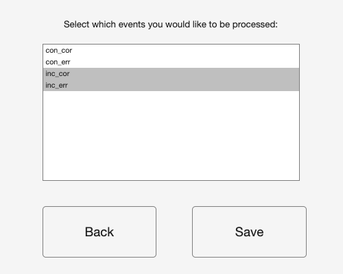
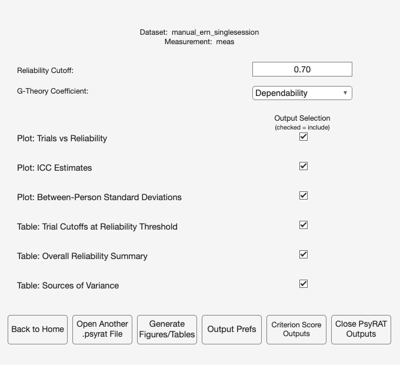
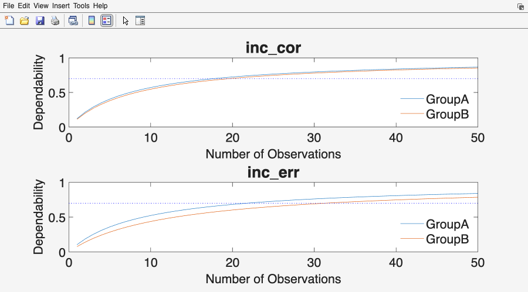
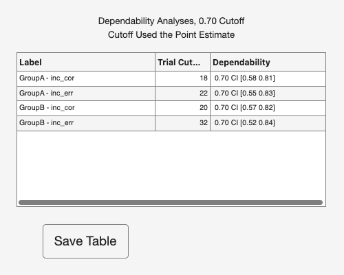
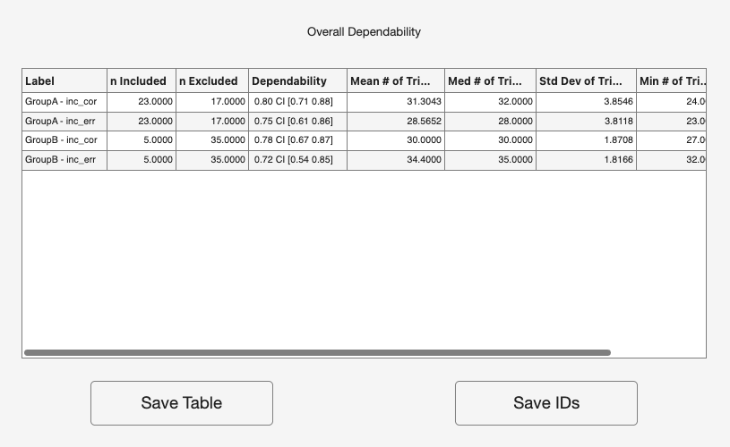
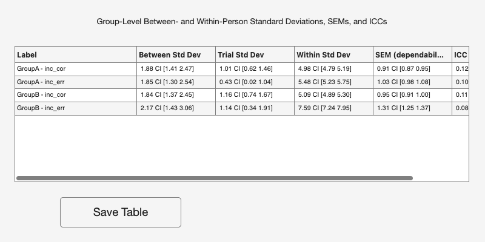
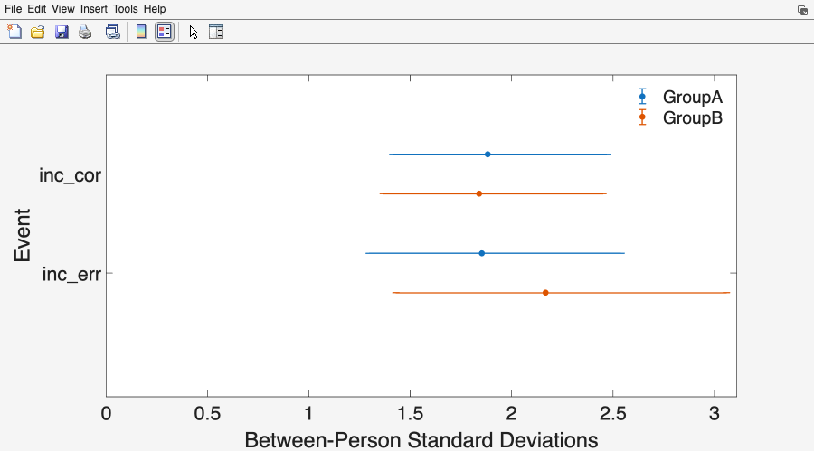
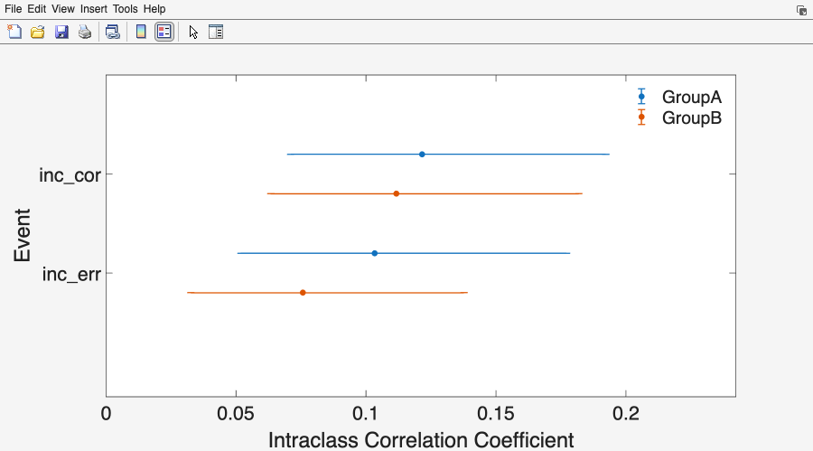

# 10. Tutorial 1: Single-session ERN reliability

A flanker task was run once, in two independent samples, and error-related
negativity (ERN) was scored as a mean amplitude on every trial. Before anyone
correlates ERN amplitude with a symptom measure, one question has to be
answered: how much of the between-person variance in those averaged scores is
person variance rather than trial-to-trial noise, and how many error trials does
a participant need before the average is stable enough to use? This tutorial
answers both for the file `test_data/manual_ern_singlesession.csv`. It reports
the two groups separately and reads them against each other, because they differ
in a way that shows up directly in the dependability estimates.

Work through this tutorial first. Tutorials 2, 3, and 4 assume you have done it
and describe only what changes.

## 10.1 The dataset

`manual_ern_singlesession.csv` is simulated. No participants were recorded, and
every generating parameter is documented in the generator that produced the file
(`tests/helpers/psyrat_make_manual_singlesession.m`). That is the point: because
the true variance components are known, the tutorial can print them next to what
the toolbox recovers.

The file is long format, one row per single-trial score, with four columns:
`id`, `group`, `event`, `meas`. There are 80 participants (ids 101 to 180) split
evenly between two between-person groups, GroupA and GroupB. Four events cross
flanker congruency with response accuracy: `inc_err`, `inc_cor`, `con_err`,
`con_cor`. Trial counts differ across participants on purpose, as they do in real
ERP files. Error trials are scarce (drawn between 12 and 36 per participant per
cell) and correct trials are plentiful (24 to 40).

The tutorial processes two of the four events, `inc_err` and `inc_cor`. The
reading of interest is incongruent-error dependability per group; incongruent
correct trials come along because a second event makes the plots and tables
worth looking at, and because Tutorial 3 builds a difference score from exactly
this pair.

## 10.2 What the true dependability is

The generating model has one facet. Each single-trial score is a grand mean plus
a person effect plus a trial main effect plus independent trial noise. Under
that model the dependability of a mean of n trials is given by the one-facet
D-coefficient in Rocha et al. (2026, Table 2), which for these data reduces to

    D(n) = sigma_p^2 / (sigma_p^2 + (sigma_i^2 + sigma_e^2) / n)

In words: dependability is the share of the total variance in an n-trial average
that is person variance, once the trial-level variance has been shrunk by
averaging. Averaging divides the trial main effect and the noise by n but leaves
the person variance untouched, so dependability rises with n and approaches 1
but never reaches it. The trial main effect (sigma_i) belongs to absolute error
only: generalizability, the relative-error sibling, drops the sigma_i^2 term,
which is why the two coefficients print different values for this file.
[Chapter 4](04_gtheory.md) develops both in full.

The generator's values are these. Person SDs are 2.0 microvolts for GroupA error
trials, 2.2 for GroupB error trials, and 1.7 for correct trials in both groups.
Trial-noise SDs are 5.5 for GroupA error trials, 7.5 for GroupB error trials, and
5.0 for correct trials in both groups; the trial main effect is 1.0 in every
cell. GroupB's error trials are the noisier ones, which is the whole comparison.

Take GroupA incongruent errors at 15 trials. The person variance is
2.0^2 = 4.00 and the trial-level variance is 1.0^2 + 5.5^2 = 31.25, so the
absolute error variance of a 15-trial average is 31.25 / 15 = 2.083, and

    D(15) = 4.00 / (4.00 + 2.083) = 4.00 / 6.083 = .658

Now GroupB, same event, same 15 trials. Person variance 2.2^2 = 4.84, trial-level
variance 1.00 + 56.25 = 57.25, error variance 57.25 / 15 = 3.817, and

    D(15) = 4.84 / (4.84 + 3.817) = 4.84 / 8.657 = .559

GroupB has slightly MORE person variance and still lands a full tenth lower,
because its trial noise is so much larger. That is the comparative lesson of this
tutorial, and it is worth stating plainly: a group can look less reliable without
being less variable between people.

Repeating that arithmetic across trial counts gives the truth table.

**Table 10.1. True dependability of the tutorial's cells, computed from the
generator's parameters.** The last two columns invert the formula:
n = (c / (1 - c)) x ((sigma_i^2 + sigma_e^2) / sigma_p^2), rounded up to a
whole trial. sigma_i is 1.0 in every cell.

| Cell | sigma_p | sigma_e | D(1) | D(15) | D(20) | D(32) | D(50) | n for .70 | n for .80 |
|---|---|---|---|---|---|---|---|---|---|
| GroupA inc_err | 2.0 | 5.5 | .113 | .658 | .719 | .804 | .865 | 19 | 32 |
| GroupB inc_err | 2.2 | 7.5 | .078 | .559 | .628 | .730 | .809 | 28 | 48 |
| GroupA inc_cor | 1.7 | 5.0 | .100 | .625 | .690 | .781 | .848 | 21 | 36 |
| GroupB inc_cor | 1.7 | 5.0 | .100 | .625 | .690 | .781 | .848 | 21 | 36 |

D(1) is the same quantity at a single trial, which is what the toolbox reports as
the absolute ICC. It is low, and it should be: a single ERN trial is mostly noise
(that is why anyone averages).

Two things to carry forward. GroupA needs 19 incongruent-error trials to reach
.70 and 32 to reach .80. GroupB needs 28 and 48. The observed error-trial counts
in this file reach 36 in both groups, so a .70 threshold is inside
what these data supply; a .80 threshold on error trials is beyond the data in
GroupB and at the very top of the range in GroupA, and the toolbox will say so.

## 10.3 About the numbers printed in this tutorial

Every value shown in a checkpoint or an output table below was produced from the
committed CSV at the settings each tutorial states: seed 12345, 4 chains, 5,000
warmup iterations, and 5,000 sampling iterations, on a single machine (Tutorial 2
raises the iteration counts, and says so). Run the same file at the same settings
on the same CmdStan version and you will reproduce them exactly, because the
estimation is seeded and deterministic.

Across CmdStan versions, compilers, and platforms, expect agreement to about .02
on the reliability point estimates and a little more movement on the credible
interval bounds. Larger discrepancies are worth investigating rather than
shrugging at; Section 18.3 of [Chapter 18](18_troubleshooting.md) lists the
usual causes.

One caveat that matters more than it looks. If the chains do not converge and you
accept the rerun offer, the toolbox DOUBLES warmup and sampling and refits.
Your run then no longer matches the settings above, and your numbers will not
match the printed ones. That is the correct outcome (a converged fit at more
iterations beats a matching number from a fit that failed), but note the change
before you compare.

I state this policy once, here. Tutorials 2 through 4 inherit it.

## 10.4 Running the analysis

### Step 1. Start the toolbox

At the MATLAB prompt, type `psyrat_start`. The Command Window prints a dependency
check and the version banner, then the home screen opens with three buttons.

Checkpoint: the Command Window should report that the PsyRAT Toolbox files were
found and that the CmdStan, MatlabProcessManager, and MatlabStan files were
found. If it instead prints a list of missing dependents, stop here and work
through [Chapter 3](03_installation.md). Nothing in this tutorial will run
without CmdStan.

### Step 2. Load the data

Click the Process New Data button. A file dialog opens. Navigate to `test_data/`
and select `manual_ern_singlesession.csv`.

The Command Window prints "Loading Data..." and then the Specify Inputs screen
opens with the file name across the top.

### Step 3. Check the auto-detected columns

Specify Inputs guesses the column mapping from the header names. This file uses
the toolbox's own canonical headers, so the guesses are all correct and there is
nothing to change. Confirm them anyway, because a wrong mapping here produces a
plausible number rather than an error.

Checkpoint: the Specify Inputs screen should show these selections.

| Control | Value |
|---|---|
| Participant ID: | `id` |
| Measurement: | `meas` |
| Group ID: | `group` |
| Event Type: | `event` |
| Occasion ID: | `(none)` |
| Items per split (n_i): | `(none)` |
| Estimation engine: | Automatic (recommended) |

The `(none)` entry is a sentinel, not a column. Selecting it tells PsyRAT that
the facet is absent from this design, and it is spelled with parentheses so that
a real data column can never be confused with it. This dataset has one session,
so Occasion ID stays on `(none)`; that is what makes this a single-session
analysis rather than the test-retest analysis in [Chapter 11](11_tutorial-test-retest.md).

Four more rows sit on this screen and are not in the table above: Dimension 1
(dynamic), Dimension 2 (dynamic), Residual correlation, and Split type. The
first three belong to the dynamic-reliability analyses in
[Chapter 15](15_advanced-designs.md) and are inert unless a Dimension column is
selected; Split type matters only when Items per split (n_i) names a column
([Chapter 13](13_tutorial-splits.md)). Leave all four alone.

### Step 4. Select the two events

Click the Select Events button. The Specify Which Events to Process screen opens.
All four event labels are listed in alphabetical order (`con_cor`, `con_err`,
`inc_cor`, `inc_err`), and the first time you open the screen all four are
selected.

Select `inc_cor` and `inc_err`, and nothing else. The list takes multiple
selections, so hold your platform's multi-select modifier key while clicking the
second one, or the first will deselect. Click Save.

Specify Inputs returns. Hover over the Select Events button and its tooltip now
ends with "(Selected: 2/4)".

Specify the Event Type column BEFORE clicking Select Events. Otherwise you will
get an error if `(none)` is selected, or a long list of measurement values if you
pointed Event Type at a numeric column. The same applies to Select Groups and
Select Occasions.

Leave Select Groups alone. Both groups are wanted, and the default is all of them.

### Step 5. Check the processing preferences

Click the Preferences button. The Specify Processing Preferences screen opens.

Nothing on this screen needs changing for this tutorial. Confirm that Number of
Chains is 4, Warmup iterations is 5000, Sampling iterations is 5000, and Random
seed is 12345. The seed is the reason two runs of the same file agree to the last
digit, so leave it alone unless you are deliberately checking sensitivity to it.

Four chains at 5,000 warmup and 5,000 sampling is a defensible default rather
than a law. It is enough for the one-facet models in this tutorial and it is not
enough for every design in the toolbox; the test-retest chapter raises it. Use as
many iterations as you need to get your model to converge.

Verbose Stan output is set to Yes by default, which means CmdStan's per-iteration
progress scrolls through the Command Window during the fit. Leave it on the first
time. Watching the sampler is the cheapest way to notice that something has gone
wrong before the run finishes.

Click Save to return to Specify Inputs. Clicking Back instead discards anything
you changed on that screen.

### Step 6. Analyze

Click the Analyze button. A save dialog opens: choose a folder and a file name
for the `.psyrat` output.

Choose a path with no spaces in it. CmdStan does not support whitespace in
filenames or paths, so a path containing a space produces a modal Whitespace
detected dialog and returns you to the save dialog. This is the single most
common way a first run stalls, and it is worth checking before you click Save
rather than after (see [Chapter 7](07_processing.md) for the full list of
pre-run checks, and [Chapter 2](02_quick-start.md) for the short version).

While the run proceeds, PsyRAT raises modal dialogs for anything that requires a
decision. A modal dialog blocks the rest of the interface until you dismiss it,
so if the toolbox appears frozen, look for a dialog window behind the main
figure.

Checkpoint: the Command Window should print, in order, "Preparing data for
analysis..." once, then "Working on event 1 of 2", "Model is being run in
cmdstan", and CmdStan's own progress output, then "Working on event 2 of 2"
and "Model is being run in cmdstan" again for the second fit.
Each event is fitted in its own model, with both groups estimated jointly inside
it, so a two-event run is two fits. When sampling finishes it should print
"Model converged", then "Saving Processed Data...".

If it instead prints "Chains did not converge" in a dialog offering Rerun and Do
Not Rerun, the fit failed PsyRAT's convergence screen (any monitored parameter
with an R-hat at or above 1.1, or an effective sample size below 40 at four
chains). Click Rerun. See Section 10.3 for what that does to your numbers.

Checkpoint: the largest R-hat in the CmdStan summary printed to the Command
Window should be 1.00, and the run should report
0 divergent transitions.

Success! There is now a `.psyrat` file on disk holding the posterior draws for
every variance component in this design, together with a `_runconfig.json`
sidecar recording the seed and settings that produced it. The viewer opens by
itself.

## 10.5 Setting up the outputs

The View Results Setup screen opens automatically after a successful single
measurement run. Its header names the dataset and the measurement column.

| Control | Value |
|---|---|
| Reliability Cutoff: | `0.70` |

Everything else on this screen stays at its default: G-Theory Coefficient is
Dependability, and all six output checkboxes are checked.

A word about that .70. Clayson and Miller (2017b) recommend .70 as a minimum
for exploratory ERP work and .80 as more appropriate in most contexts, and they
are explicit that a threshold is a decision about how much measurement error a
study can tolerate rather than a property of the data. Table 10.1 shows why .70
is the value to walk through: every cell's cutoff lands inside the observed
trial counts, so the table comes back with numbers in every cell, and the
retention cost the threshold exacts (steep in GroupB) is visible on real rows.
Section 10.8 then raises the threshold to .80 and shows what the sentinels look
like when a cutoff lands beyond the data.

Click Generate Figures/Tables. Three figure windows and three table windows open.

## 10.6 Reading the output

### The dependability-versus-trials plot

The window is titled Dependability v Number of Trials: Point Estimate. The x axis
is the number of observations averaged into the score, running from 1 to 50 (set
by Number of trials to plot under Output Prefs). The y axis is dependability,
fixed from 0 to 1. There is one panel per event, titled with the event label, and
one line per group; the legend names them. The dotted horizontal line is the
Reliability Cutoff you entered.

This is the D-study. Each curve answers "if every participant contributed exactly
n trials, what would the dependability of their averages be?", evaluated at the
posterior mean of the variance components. Read it left to right: the curves rise
steeply over the first ten or fifteen trials, then flatten. That flattening is
the practical message of generalizability theory for ERP work. Going from 5 to 15
trials buys a great deal; going from 40 to 50 buys almost nothing.

In the `inc_err` panel, the GroupA line reaches .84 at 50 trials and the GroupB
line reaches .79. The gap between them is the whole comparison: the two groups'
error-trial curves do not converge, because they differ in the trial noise that
averaging is trying to beat down. In the `inc_cor` panel the two lines sit
close together (.87 and .85 at 50 trials), which is what you expect from two
cells the simulator gave identical parameters.

### The trial-cutoff table

The window is titled Results of Increasing the Number of Trials on Dependability,
with a subtitle giving the cutoff and which estimate was used to find it
(Point Estimate, the default). The columns are Label, Trial Cutoff, and
Dependability.

Trial Cutoff is the smallest number of trials at which the dependability point
estimate reaches the threshold. Dependability is the coefficient at that cutoff,
printed as a point estimate with its 95% credible interval.

| Label | Trial Cutoff | Dependability | True cutoff | True D there |
|---|---|---|---|---|
| GroupA - inc_cor | 18 | .70 [.58, .81] | 21 | .700 |
| GroupA - inc_err | 22 | .70 [.55, .83] | 19 | .709 |
| GroupB - inc_cor | 20 | .70 [.57, .82] | 21 | .700 |
| GroupB - inc_err | 32 | .70 [.52, .84] | 28 | .703 |

The true cutoffs invert the formula at .70, with the trial main effect included
in the numerator of the error ratio: (.7 / .3) x 7.813 = 18.2 for GroupA error
trials, (.7 / .3) x 11.829 = 27.6 for GroupB error trials, and
(.7 / .3) x 8.997 = 21.0 for correct trials, each rounded up to the next whole
trial. The cutoff is always a whole trial and the coefficient at it therefore
sits at or a little above the threshold, which is why the True D column reads
.709 rather than .700 for GroupA error trials.

There are two ways this table reports that a threshold is out of reach, and they
are different conditions with different appearances. Sentinels get their own
labeled paragraph below because both are easy to misread as data.

A value of -1 in the Trial Cutoff column indicates that an appropriate cutoff
could not be realistically found given the specified reliability threshold. It is
a sentinel, not a count, and it never means zero trials. PsyRAT searches out to
the largest observed trial count plus a thousand, so this appears only when even
that extended search finds nothing.

A value of -1.00 CI [-1.00 -1.00] in the Dependability column is the OTHER
condition: a cutoff was found, and it is printed, but no participant in that
cell supplied that many trials. Consider this example. At a .80 threshold
GroupB incongruent errors need 48 trials at the true values (your run prints
its own estimate of that count; Section 10.8 reads it). The search finds the
count and prints it, but the most any GroupB participant supplied is 36, so the
coefficient cell is blanked to -1 and PsyRAT raises a non-modal dialog titled
Extrapolation beyond data reading "Not enough trials are present in the current
data" and "Cutoffs represent an extrapolation beyond the data". Both conditions
mean the same thing in practice: the score you have cannot be made that
dependable by averaging the trials you collected. Section 10.8 walks into this
case deliberately.

### The overall summary

The window is titled Dependability Analyses and the table is headed Overall
Dependability. The columns are Label, n Included, n Excluded, Dependability,
Mean # of Trials, Med # of Trials, Std Dev of Trials, Min # of Trials, and
Max # of Trials.

The n Included logic is worth pausing on, because it is a group-level quantity
printed on a per-event row. A participant is retained for a group only if they
meet the trial cutoff for EVERY event processed in that group. At this threshold
both rows for GroupA therefore report the same n Included: participants who
cleared the cutoff on `inc_err` but not on `inc_cor` are excluded from both. That
is deliberate. If you intend to compare or combine the two conditions, a
participant who is adequately measured in only one of them is not adequately
measured for the comparison. Process one event at a time if you want per-event
retention instead.

The rule has no exceptions, and Section 10.8 walks into its sharpest case on
purpose: an event in which nobody clears the cutoff empties the group's
retained set, so every row of that group prints n Included 0, n Excluded rises
to the full group size, and for this analysis the two columns add up to the
group size on every row. The console also prints a line saying the group
retained nobody.

Dependability in this table is not the same quantity as in the cutoff table. Here
it is the coefficient evaluated at the mean number of trials the RETAINED
participants actually contributed, so it describes the scores you would carry
forward, not a hypothetical count.

| Label | n Included | n Excluded | Dependability | Mean # of Trials |
|---|---|---|---|---|
| GroupA - inc_cor | 23 | 17 | .80 | 31.3 |
| GroupA - inc_err | 23 | 17 | .75 | 28.6 |
| GroupB - inc_cor | 5 | 35 | .78 | 30.0 |
| GroupB - inc_err | 5 | 35 | .72 | 34.4 |

Applying the TRUE cutoffs from the table above to the observed trial counts
retains 29 of 40 participants in GroupA and 13 of 40 in GroupB, at mean retained
error-trial counts of 26.7 and 31.5. That retention gap is the comparison again,
in the currency a study actually pays: GroupB's noisier error trials cost
twenty-seven participants at a threshold GroupA clears with eleven exclusions.
The counts your run reports follow the ESTIMATED cutoffs, and an estimated
cutoff a few trials above or below the true one moves several participants
across the line, so expect the printed counts to differ from these.

Two buttons sit under the table. Save Table writes the table with a provenance
header (seed, analysis, engine, priors, convergence verdict, divergent
transitions) to `.xlsx` or `.csv`. Save IDs writes the list of retained
participant ids, which is what you feed back into your analysis pipeline as the
inclusion list. Save both. The provenance header is what makes the exported table
interpretable a year later.

### Sources of variance

The window is titled Point and 95% Interval Estimates for the Between- and
Within-Person Standard Deviations, SEMs, and ICCs. For a one-facet analysis the
columns are Label, Between Std Dev, Trial Std Dev, Within Std Dev,
SEM (dependability), and ICC (dependability). Every cell is a posterior mean with
its 95% credible interval.

Between Std Dev is sigma_p, the between-person standard deviation. Trial Std Dev
is sigma_i, the trial main effect: systematic drift across trial position, common
to all participants. Within Std Dev is sigma_pi,e, the person-by-trial residual,
which is the noise that averaging reduces. SEM (dependability) is the absolute
standard error of measurement of a score at the retained mean trial count, in
microvolts, and it is the number to attach to an individual participant's score.
ICC (dependability) is the absolute intraclass correlation, which is
dependability at a single trial.

| Label | Between Std Dev | Trial Std Dev | Within Std Dev | SEM (dep.) | ICC (dep.) |
|---|---|---|---|---|---|
| GroupA - inc_cor | 1.88 | 1.01 | 4.98 | 0.91 | .12 |
| GroupA - inc_err | 1.85 | 0.43 | 5.48 | 1.03 | .10 |
| GroupB - inc_cor | 1.84 | 1.16 | 5.09 | 0.95 | .11 |
| GroupB - inc_err | 2.17 | 1.14 | 7.59 | 1.31 | .08 |

The simulator put a genuine trial main effect of 1.0 microvolt into every cell,
shared by all participants at the same trial position, and the Trial Std Dev
column is the model recovering it. Three of the four cells come back near that
value (1.01, 1.14, and 1.16); GroupA inc_err comes back at 0.43, with a 95%
credible interval of [0.02, 1.04] that still covers the generating value. The
trial main effect is estimated from at most 36 shared trial positions per cell,
so it is the least well determined component in this table, and Table 10.2
shows the same cell again. The trial main effect is also why the SEM and ICC in
this table (absolute, dependability-based) differ from their relative-error
counterparts, the SEM sitting above and the ICC below: sigma_i belongs to
absolute error only, so absolute error is the larger error term. In your own
data a substantial trial SD is drift worth investigating (fatigue, habituation,
electrode impedance) rather than a nuisance to average away.

### Between-person standard deviations and ICC estimates

Both figures put Event on the x axis, with one point per group at each event and
a legend naming the groups. The first has Between-Person Standard Deviations on
the y axis in microvolts; the second has Intraclass Correlation Coefficient. Each
y axis starts at zero and runs to just above the largest upper bound plotted, so
the ICC figure is not scaled to a fixed 0-to-1 range. Each point is a posterior
mean and each whisker a 95% credible interval.

Read the two together, against Table 10.1. The generator gave GroupB the LARGER
person standard deviation on error trials (2.2 against 2.0) and the LOWER true
ICC (.078 against .113). Nothing is contradictory: the ICC divides by total
variance, and GroupB's denominator is inflated by trial noise. A group can be
more variable between people and less reliable at the same time, and these two
figures are where you would see it.

With 40 participants per group the credible intervals are wide. Overlapping intervals are
the expected state of affairs at this sample size, and the honest reading is that
the group difference in incongruent-error dependability is suggested, not
established.

## 10.7 Interpretation

At 24 incongruent-error trials, which is about what these participants supplied
on average (23.5 in GroupA, 23.7 in GroupB), GroupA's ERN average clears .70
(true D about .75), GroupB's does not (about .67), and neither clears .80. That is not a defect of the
simulation. It is the ordinary situation for error-trial ERP scores, and it is
the reason trial counts belong in a methods section. Baldwin, Larson, and
Clayson (2015) reported the same pattern in real performance-monitoring data:
within-person variance exceeded between-person variance for every component
examined.

The practical consequence is that a study designed around 20 error trials per
participant has built a measure whose scores carry substantial measurement error
for a group like GroupB, and any correlation estimated from those scores is
attenuated accordingly. The fix is either more error trials or a design that
tolerates lower reliability with a correspondingly larger sample.

## 10.8 How many trials for .80?

Change Reliability Cutoff to `0.80` and click Generate Figures/Tables again. The
posterior does not change; only the threshold applied to it does, so the pass
costs nothing and re-answers the design question at the stricter standard.

| Label | Trial Cutoff at .80 | True |
|---|---|---|
| GroupA - inc_cor | 31 | 36 |
| GroupA - inc_err | 38 | 32 |
| GroupB - inc_cor | 34 | 36 |
| GroupB - inc_err | 55 | 48 |

GroupB's true error-trial cutoff, 48, exceeds every observed count in its cell:
the most any GroupB participant supplied is 36. GroupA's true cutoff, 32, sits
inside the top of its range (the GroupA maximum is also 36), but the estimated
cutoff in the table above lands past 36, so in this run both error rows come
back blanked; a run whose GroupA estimate landed a few trials lower would keep
a coefficient on that row, reached by a handful of participants. Correct trials
are plentiful enough that their cutoffs stay inside the data.
Where a cutoff lands outside, the Dependability cell for that row is blanked to
-1.00 CI [-1.00 -1.00] and the Extrapolation beyond data dialog appears. The
Trial Cutoff itself is still printed, because it is still the honest answer to
"how many would be needed".

Now read the overall summary. In GroupB no participant supplies 48 error
trials, so the error event retains nobody and the all-events rule empties the
group: both GroupB rows print n Included 0,
n Excluded rises to 40, and the Command Window prints a line saying no
participants met the threshold for every event type. GroupA keeps only the
participants who supplied at least 32 error trials AND at least 36 correct
trials, which at the true cutoffs is one of 40; your run prints n Included
0 on both GroupA rows, following the estimated
cutoffs. A row whose group retained nobody still shows a dependability figure,
computed at the mean trial count over ALL participants; it describes the file,
not a retained sample, so treat it accordingly.

That is the answer to the design question, and it is a blunt one. Reaching .70
on incongruent-error ERN takes 19 trials in GroupA, inside what most of its
participants supplied, and 28 in GroupB, in the upper part of its range.
Reaching .80 takes 32 and 48: within reach of only the best-measured GroupA
participants, and a third again the maximum anyone in GroupB supplied. Plan the
task accordingly, or report the reliability you actually achieved and interpret
the effect sizes in light of it. The toolbox will not make that call for you.

## 10.9 Recovery: truth against estimate

Because the generating parameters are known, the estimates can be checked
against them directly.

**Table 10.2. Recovery of the generating parameters.** Truth is from the
generator; the estimate and interval are the posterior mean and 95% credible
interval from the Sources of Variance table.

| Quantity | Truth | Estimate | 95% CrI |
|---|---|---|---|
| GroupA inc_err sigma_p | 2.00 | 1.85 | [1.30, 2.54] |
| GroupA inc_err sigma_pi,e | 5.50 | 5.48 | [5.23, 5.75] |
| GroupA inc_err sigma_i | 1.00 | 0.43 | [0.02, 1.04] |
| GroupB inc_err sigma_p | 2.20 | 2.17 | [1.43, 3.06] |
| GroupB inc_err sigma_pi,e | 7.50 | 7.59 | [7.24, 7.95] |
| GroupA inc_cor sigma_p | 1.70 | 1.88 | [1.41, 2.47] |
| GroupA inc_cor sigma_pi,e | 5.00 | 4.98 | [4.79, 5.19] |
| GroupB inc_cor sigma_p | 1.70 | 1.84 | [1.37, 2.45] |
| GroupB inc_cor sigma_pi,e | 5.00 | 5.09 | [4.89, 5.30] |
| GroupA inc_err dependability at .70 retention | .774 | .75 | (printed with the estimate) |
| GroupB inc_err dependability at .70 retention | .727 | .72 | (printed with the estimate) |

The two dependability truths are the D(n) formula at the mean error-trial
counts of the participants the TRUE .70 cutoffs retain, 26.724 for GroupA and
31.462 for GroupB: 4.00 / (4.00 + 31.25 / 26.724) = .774 and 4.84 / (4.84 +
57.25 / 31.462) = .727. Note what retention has done to the comparison.
GroupB's surviving thirteen participants are its best-measured thirteen, so its
reported dependability is much closer to GroupA's than the two groups' true
curves are at any common trial count. Selecting on trial count selects on
reliability, and a coefficient computed after that selection describes the
retained sample, not the population you sampled from. Read 28.6 and 34.4 out of
your own overall summary and recompute the truth at those counts if the
estimated cutoffs retained a different set.

Read this table for what it teaches, not as a validation exercise. With 40
participants per group and 12 to 36 error trials each, the point estimates will
NOT equal the true values, and the between-person standard deviations in
particular are estimated from 40 people and carry wide intervals. A person SD
estimated at 1.8 when the truth is 2.0 is not a bug in the toolbox and not a
failure of the model. It is what 40 participants buys you, and the credible
interval is the toolbox telling you so.

That is the pedagogical point, and it generalizes: when your own study reports a
dependability of .68, the honest statement is not "reliability is .68" but
"reliability is estimated at .68, with an interval that runs from here to here".
Report the interval.

This recovery exercise is an illustration. It is not evidence that the toolbox's
estimators are correct. PsyRAT's correctness claims rest on its validation
suites, described in `README.md`, which check the formulas against fixed
references and check estimation against simulated data with known components at
sample sizes chosen for that purpose. A single 80-participant run is far too
small a sample to license any conclusion about estimator accuracy, in either
direction.

## 10.10 Reporting this analysis

[Chapter 17](17_reporting.md) sets out what a reliability section should contain
and why. Here is that chapter's template, pre-filled for this tutorial. Replace
the placeholders with the values from your own run.

> Score reliability was evaluated with generalizability theory as implemented
> in PsyRAT, which estimates variance components in a Bayesian one-facet
> (persons x trials) design via CmdStan. Models were fitted with 4 chains,
> 5,000 warmup and 5,000 sampling iterations, and a random seed of 12345;
> convergence was assessed by the potential scale reduction factor (maximum
> R-hat = 1.00) and effective sample size, and 0 divergent transitions were
> observed. Dependability (the absolute-error coefficient) was estimated
> separately for each group and event. For incongruent-error trials, the
> between-person standard deviation was 1.85 microvolts in GroupA and 2.17
> microvolts in GroupB, and the person-by-trial residual standard deviation was
> 5.48 and 7.59 microvolts, respectively. A decision study indicated that 22
> incongruent-error trials were required to reach a dependability of .70 in
> GroupA and 32 in GroupB; 38 and 55 trials, respectively, were required to
> reach .80. A retention threshold of .70 was applied. Participants who did not
> supply enough trials to meet that threshold in every processed condition were
> excluded, retaining 23 of 40 participants in GroupA and 5 of 40 in GroupB.
> Among retained participants, incongruent-error scores had a dependability of
> .75 in GroupA and .72 in GroupB at mean trial counts of 28.6 and 34.4. The
> absolute standard error of measurement was 1.03 and 1.31 microvolts,
> respectively.

Report the trial counts, the threshold, the exclusion rule, and the interval, not
just the coefficient. A dependability estimate without the trial count it was
evaluated at is not interpretable, because the same variance components produce a
different coefficient at every n.

Notice what the retention sentence had to do. The .70 threshold kept only a
minority of GroupB, and the paragraph says so with the counts rather than
burying them. A reliability coefficient reported after exclusions describes the
retained sample; disclosing how many participants the threshold cost is part of
reporting it, and quietly reporting the correct-trial reliability instead is
not a defensible substitute.

## 10.11 Where to go next

- Two occasions instead of one: [Chapter 11](11_tutorial-test-retest.md).
- The reliability of `inc_err` minus `inc_cor`: [Chapter 12](12_tutorial-difference-scores.md).
- Data that arrive as split means rather than single trials: [Chapter 13](13_tutorial-splits.md).
