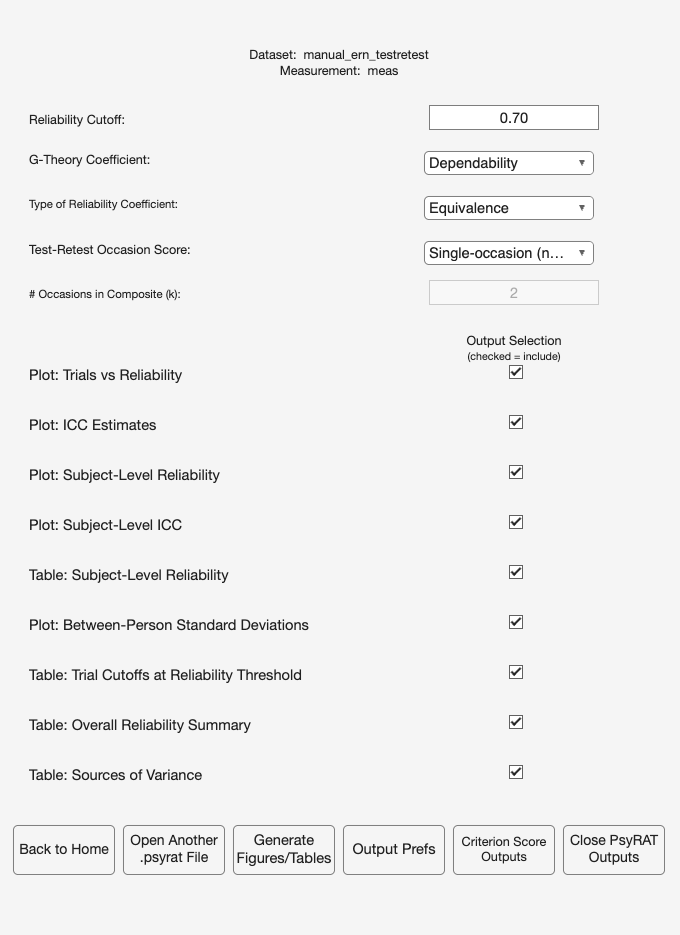
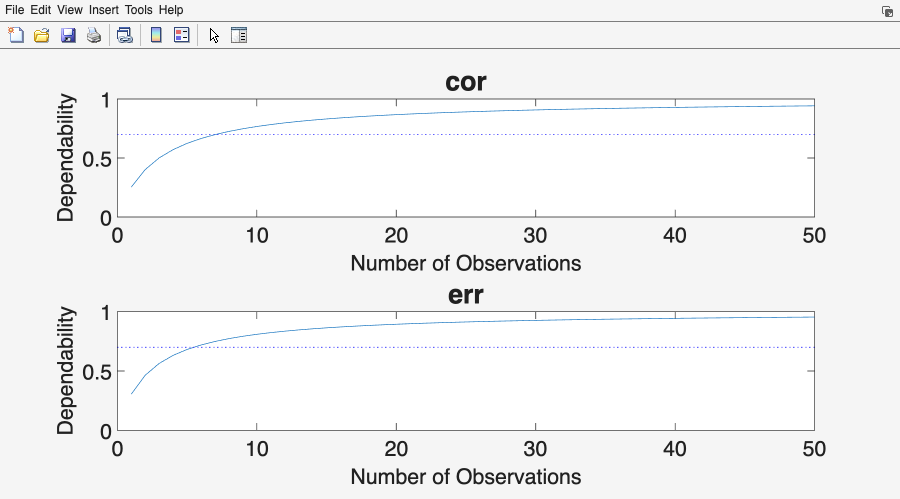

# 11. Tutorial 2: Test-retest reliability

The same flanker task, run twice, two weeks apart. A score that is internally
consistent within a session can still be unstable across sessions, and the two
questions have different answers because they generalize over different things.
Internal consistency asks whether a participant's average would be the same if
you had recorded different trials on the same day. Test-retest reliability asks
whether it would be the same if you had recorded the same participant on a
different day. A measure intended to index a trait, or to serve as a baseline in
a treatment study, needs the second answer, and a two-facet design is what
supplies it.

This tutorial uses `test_data/manual_ern_testretest.csv`. It assumes you have
worked through [Chapter 10](10_tutorial-single-session.md) and describes only
what differs. The screen-by-screen reference lives in
[Chapter 7](07_processing.md) and [Chapter 9](09_viewing-results.md).

## 11.1 The dataset

Thirty participants (ids 201 to 230) completed the task at two occasions, `t1`
and `t2`. Two events, `err` and `cor`. There is no group column. Trial counts are
balanced by design: every participant contributed exactly 24 error and 40
correct trials at each occasion. The unequal-counts lesson belongs to Tutorial 1;
this file needs a common trial index so that the occasion, trial, and interaction
components are all identifiable.

The columns are `id`, `time`, `event`, `meas`. The file is simulated, and the
generator (`tests/helpers/psyrat_make_manual_testretest.m`) documents every
component.

## 11.2 What the true coefficients are

The generating model is the fully crossed persons x trials x occasions
decomposition, which is the design Rocha et al. (2026, Table 3) tabulates. A
score is a grand mean plus seven independent effects: person, occasion, trial,
person x trial, person x occasion, occasion x trial, and residual.

**Table 11.1. The seven generating components, in microvolts.**

| Component | Symbol | err | cor |
|---|---|---|---|
| Person | sigma_p | 3.2 | 2.8 |
| Occasion | sigma_o | 0.6 | 0.6 |
| Trial | sigma_i | 1.0 | 1.0 |
| Person x trial | sigma_pi | 1.0 | 0.8 |
| Person x occasion | sigma_po | 1.7 | 1.4 |
| Occasion x trial | sigma_oi | 0.5 | 0.5 |
| Residual (p x o x i) | sigma_poi,e | 5.5 | 5.0 |

Three coefficients follow from those seven numbers, and they differ in which
facet is held fixed. Squaring the SDs and taking the error event at its 24
trials, with one occasion:

**Coefficient of equivalence (CE).** Occasion is fixed, so person x occasion
variance counts as universe-score variance rather than error. This is internal
consistency at one session.

    universe = sigma_p^2 + sigma_po^2 = 10.24 + 2.89 = 13.13
    absolute error = (sigma_pi^2 + sigma_poi,e^2 + sigma_i^2 + sigma_oi^2) / 24
                   = (1.00 + 30.25 + 1.00 + 0.25) / 24 = 32.50 / 24 = 1.354
    D_CE = 13.13 / (13.13 + 1.354) = .907

**Coefficient of stability (CS).** Trials are fixed, so person x trial variance
joins the universe score and occasion-related variance becomes error. This is
test-retest reliability proper.

    universe = sigma_p^2 + sigma_pi^2 / 24 = 10.24 + 0.042 = 10.282
    absolute error = sigma_po^2 + sigma_o^2 + (sigma_poi,e^2 + sigma_oi^2) / 24
                   = 2.89 + 0.36 + 30.50 / 24 = 4.521
    D_CS = 10.282 / (10.282 + 4.521) = .695

**Coefficient of equivalence and stability (CES).** Both facets are random, so
only person variance survives in the numerator. This is the reliability of a
score meant to generalize across both trials and days.

    universe = sigma_p^2 = 10.24
    absolute error = 0.042 + 2.89 + 1.260 + 0.042 + 0.36 + 0.010 = 4.604
    D_CES = 10.24 / (10.24 + 4.604) = .690

**Table 11.2. True dependability and generalizability at the observed design
(24 error trials, 40 correct trials, one occasion).**

| Coefficient | err D | err G | cor D | cor G |
|---|---|---|---|---|
| Equivalence (CE) | .907 | .910 | .936 | .939 |
| Stability (CS) | .695 | .712 | .727 | .752 |
| Equivalence + stability (CES) | .690 | .710 | .724 | .751 |

Stability is far below equivalence for both events, and that ordering is the
substantive finding. It is driven by two components: the occasion main effect
(sigma_o = 0.6) and the person x occasion interaction (sigma_po = 1.7 for error
trials and 1.4 for correct trials). Neither of them shrinks when you add trials,
because they are not trial-level noise. A study that reports internal
consistency and calls it reliability has reported the larger and less demanding
of the two numbers.

That has a hard consequence for thresholds. As the trial count grows without
bound, the stability and CES dependability coefficients approach
10.24 / (10.24 + 2.89 + 0.36) = .759 for error trials and
7.84 / (7.84 + 1.96 + 0.36) = .772 for correct trials. They never reach .80 at
any trial count. Collecting more trials cannot fix instability across days; only
more occasions can, and that is a different design.

## 11.3 What changes on the input screen

Load `manual_ern_testretest.csv` through Process New Data as before. Auto-detect
finds the occasion column this time, because the header is `time`.

Checkpoint: the Specify Inputs screen should show these selections.

| Control | Value |
|---|---|
| Participant ID: | `id` |
| Measurement: | `meas` |
| Group ID: | `(none)` |
| Event Type: | `event` |
| Occasion ID: | `time` |
| Items per split (n_i): | `(none)` |

Occasion ID is the control that turns a one-facet analysis into a two-facet one.
Selecting a column there is the entire difference at the input stage. Leave Group
ID on `(none)`, since this file has no group column, and leave Select Events
alone: both events are wanted.

## 11.4 The iteration advisory, and honoring it

The next time you open the Preferences screen with an Occasion ID column
assigned, PsyRAT checks the iteration settings and may raise a non-modal
dialog titled Recommended Iteration Increase:

> Test-retest workflows usually require at least 10,000 iterations.
> You currently selected fewer iterations, which may prevent convergence.
> How to fix: open Preferences and increase warmup and/or sampling iterations.

The dialog fires only when warmup plus sampling falls below 10,000. At the
shipped defaults (5,000 plus 5,000) the total is exactly 10,000, so on a fresh
installation you will not see it. You will see it if you have saved lower
settings, or if a previous run left them lowered.

Honor the advice regardless. Seven variance components estimated from 30
participants is a harder posterior than the one-facet model in Tutorial 1, and
the default that suffices there is the floor here, not a comfortable margin.
Click Preferences and set both iteration fields higher.

| Control | Value |
|---|---|
| Warmup iterations: | `10000` |
| Sampling iterations: | `10000` |

Click Save. Number of Chains stays at 4 and Random seed stays at 12345. Those
two settings plus these iteration counts are what the reference values in this
chapter were produced at; record them, because a run at any other iteration count
will not reproduce them exactly.

This run takes noticeably longer than Tutorial 1. Twice the iterations on a
seven-component crossed model is not a small change, and the honest advice is to
start it and go do something else.

Click Analyze, choose a whitespace-free output path, and wait.

Checkpoint: the Command Window should print "Model converged" and then "Saving
Processed Data...". The largest R-hat should be 1.00 and the run
should report 909 divergent transitions.

That divergence count is not zero, and it will not be zero for you either. A
persons x trials x occasions model with two occasions leaves the occasion
standard deviation almost unidentified (two occasion effects cannot pin down a
spread), and the sampler reports divergent transitions in that region even at
the tighter target acceptance this model already runs at. R-hat is 1.00, the
person and residual components are recovered (Section 11.8), and the
equivalence coefficients this tutorial reads first do not carry the occasion
term; the stability coefficients do, and Section 11.7 shows what that costs.
The count is reported here rather than hidden, and the same message will
appear on your own two-session data. The tutorial proceeds because the
quantities it reads are insensitive to the offending term, but a run you
intend to report should try the remedies in Section 18.3 of
[Chapter 18](18_troubleshooting.md) first: more warmup, a higher Adapt delta,
and, where the design allows it, more occasions.

Trace plots are not rendered for test-retest analyses. If you left View trace
plots prior to saving Stan output on Yes, the Command Window prints "Viewing
trace plots for trt analyses is not currently supported" and the run continues.
That message is informational, not an error.

## 11.5 The test-retest viewer

Before the setup screen appears, a notice titled Estimation diagnostics repeats
the divergence count from the checkpoint above. Click OK to continue.

The View Results Setup screen for a two-facet run carries three controls the
single-session viewer does not.

**Type of Reliability Coefficient:** which of the three coefficients to compute.
The options are Equivalence, Stability, and Equivalence + Stability, and they
correspond to CE, CS, and CES in Rocha et al. (2026, Table 3). The choice is not
cosmetic: it changes which variance components sit in the numerator and which
count as error, so the three answer three different scientific questions.

Choose Equivalence when you want internal consistency at a single session, which
is what a one-session study reports and what makes a test-retest run comparable
to Tutorial 1. Choose Stability when the question is whether a participant's
score holds across days, which is what a trait interpretation requires and what a
pre-post treatment design depends on. Choose Equivalence + Stability when the
score has to generalize across both, which is the right default for a measure
proposed as an individual-difference index. Clayson, Carbine, et al. (2021)
work through the three coefficients and their algorithms in detail, and their
framing is the one this viewer implements.

**Test-Retest Occasion Score:** whether the reported coefficient describes a
score from one occasion or a composite averaged over several. The options are
Single-occasion (n'_o = 1) and Multi-occasion composite (n'_o = k). A box labeled
"# Occasions in Composite (k):" sits below it and becomes relevant only for the
second option.

The default is single-occasion, n'_o = 1, and that is the toolbox's convention
rather than something a table forces. PsyRAT reports, by default, the reliability
of a score taken at ONE session while generalizing over the occasion facet,
because that is the score most studies actually analyze: participants are
recorded twice so that occasion variance can be estimated, and then the analysis
uses one session's data. Set n'_o = k only when your analysis really does average
across k occasions. The reported SEM follows the same n'_o as the coefficient,
so the two always describe the same score.

**G-Theory Coefficient:** Dependability or Generalizability, as in Tutorial 1.

| Control | Value |
|---|---|
| Reliability Cutoff: | `0.70` |

Everything else stays at its default: Type of Reliability Coefficient is
Equivalence, G-Theory Coefficient is Dependability, and Test-Retest Occasion
Score is Single-occasion (n'_o = 1). Section 11.7 changes the first of those.

Three of the output checkboxes on this screen (Plot: Subject-Level Reliability,
Plot: Subject-Level ICC, Table: Subject-Level Reliability) apply only to runs
that estimated subject-specific error variances. This run did not, so leaving
them checked produces nothing and costs nothing.

Click Generate Figures/Tables.

## 11.6 Reading the equivalence results

The dependability-versus-trials plot reads exactly as in Tutorial 1: number of
observations on the x axis, dependability from 0 to 1 on the y axis, one panel
per event, and the cutoff drawn as a dotted line. With no group column there is
no legend and a single line per panel.

The trial-cutoff table is titled Results of Increasing the Number of Trials on
Dependability, exactly as in Tutorial 1. Nothing on that window names the
coefficient type, so if you generate the table three times at three settings you
will end up with three windows that look alike. Save each one as you go: the
exported file's header block records the coefficient type, the occasion estimand,
and the seed. Overwriting the wrong one is easily done and not easily noticed.

| Label | Trial Cutoff | Dependability | True cutoff |
|---|---|---|---|
| err | 6 | .72 [.62, .82] | 6 |
| cor | 8 | .73 [.63, .82] | 7 |

The true cutoffs come from inverting the CE dependability formula at .70:
(.7 / .3) x 32.50 / 13.13 = 5.8 for error trials and (.7 / .3) x 26.89 / 9.80 =
6.4 for correct trials, each rounded up. Both are far inside what participants
supplied (24 and 40), so every participant is retained. Equivalence is easy to
reach in these data, and that is the point of the comparison that follows.

The overall summary reports 30 participants included and 0 excluded, with
equivalence dependability of .91 for error trials at 24 trials and .93 for
correct trials at 40.

The Sources of Variance table has one fewer column than in Tutorial 1: Label,
Between Std Dev, Within Std Dev, SEM (dependability), and ICC (dependability),
with the occasion estimand named in a line above the table. For a two-facet
design Between Std Dev is sigma_p and Within Std Dev is the three-way residual
sigma_poi,e. The other five components are estimated and used, but they are not
printed here.

| Label | Between Std Dev | Within Std Dev | SEM (dep.) | ICC (dep.) |
|---|---|---|---|---|
| err | 3.47 | 5.42 | 1.20 | .30 |
| cor | 2.61 | 5.05 | 0.83 | .25 |

To see the generalizability coefficients instead, set G-Theory Coefficient to
Generalizability and click Generate Figures/Tables again. Equivalence
generalizability comes back as .91 for error trials and .93 for correct trials.
The two coefficients are close here because the terms dependability adds (the
trial and occasion x trial main effects) are small in these data, which is
exactly what Table 11.1 predicts.

## 11.7 Stability, and a threshold that cannot be met

Set Type of Reliability Coefficient to Stability and click Generate
Figures/Tables. Then do it again with Equivalence + Stability.

Lower Reliability Cutoff to `0.50` before you do, and here is why. Section 11.2
showed that stability and CES dependability top out at .759 and .772 as trials
increase, so .80 is out of reach at any trial count, and .70 sits just under
those ceilings: at the true values it takes 27 to 29 error trials (more than the
24 supplied) and 25 or 26 correct trials. The estimates sit lower still, and the
reason is the occasion component. With two occasions the occasion main effect is
estimated from two values, its posterior is pulled toward the prior and lands
well above the true 0.6, and both stability coefficients carry sigma_o^2 in their
error term (Section 11.8 shows the recovered value). Leave the cutoff at .70 and
the Trial Cutoff column will report a count far larger than any participant
supplied, PsyRAT will warn that the cutoff extrapolates beyond the data, and
n Included will come back as zero. Nothing is broken when that happens. It is the
software telling you that, as estimated from two sessions, no amount of
averaging will make these day-to-day scores that stable.

At a .50 cutoff every cell clears the threshold well inside the observed data
(5 trials for either coefficient and either event at the true values, and more
than that in the estimate, for the same occasion-component reason), and the
tables become readable.

| Coefficient | Event | Trial Cutoff | Dependability | Truth (Table 11.2) |
|---|---|---|---|---|
| Stability | err | 9 | .56 | .695 |
| Stability | cor | 29 | .51 | .727 |
| Equivalence + stability | err | 11 | .55 | .690 |
| Equivalence + stability | cor | 32 | .51 | .724 |

Read the three coefficients side by side. Equivalence sits near .91 and .93;
stability sits near .56 and .51. Reporting only the first would overstate how
reproducible these scores are across sessions by thirty-five points or more, and
the overstatement is not a rounding matter. It is the difference between a measure
you can use as a stable individual-difference index and one you cannot.

Two occasions is also the minimum for this design, not a comfortable number. With
two sessions the occasion main effect is estimated from a single contrast, and
its credible interval will be correspondingly wide. Treat a stability coefficient
from two occasions as an estimate with real uncertainty attached, and report the
interval.

## 11.8 Recovery of the seven components

The Sources of Variance table shows two of the seven components. To see all
seven, click the View All Standard Deviations button at the bottom right of that
window. A second window opens, titled Point Estimates of All Standard Deviation
Components, with the columns Label, Between Person, Between Session, Between
Trial, Person x Session, Person x Trial, Session x Trial, and Within Person
(Error).

That window reports point estimates only, with no credible intervals, and its
Save Table button exports them. Read them as posterior means: a component printed
as 0.41 is the mean of its posterior, not a value the data pinned down to two
decimals.

**Table 11.3. Recovery of the seven generating components.** Estimates are the
posterior means shown in Point Estimates of All Standard Deviation Components.

| Component | Column | Truth (err) | Estimate (err) | Truth (cor) | Estimate (cor) |
|---|---|---|---|---|---|
| Person | Between Person | 3.2 | 3.47 | 2.8 | 2.61 |
| Occasion | Between Session | 0.6 | 2.58 | 0.6 | 2.16 |
| Trial | Between Trial | 1.0 | 1.25 | 1.0 | 1.12 |
| Person x occasion | Person x Session | 1.7 | 1.70 | 1.4 | 1.56 |
| Person x trial | Person x Trial | 1.0 | 1.73 | 0.8 | 0.75 |
| Occasion x trial | Session x Trial | 0.5 | 0.28 | 0.5 | 0.22 |
| Residual | Within Person (Error) | 5.5 | 5.42 | 5.0 | 5.05 |

The column order on screen puts Person x Session before Person x Trial, which is
not the order Table 11.1 uses. Match on the column heading, not the position.

Expect the residual and the person component to land close to truth and the small
components to land loosely. The occasion main effect is the extreme case: with
two occasions there are two occasion effects, and estimating a standard deviation
from two values is not something 30 participants can rescue. Its posterior will
be pulled toward the prior. That is the correct behavior for a component the
design barely identifies, and it is worth seeing once, because the same thing
will happen in your own two-session data. The full posterior draws for all seven
components are on the saved `.psyrat` file under `psyrat_data.rel.out`, if you
want intervals rather than point estimates; see [Chapter 14](14_scripting.md).

This is an illustration, not validation evidence. Thirty participants at two
occasions cannot establish that an estimator is unbiased. PsyRAT's correctness
claims rest on the validation suites described in `README.md`.

## 11.9 Reporting this analysis

The [Chapter 17](17_reporting.md) template, pre-filled for this tutorial.

> Test-retest reliability was evaluated with generalizability theory as
> implemented in PsyRAT, using a fully crossed persons x trials x occasions
> design with Bayesian variance-component estimation in CmdStan. Models were
> fitted with 4 chains, 10,000 warmup and 10,000 sampling iterations, and a
> random seed of 12345 (maximum R-hat = 1.00; 909 divergent transitions).
> Coefficients are reported for a single-occasion score (n'_o = 1),
> generalizing over the occasion facet. For error trials at 24 trials, the
> coefficient of equivalence (dependability) was .91, the coefficient of
> stability was .56, and the coefficient of equivalence and stability was .55;
> the corresponding values for correct trials at 40 trials were .93, .51, and
> .51. The between-person standard deviation was 3.47 microvolts for error
> trials and 2.61 microvolts for correct trials, with a person x occasion
> standard deviation of 1.70 and 1.56, respectively. Applying a .70 threshold
> to the coefficient of equivalence retained 30 of 30 participants. The
> absolute standard error of measurement was 1.20 microvolts for error trials
> and 0.83 microvolts for correct trials.

Name the coefficient. "Test-retest reliability was .73" is ambiguous among
three quantities, and the reader cannot recover which one you meant. In these
data equivalence exceeds the other two by thirty-five points or more, so the
ambiguity is not a small one. State whether it is equivalence, stability, or
both, and state the n'_o the coefficient was evaluated at.

## 11.10 Where to go next

- The reliability of a difference between two conditions:
  [Chapter 12](12_tutorial-difference-scores.md).
- Data that arrive as split means: [Chapter 13](13_tutorial-splits.md).
- Other two-facet and conditional designs:
  [Chapter 15](15_advanced-designs.md).
