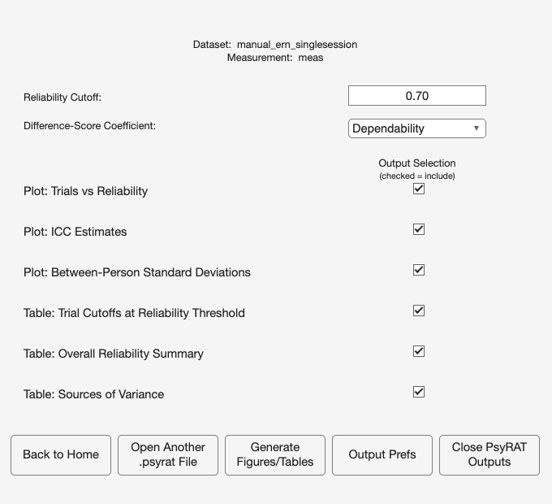

# 12. Tutorial 3: Difference-score reliability

ERN is very often analyzed as a difference: error-trial amplitude minus
correct-trial amplitude, on the argument that subtracting the correct-trial
response removes shared, non-specific activity. The subtraction has a
psychometric cost, and it is a large one. This tutorial estimates it directly on
the file from [Chapter 10](10_tutorial-single-session.md), so the difference
score can be read next to the two scores it was built from.

The dataset, the loading steps, and the viewer are all as in Tutorial 1. Only the
processing preference and the reading change.

## 12.1 Why a difference is less dependable than its parts

A difference score inherits the error of both constituents and keeps only the
part of their person variance that they do NOT share. Both halves of that
sentence work against it.

The universe-score variance of a difference is

    sigma^2_diff(p) = sigma^2_X(p) + sigma^2_Y(p) - 2 sigma_XY(p)

and the covariance term is what does the damage. Write the covariance as
r x sigma_X(p) x sigma_Y(p) and the more correlated the two conditions are across
people, the less between-person variance survives the subtraction. Meanwhile the
error variances ADD, because trial noise in the error condition is independent of
trial noise in the correct condition. Rocha et al. (2026, Table 6) give the full
one-facet coefficient, with each constituent's residual divided by its own trial
count and the residual covariance divided by the harmonic mean of the two counts.

The simulator built these data with a person-effect correlation of r = .75
between every pair of events, which is a realistic value for correct-trial and
error-trial ERN person effects. Take GroupA, `inc_err` minus `inc_cor`. The
person SDs are 2.0 and 1.7, so

    numerator = 2.0^2 + 1.7^2 - 2 x .75 x 2.0 x 1.7
              = 4.00 + 2.89 - 5.10
              = 1.79

Of the 6.89 microvolts squared of person variance that go in, 1.79 come out:
26% survives. For GroupB, with person SDs of 2.2 and 1.7,

    numerator = 4.84 + 2.89 - 2 x .75 x 2.2 x 1.7 = 7.73 - 5.61 = 2.12

Now the error. At 15 error trials and 30 correct trials, the trial-level
variance of each condition is its trial main effect plus its trial noise
(1.0^2 + 5.5^2 = 31.25 for GroupA errors, 1.0^2 + 5.0^2 = 26.00 for corrects).
The trial main effects were drawn independently per condition, so no covariance
enters, and with no residual covariance between the two conditions,

    absolute error = 31.25 / 15 + 26.00 / 30 = 2.083 + 0.867 = 2.950
    D_diff = 1.79 / (1.79 + 2.950) = .378

The two constituents at those same trial counts are .658 and .769 (Table 10.1
and the same formula at n = 30). The difference lands at .378. Nothing has gone
wrong. The subtraction threw away three quarters of the signal and kept all of
the noise.

**Table 12.1. True dependability of the `inc_err` minus `inc_cor` difference, by
trial counts.** n1 is error trials, n2 correct trials.

| (n1, n2) | GroupA D | GroupB D |
|---|---|---|
| (10, 25) | .301 | .239 |
| (15, 30) | .378 | .312 |
| (20, 35) | .437 | .370 |
| (40, 40) | .556 | .505 |
| (100, 100) | .758 | .718 |

Even at a hundred trials in each condition, neither group's difference score
reaches .80. It would get there eventually, because the error term still shrinks
with n, but slowly: solving for .80 gives 128 trials per condition in GroupA and
158 in GroupB. Compare those with the 32 and 48 error trials the constituent
scores need for the same threshold (Table 10.1). Shrinking the numerator by three
quarters roughly quadruples the trial count the difference requires.

**Table 12.2. What the person-effect correlation costs, GroupA at 15 and 30
trials.** Only r changes; everything else is held at the generator's values.

| r | Numerator | D_diff |
|---|---|---|
| .00 | 6.89 | .700 |
| .50 | 3.49 | .542 |
| .75 | 1.79 | .378 |
| .90 | 0.77 | .207 |

This is the table to keep in mind when someone reports that their difference
score is unreliable. The usual response is to collect more trials. Table 12.2
says the binding constraint is often r, not n, and more trials cannot touch r.

## 12.2 Running the analysis

Load `test_data/manual_ern_singlesession.csv` and set up Specify Inputs exactly
as in Tutorial 1 (auto-detect gets `id`, `meas`, `group`, and `event` right, and
Occasion ID stays on `(none)`).

Click Select Events and choose `inc_cor` and `inc_err`, and nothing else. Exactly
two events are required for a two-event difference score; PsyRAT rejects one or
more than two before CmdStan launches.

The difference is formed as the FIRST selected event minus the second, where
"first" means the order in which the two events first appear in the file after
sorting by group and participant. For this file that is `inc_err` minus
`inc_cor`, which is the conventional ERN difference. Direction does not change
the coefficient (the universe-score and error terms are both symmetric), but it
does determine the sign of the scores, so check it before you interpret a mean.

Click Preferences and change one setting.

| Control | Value |
|---|---|
| Estimate internal consistency of difference scores | Yes: 2-event difference |

Leave Estimate residual covariance for co-occurring events on No. That preference
exists for events measured on the SAME trial (two components scored from one
epoch, say), where the two residuals are correlated by construction. Incongruent
error trials and incongruent correct trials are different trials, so their
residuals are independent, and asking PsyRAT to estimate a covariance between
them would fit a parameter the design cannot identify. Leave the iteration
settings at their defaults (4 chains, 5,000 warmup, 5,000 sampling, seed 12345).

Click Save, then Analyze, and choose a whitespace-free output path.

Checkpoint: the Command Window should print "Model converged", with a maximum
R-hat of 1.00 and 0 divergent transitions.

## 12.3 The viewer

The View Results Setup screen looks slightly different for a difference-score
run. Where a plain single-session run offers G-Theory Coefficient, this one
offers Difference-Score Coefficient, with the same two options.

| Control | Value |
|---|---|
| Reliability Cutoff: | `0.70` |

Use .70, as Tutorial 1 did: every per-event cutoff lands inside the observed
trial counts, so those rows come back with numbers. The difference-score rows
are another matter, and that is the lesson: the same threshold the constituents
can meet sends the difference score's common cutoff far beyond the data. Those
rows still print the cutoff and a coefficient at it, and the Extrapolation
beyond data dialog is the honest report of it (Section 10.8 covers the -1
sentinels, which do not appear on these rows).

Difference-Score Coefficient stays on Dependability. On this analysis, that
one visible control governs both the difference-score row and the per-event
rows, so everything in the output follows the coefficient you pick here; the
stored G-Theory Coefficient preference is not read.

Click Generate Figures/Tables.

## 12.4 Reading the output

The trial-cutoff table and the overall summary each carry an extra row per group,
labeled `GroupA - diff score` and `GroupB - diff score`, alongside the per-event
rows you already know. The Sources of Variance table does not: for a
difference-score run its difference information lives in a separate window,
described at the end of this section.

### The trial-cutoff table

| Label | Trial Cutoff | Dependability |
|---|---|---|
| GroupA - inc_err | 22 | .70 [.55, .82] |
| GroupA - inc_cor | 19 | .71 [.59, .81] |
| GroupA - diff score | 114 | .70 [.39, .87] |
| GroupB - inc_err | 32 | .71 [.53, .83] |
| GroupB - inc_cor | 21 | .71 [.58, .82] |
| GroupB - diff score | 97 | .70 [.40, .87] |

The diff score row's Trial Cutoff is a single COMMON trial count, applied to both
conditions at once, and not the pair of per-event cutoffs above it. That is a
deliberate choice: a reader of this row wants to know how many trials the
difference score needs, and two separately derived counts (each chosen so its own
event clears the threshold) do not answer that question. Holding the two counts
equal also removes the case where unequal counts make the error variance
misbehave.

From the truth values, GroupA's difference needs a common count of 75 trials in
each condition to reach .70, and GroupB's needs 92. Solve
1.79 x .3 = .7 x 57.25 / n for GroupA, and 2.12 x .3 = .7 x 83.25 / n for GroupB
(each condition's error term is its trial main effect plus its trial noise).
Both counts are far beyond what any participant supplied (the largest observed
error-trial count in the file is 36), so PsyRAT raises a non-modal dialog titled
Extrapolation beyond data:

> Not enough trials are present in the current data
> Cutoffs represent an extrapolation beyond the data

That dialog is the correct outcome and the substantive result. Read the number,
note that it is an extrapolation, and do not report it as though participants
supplied that many trials.

### The overall summary

| Label | Dependability | Mean # of Trials | True D |
|---|---|---|---|
| GroupA - inc_err | .75 | 28.6 | .774 |
| GroupA - inc_cor | .80 | 31.3 | .781 |
| GroupA - diff score | .40 | (uses both counts) | .475 |
| GroupB - inc_err | .72 | 34.4 | .727 |
| GroupB - inc_cor | .78 | 30.0 | .783 |
| GroupB - diff score | .46 | (uses both counts) | .447 |

This is the table to read. The diff score row is the difference-score
dependability evaluated at the mean trial counts the retained participants
actually contributed in each condition, which is the score a study would carry
forward. Put the three rows for a group side by side and the cost of the
subtraction is visible in one line: two constituents between .72 and .80
produce a difference below .47.

The True D column is computed at the trial counts the TRUE .70 cutoffs retain:
means of 26.724 and 32.000 in GroupA and 31.462 and 32.538 in GroupB, computed
from the committed dataset (Tutorial 1 prints the error-trial pair; the
correct-trial pair comes from the same retention rule). For GroupA's difference,
1.79 / (1.79 + 31.25 / 26.724 + 26 / 32.000) = 1.79 / 3.772 = .475. If your run's
estimated cutoffs retained a different set, recompute at the Mean # of Trials it
actually reports.

To see the relative-error coefficient instead, set Difference-Score Coefficient
to Generalizability and regenerate. Generalizability comes back as .41 for
GroupA and .47 for GroupB. The two coefficients differ by the two sigma_i^2 / n
terms the absolute coefficient adds; with a trial main effect of 1.0 against
trial noise five or more times larger, the gap is real but small (truth: .483
against .475 for GroupA). One caveat when reading the printed pair: switching
the coefficient re-derives the trial cutoffs. In GroupB the generalizability
cutoffs retain two more participants than the dependability cutoffs did, so
GroupB's two values are evaluated at slightly different mean trial counts as
well. GroupA's retained set is the same in both passes, and there the
difference is the formula alone.

### All standard deviation components

The Sources of Variance window carries a second button for a difference-score
run: View All Standard Deviations. Click it and a window titled All Standard
Deviation Components opens, with the columns Label, Between-Person Std Dev, BP
Covariance Std Dev, Between-Trial Std Dev, BT Covariance Std Dev, Error Std Dev,
Error Covariance Std Dev, and ICC (n'=1).

The covariance columns are populated on the `diff score` rows and dashed out on
the per-event rows; the standard-deviation columns are the reverse. Every
covariance is reported on the standard-deviation scale, as the square root of the
covariance, so it can be read against the standard deviations beside it.

| Quantity | Truth | Estimate |
|---|---|---|
| GroupA BP Covariance Std Dev | 1.60 | 1.66 |
| GroupB BP Covariance Std Dev | 1.67 | 1.68 |
| GroupA Error Covariance Std Dev | 0.00 | 0.00 |
| GroupA diff score ICC (n'=1) | .030 | .02 |
| GroupB diff score ICC (n'=1) | .025 | .03 |

The truth values for the covariance columns are the square roots of the
generating covariances: sqrt(.75 x 2.0 x 1.7) = sqrt(2.55) = 1.60 for GroupA and
sqrt(.75 x 2.2 x 1.7) = sqrt(2.805) = 1.67 for GroupB. The error covariance is
exactly zero because it was not estimated, and it prints as a bare number with no
interval for the same reason.

The ICC column is labeled ICC (n'=1), and on the `diff score` rows it is a
DERIVED single-replication quantity: the same variance ratio as the coefficient,
evaluated at one trial in each condition. Rocha et al. (2026, Table 6) tabulate
no ICC for difference scores, so this is the toolbox's own convention rather than
a formula from that table, and the column heading says so. The truth values above
were computed the same way: 1.79 / (1.79 + 31.25 + 26.00) = .030 for GroupA.
Report it as a single-trial quantity if you report it at all.

## 12.5 When is a difference score worth it?

The psychometric answer is unhappily simple: a subtraction-based difference score
is worth its cost only when the two conditions are weakly correlated across
people, or when the difference is what the theory is actually about and the
constituents are not.

Clayson, Baldwin, and Larson (2021) worked this through for ERN and reward
positivity difference scores in the same sample and reached a conclusion worth
repeating: generalizability theory gives more suitable internal-consistency
estimates for subtraction-based difference scores than classical test theory
does, and the estimates it gives are frequently low. Their paper also covers
residualized difference scores, which are a different construction with a
different psychometric profile, and is the reference to read before committing to
one.

Three things follow for practice. Report the difference score's reliability
separately, because the constituents' reliabilities do not imply it and are
usually much higher. Report the person-effect correlation between conditions, or
at least the covariance, because it is the quantity that determines whether the
difference can be reliable at all. And when the difference score's reliability is
low, say so and interpret the effect sizes accordingly rather than quietly
switching to the constituent that reads better.

I have no general rule to offer about when to subtract. Whether a difference
score is the right dependent variable is a theoretical question about what the
subtraction is supposed to remove, and the psychometrics can only tell you what
it will cost. The toolbox gives you the cost; the decision stays yours.

## 12.6 Reporting this analysis

The [Chapter 17](17_reporting.md) template, pre-filled.

> The internal consistency of the incongruent error minus incongruent correct
> difference score was estimated with generalizability theory as implemented in
> PsyRAT, using the one-facet difference-score model (Rocha et al., 2026, Table
> 6) with Bayesian variance-component estimation in CmdStan (4 chains, 5,000
> warmup and 5,000 sampling iterations, seed 12345; maximum R-hat = 1.00, 0
> divergent transitions). Residual covariance between conditions was not
> estimated, because the two conditions comprise different trials.
> Dependability of the difference score was .40 in GroupA and .46 in GroupB at
> mean trial counts of 28.6 and 31.3 (GroupA) and 34.4 and 30.0 (GroupB). The
> constituent scores were considerably more dependable (.75 and .80 in GroupA;
> .72 and .78 in GroupB), reflecting the between-person covariance between
> conditions (covariance standard deviation 1.66 and 1.68 microvolts), which
> the subtraction removes. A decision study indicated that 114 and 97 trials
> per condition would be required for the difference score to reach a
> dependability of .70; both counts extrapolate beyond the observed trial
> counts and should be read as such.

Never report the constituents' reliabilities as though they described the
difference. That substitution is common in the ERP literature, and Table 12.1
shows the size of the error it introduces.

## 12.7 Where to go next

- Data that arrive as split means rather than single trials:
  [Chapter 13](13_tutorial-splits.md).
- Four-event differences of differences and other advanced contrasts:
  [Chapter 15](15_advanced-designs.md).
