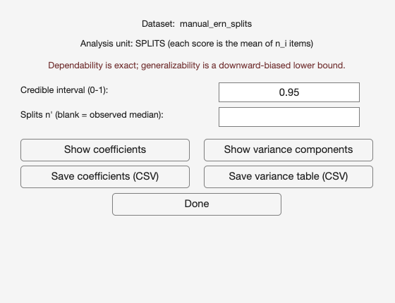

# 13. Tutorial 4: Reliability from data splits

Sometimes single-trial scores are gone. A collaborator sends averages from six
blocks; a published dataset supplies odd-trial and even-trial means; a
preprocessing pipeline exports per-run averages and nothing finer. The variance
components a one-facet model needs are still recoverable from those averages,
provided one extra piece of information travels with them: how many trials went
into each average.

That number is what makes the analysis possible, and PsyRAT requires it. This
tutorial runs `test_data/manual_ern_splits.csv` through the splits path. It
assumes [Chapter 10](10_tutorial-single-session.md).

## 13.1 The splits input contract

A splits file is long format, one row per SPLIT rather than one row per trial,
with three required columns.

- `id`: the participant identifier, as always.
- `meas`: the split MEAN, not a single-trial score.
- a weight column: n_i, the number of items (trials) averaged into that split.

Optional `group`, `event`, and `time` columns behave as they do elsewhere,
subject to the design restriction in Section 13.7.
[Chapter 6](06_preparing-data.md) covers file preparation in general.

The weight column is not optional and it is not a precision hint. It is a
structural parameter of the model: the residual variance of a split mean is the
per-item residual variance divided by n_i, so the estimator cannot separate the
item-level residual from the person-by-split interaction without variation in
n_i. PsyRAT checks the column on load and requires positive whole numbers. A
value of 0, a negative value, a fraction, or a non-numeric entry stops the run
with an error naming the column.

`manual_ern_splits.csv` has 36 participants (ids 301 to 336), sixteen split
means each, 576 rows, and weights drawn between 4 and 40 trials per split. The
unequal weights are deliberate: they are what puts this file on the nonparallel
path.

## 13.2 Parallel or nonparallel

The Split type control asks you to declare which kind of splits you have, and it
is a declaration about the design rather than a request for a computation.

Parallel (equal n_i) means every split holds the same number of items. PsyRAT
then reuses the standard one-facet or test-retest machinery unchanged: the split
mean is simply the score, and n' becomes the number of splits instead of the
number of trials. Every output you know from Tutorial 1 appears, with "trial"
relabeled "split" throughout.

Nonparallel (unequal n_i) means the splits hold different numbers of items.
PsyRAT then fits a weighted, observed-design model in which each split mean's
residual is scaled by its own n_i. That model is identified ONLY by variation in
n_i, which is why declaring nonparallel on a file with equal weights will not
work, and why declaring parallel on this file would silently treat sixteen
unequal averages as interchangeable.

Check the weights before you declare. This file has unequal weights, so it is
nonparallel.

## 13.3 What the true values are

The generating model is persons crossed with splits on the item scale. Each
split mean is a grand mean plus a person effect, a split main effect (shared by
every participant at that split index), a person-by-split interaction, and
residual noise whose variance is the per-item variance divided by that split's
n_i:

    meas(p, s) = mu + person(p) + split(s) + ps(p, s) + e(p, s),
                 e ~ Normal(0, sigma_item^2 / n_i)

with mu = -3.5 microvolts, sigma_p = 2.0, sigma_s = 0.5, sigma_ps = 0.7, and
sigma_item = 5.0. The two split-level components are small on purpose: large
enough that the model has something real to find, small enough that the
item-level noise dominates the residual, as it does in split data from an ERP
task.

Dependability of an equal-weight mean of n_s split means uses the HARMONIC mean
of the items per split, because that is the exact residual scale when split means
of different sizes are averaged with equal weight. For this file the harmonic
mean over all 576 splits is

    n-bar_i = 576 / sum(1 / n_i) = 14.757

against an arithmetic mean of 21.87. The gap between those two numbers is the
price of equal-weight averaging over unequal splits, and it is real: the design
behaves like 16 x 14.757 = 236.1 items per participant rather than the 349.9
items that were actually averaged.

The true dependability at the observed design (16 splits) is

    item part of one split mean's variance = 5.0^2 / 14.757 = 1.694
    split-level part = sigma_ps^2 + sigma_s^2 = 0.49 + 0.25 = 0.74
    absolute error variance of a 16-split mean = (1.694 + 0.74) / 16 = 0.152
    D = 2.0^2 / (2.0^2 + 0.152) = 4.00 / 4.152 = .963

and the absolute standard error of measurement is sqrt(0.152) = 0.39 microvolts.
The true generalizability coefficient drops the split main effect from the
error, (1.694 + 0.49) / 16 = 0.137, and comes out at 4.00 / 4.137 = .967, with a
relative standard error of measurement of 0.37. Section 13.6 explains why
PsyRAT reports the second one as a bound.

For comparison, a straight mean of all 349.9 items, with no split structure at
all, would have reached 4.00 / (4.00 + 25 / 349.9) = .982. The two hundredths
between that and .963 split about evenly between the two split-level components,
which averaging over sixteen splits shrinks by sixteen rather than by three
hundred and fifty, and the harmonic-mean penalty for unequal weights. Both costs
are small, and neither is zero.

## 13.4 Running the analysis

Load `test_data/manual_ern_splits.csv` through Process New Data.

Checkpoint: the Specify Inputs screen should show these selections.

| Control | Value |
|---|---|
| Participant ID: | `id` |
| Measurement: | `meas` |
| Group ID: | `(none)` |
| Event Type: | `(none)` |
| Occasion ID: | `(none)` |
| Items per split (n_i): | `(none)` |

Auto-detect finds `id` and `meas`. It does NOT find the weight column, and it
never will: PsyRAT cannot tell a column of item counts from any other integer
column, and guessing wrong would change the design silently. Set the last two
controls yourself.

| Control | Value |
|---|---|
| Items per split (n_i): | `weight` |
| Split type: | Nonparallel (unequal n_i) |

Selecting a column under Items per split (n_i) is what declares that each row is
a split mean rather than a single trial. Leave it on `(none)` and PsyRAT will run
an ordinary one-facet analysis without complaint, because nothing in the file
itself says otherwise.

What comes back is then mislabeled rather than obviously wrong, which is worse.
The sixteen averages are treated as sixteen trials, so every "trial" in the
output is really a split; the decision study projects over hypothetical numbers of SPLITS
while calling them trials, and a trial cutoff of 9 would mean nine splits, not
nine trials; and the per-item residual, which is the quantity the splits model
exists to recover, is never estimated at all. The coefficient at the observed
design happens to come out close either way, because a common residual fitted to
split means lands near the same place. That coincidence is exactly why the
mislabeling is easy to miss. Declaring the column costs one click.

Leave the processing preferences at their defaults: 4 chains, 5,000 warmup, 5,000
sampling, seed 12345.

Click Analyze and choose a whitespace-free output path.

Checkpoint: the Command Window should print "Model converged", with a maximum
R-hat of 1.00 and 0 divergent transitions.

## 13.5 The splits viewer

A nonparallel splits run opens its own viewer, not the single-session one.

The window is titled Data-Splits Reliability: View Results. Under the dataset
name sits a banner reading "Analysis unit: SPLITS (each score is the mean of n_i
items)", and under that, in red, the caveat this chapter's Section 13.6 explains:

> Dependability is exact; generalizability is a downward-biased lower bound.

Two controls and five buttons follow.

- Credible interval (0-1): the interval width, default `0.95`.
- Splits n' (blank = observed median): the number of splits the coefficients are
  reported at. Blank uses each stratum's observed median, which is 16 here.
- Show coefficients, Show variance components, Save coefficients (CSV),
  Save variance table (CSV), and Done.

A third control, Occasions n' (blank = observed), appears only for the
multi-occasion split design. This file has one occasion, so it is not there.

Leave both controls as they are and click Show coefficients.

Notice what this viewer does NOT have: no Reliability Cutoff, no
dependability-versus-splits plot, no split-cutoff table, and no included and
excluded counts. That absence is the design, not an omission, and Section 13.7
explains it.

### The coefficients table

The window is titled Data-splits reliability: coefficients. Its columns are
Stratum, Coefficient, n splits, n occasions, Dependability, D low, D high,
Generalizability (lower bound), G low, G high, SEM (abs), and
SEM (rel, upper bound). The bias note is repeated in full under the table.

There is one row, because this design has one stratum and one coefficient.

| Column | Value | Truth |
|---|---|---|
| Stratum | measure | |
| Coefficient | Internal consistency (equivalence) | |
| n splits | 16 | 16 |
| n occasions | 1 | 1 |
| Dependability | .97 | .963 |
| D low, D high | .96, .98 | |
| Generalizability (lower bound) | .97 | .967 |
| G low, G high | .96, .99 | |
| SEM (abs) | 0.39 | 0.39 |
| SEM (rel, upper bound) | 0.37 | 0.37 |

Dependability near .97 is high, and it should be. Sixteen splits of about
fifteen effective items each is over two hundred effective items per
participant, and the same components at 50 single trials would give only
4.00 / (4.00 + 25 / 50) = .889. The splits path is not doing anything more
efficient than ordinary averaging. It is starting from data that have already
been averaged a great deal.

### The variance components table

Click Show variance components. The window is titled Data-splits reliability:
variance components, with the columns Stratum, Component, Symbol, Estimate,
CI lower, and CI upper.

These are VARIANCES, not standard deviations. The truth column below squares the
generator's SDs accordingly.

| Component | Symbol | Truth | Estimate | 95% CrI |
|---|---|---|---|---|
| Between-person variance (universe score) | sigma^2_p | 4.00 | 5.52 | [3.37, 9.03] |
| Split main-effect variance | sigma^2_s | 0.25 | 0.24 | [0.08, 0.56] |
| Person x split variance | sigma^2_ps | 0.49 | 0.71 | [0.28, 1.13] |
| Per-item residual variance (item:split lumped) | sigma^2_(i:s),e | 25.00 | 21.49 | [13.78, 30.85] |

The per-item residual is the interesting one. The data contain no item-level
scores at all, and the model still recovers the item-level variance, because
splits built from different numbers of items shrink at different rates and that
pattern identifies the per-item scale. Recovering a per-item variance whose
credible interval covers the true 25 from a file whose smallest unit is a split
mean of anywhere from 4 to 40 trials is the whole trick of the nonparallel
design, and it is worth a moment's appreciation before Section 13.6 explains
what it cannot do.

The Save coefficients (CSV) and Save variance table (CSV) buttons export either
table to `.xlsx` or `.csv` with a provenance header carrying the seed, the
engine, the credible-interval width, the analysis-unit banner, the convergence
verdict, and the bias note. Export both.

The two split-level components should come back small, with wide intervals: a
split main effect is estimated from sixteen split indices and a person-by-split
interaction from sixteen values per participant, so neither is pinned down
tightly, and that is the correct amount of uncertainty for what sixteen splits
can tell you. In your own data a substantial split main effect would mean the
splits differ systematically (blocks recorded at different times, say), and a
substantial person-by-split variance would mean participants differ in how they
change across splits. Either is worth knowing about before you average the
splits together.

This recovery is an illustration. Thirty-six participants cannot establish that
an estimator is unbiased, and this run is not evidence that it is; PsyRAT's
correctness claims rest on the validation suites described in `README.md`.

## 13.6 Why generalizability is only a lower bound

The caveat line in the viewer is not boilerplate, and it has a specific cause.

Dependability, the absolute-error coefficient, counts every source of within-person
variation as error. Generalizability, the relative-error coefficient, excludes the
item main effect, because a constant shift affecting all participants equally does
not disturb their rank ordering. Excluding that term is what makes generalizability
the larger of the two coefficients in an ordinary one-facet analysis (equal
when the excluded term is zero).

From split means, the item main effect cannot be separated out. A split mean has
already collapsed its items, so the item-level partition is gone, and the
per-item residual PsyRAT estimates necessarily lumps the item main effect
together with the person-involving item residual. The absolute coefficient does
not care, because it was going to count both terms as error anyway, and it is
computed exactly. The relative coefficient does care: it subtracts a term it
cannot see, so it subtracts nothing, leaves too much in the error, and comes out
too low. Its SEM is correspondingly too high.

Hence the labeling. Generalizability (lower bound) and SEM (rel, upper bound) are
honest column headings, and the toolbox flags every relative coefficient it
reports from split data. Use the dependability coefficient when you can. If your
question genuinely requires the relative coefficient, report the value as a bound
and say why.

In this file the bound happens to be tight, because the simulator included no
item main effect for the estimator to miss. Do not read that as reassurance about
your own data. The toolbox cannot tell a tight bound from a loose one, and
neither can you, from split means alone.

## 13.7 No D-study for the nonparallel design

There is no dependability-versus-splits plot here and no split-cutoff table, and
the reason is the same identifiability collapse.

A D-study projects reliability onto hypothetical designs: what would this score
look like at 20 trials, at 40, at 100? That projection requires knowing how each
variance component scales with the count being varied, and for the nonparallel
split design the item-level partition needed to project over ITEM counts is not
recoverable from split means. PsyRAT therefore reports coefficients at the
OBSERVED design only, and offers exactly one projection it can defend: the
Splits n' box, which reports the coefficients at a different number of SPLITS,
holding the harmonic-mean items-per-split fixed at what the data supplied.

Try it. Enter `3` under Splits n' and click Show coefficients again, then try
`12`. At the true components, the same arithmetic as Section 13.3 (2.434 of
variance per split mean, item part plus split-level part) gives
4.00 / (4.00 + 2.434 / 3) = .831 at three splits and
4.00 / (4.00 + 2.434 / 12) = .952 at twelve. The viewer does not know the true
components. It recomputes from the fitted ones, holding the harmonic-mean
items-per-split fixed at what the data supplied, and the fitted between-person
variance came out at 5.52 rather than 4.00, so the printed values run higher.
Plugging the variance-components table into the same formula
(0.24 + 0.71 + 21.49 / 14.757 = 2.41 of variance per split mean) gives
5.52 / (5.52 + 2.41 / 3) = .87 at three splits and
5.52 / (5.52 + 2.41 / 12) = .96 at twelve. The viewer prints
.87 at three splits and .96 at twelve. It averages
the coefficient over the posterior draws rather than plugging in point
estimates, so it need not match the plug-in arithmetic to the second decimal.
Those are legitimate projections because the number of splits is a count the
design does identify.

What you cannot ask is "what if each split had 40 items instead of about 15",
and the viewer does not offer it. If you need that answer, you need the
single-trial data, and [Chapter 10](10_tutorial-single-session.md) is the
analysis to run on them.

One further restriction, so it does not surprise you mid-run: the single-occasion
nonparallel splits design does not support group or event facets. It is fitted as
one pooled model over all participants. Adding an occasion column moves you to
the two-facet split design, which IS group and event aware.

Point Group ID or Event Type at a real column on a single-occasion splits file
and the run stops rather than pooling your groups silently. The Command Window
prints "Measurement failed:" with the measurement column name, then a "Reason:"
line, PsyRAT writes a `.txt` error report next to the output path, and a modal dialog reports that the measurement
failed and points you at that report. Nothing is estimated, and nothing wrong is
saved. Other combinations the splits path does not support (difference scores,
subject-level error variances, dynamic reliability) are caught earlier, by a
modal Reliability with splits dialog raised before CmdStan launches.

## 13.8 Reporting this analysis

The [Chapter 17](17_reporting.md) template, pre-filled.

> Scores were available as block means rather than single trials, so
> reliability was estimated with the observed-design data-splits model
> implemented in PsyRAT, in which each score is the mean of n_i items and n_i
> is supplied per split (Bayesian estimation in CmdStan; 4 chains, 5,000 warmup
> and 5,000 sampling iterations, seed 12345; maximum R-hat = 1.00, 0 divergent
> transitions). Splits were nonparallel (items per split ranged from 4 to 40;
> harmonic mean 14.76). Coefficients are reported at the observed design of 16
> splits per participant; no decision study over item counts is identified from
> split means. Dependability was .97, 95% CrI [.96, .98], with an absolute
> standard error of measurement of 0.39 microvolts. The between-person variance
> was 5.52 and the per-item residual variance 21.49. The generalizability
> coefficient (.97) is reported as a downward-biased lower bound, because the
> item main effect cannot be separated from the person-involving item residual
> when only split means are available.

State that the data were splits, state the items-per-split distribution, and
state the design the coefficients were reported at. A dependability of .97 from
sixteen averages of 4 to 40 trials is a different claim from a dependability of
.97 from sixteen trials, and a reader who is given only the coefficient cannot
tell them apart.

## 13.9 Where to go next

- The complete set of analyses and when each applies:
  [Chapter 16](16_analysis-reference.md).
- Running these analyses from a script instead of the GUI:
  [Chapter 14](14_scripting.md).
