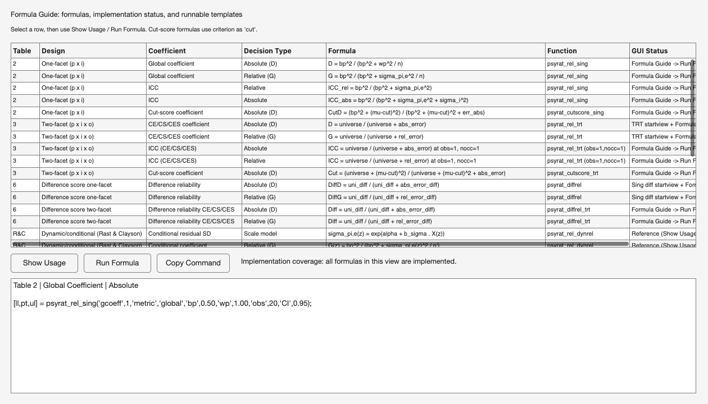

# 14. Scripting with psyrat_run

Almost everything the Process New Data screens do can also be done from a
script; Sections 14.3 and 14.6 name the exceptions. `psyrat_run` is the
command-line entry point. It accepts the same settings the
GUI collects, in the same units, with the same defaults, and it validates them
against the same rules.

## 14.1 Why script an analysis

If a study has eight measurement columns and two datasets, the GUI asks for
sixteen trips through the same screens. A loop asks once. Batch work is the
most common reason to move to the command line, and the saving compounds every
time a preprocessing change sends you back through all sixteen.

A script is also the record. It states the seed, the iteration counts, the
column mapping, and the design flags in a form a reviewer can read and a
collaborator can execute. Nothing has to be reconstructed from memory when the
revise-and-resubmit arrives eleven months later.

The third reason is hardware. A cluster node or a remote session with no
display cannot open a GUI at all. `psyrat_run` never opens one unless you ask
it to.

None of that would be worth much if the scripted path were a second
implementation of the analysis. It is not. `psyrat_run` builds the same
preferences and data scaffold the GUI builds, then hands them to the same
loader and the same estimation wrapper the GUI calls. Given the same inputs and
the same seed, a scripted run produces the same variance components and the
same convergence diagnostics as the GUI, and writes the same `.psyrat` file.

What a script needs installed is what the GUI needs installed, and nothing more:
a MATLAB release the toolbox runs on, a working CmdStan for the full Bayesian
path, and the patched MatlabStan that ships inside `bundled_dependents/`
([Chapter 3](03_installation.md)). The scripted path adds no requirement of its
own, and it removes none either.

Before scripting, get the toolbox on the MATLAB path by running `psyrat_start`
once in the session. That adds the toolbox root, `subroutines/`, and
`bundled_dependents/`. Do not use `addpath(genpath(...))` on the whole toolbox
folder. Otherwise, stale copies sitting in tooling or artifact folders can
shadow the real files, and you will be running code you cannot locate.

One more thing to know before the first call: `psyrat_run` analyzes one
measurement column per call. The GUI can queue several measurements behind a
single press. A script loops instead, which is what Section 14.3 shows.

## 14.2 Tutorial 1 as a script

Tutorial 1 ([Chapter 10](10_tutorial-single-session.md)) walks the
single-session ERN dataset through the GUI, and the script below runs that same
analysis. Start with this preamble, because every block after it reuses these
variables.

```matlab
% Locate the toolbox root from a file that lives in it, rather than hardcoding
% a path. which() reports where MATLAB actually found psyrat_run, so this also
% fails loudly if the toolbox is not on the path yet.
psyratroot = fileparts(which('psyrat_run'));
datafile   = fullfile(psyratroot,'test_data','manual_ern_singlesession.csv');

% Output directory. It must already exist when psyrat_run is called: the
% toolbox writes into it, but it does not create it for you.
outdir = fullfile(tempdir,'psyrat_manual');
if ~exist(outdir,'dir')
    mkdir(outdir);
end

% CmdStan rejects whitespace anywhere in the output path or the output
% filename. Check here rather than after a failed model compile.
if any(isspace(outdir))
    error('Choose an output directory with no spaces in it: %s', outdir);
end
```

The estimation call comes next. The tutorial dataset uses the canonical column
names (`id`, `meas`, plus `group` and `event`), so `idcol` and `meascol` could
both be omitted. They are written out once here so the mechanism is visible:
any file whose id or score column is named something else needs these two
arguments, and most real files do.

```matlab
psyrat_data = psyrat_run( ...
    'file',     datafile, ...    % long format: one row per single-trial score
    'idcol',    'id', ...        % participant id column (this IS the default)
    'meascol',  'meas', ...      % numeric score column to analyze (also default)
    'groupcol', 'group', ...     % between-person grouping column
    'eventcol', 'event', ...     % condition column
    'whichevents', {'inc_err', 'inc_cor'}, ... % the two events Tutorial 1 selects
    'savepath', outdir, ...      % must exist, and must contain no whitespace
    'savename', 'manual_ern.psyrat', ... % '.psyrat' is added if you omit it
    'chains',   4, ...           % default 4; 3 is the enforced floor for R-hat
    'warmup',   5000, ...        % default
    'sampling', 5000, ...        % default
    'seed',     12345);          % default; fix it, and report it in the paper
```

Success! Two files now exist in `outdir` and one structure exists in the
workspace. `manual_ern.psyrat` holds the estimated result,
`manual_ern_runconfig.json` records the settings that produced it (Section
14.4), and
the returned `psyrat_data.rel` holds the variance components and the
convergence diagnostics. Reopen the saved file later with the GUI View Results
button, or read it back in a script. It is a MAT-file under a different
extension, and it contains one variable:

```matlab
S = load(fullfile(outdir,'manual_ern.psyrat'), '-mat');
psyrat_data = S.psyrat_data;
```

Budget for the first call to cost more than the ones after it. Every generated
model is compiled once before it can be sampled, and a run that fits four events
compiles four models ([Chapter 3](03_installation.md) records the measured
compile time). Sampling time after that scales with the data and the iteration
counts. The `psyrat_relsummary` and `psyrat_report` steps below add seconds
rather than minutes, because neither one samples.

Two variations on the input are worth having before the first real dataset.
Passing `data` with a table already in the workspace replaces `file`; supply
exactly one of the two, never both. This is the route to take when the scores
are built or filtered in MATLAB rather than read from disk, and it is how the
import and scoring screens hand their result to an analysis
([Chapter 8](08_import-score.md)).

```matlab
tbl = readtable(datafile);      % or any long-format table you built yourself
psyrat_data = psyrat_run('data', tbl, ...
    'savepath', outdir, ...
    'savename', 'manual_ern_inmemory.psyrat');
```

The second is `timecol`, which is the argument that selects a test-retest
design. Naming an occasion column declares the occasion facet, and the analysis
changes accordingly; the tutorial file here is single-occasion, so the examples
in this chapter stay one-facet. On a repeated-measures file the change is
`'timecol','session'` alongside the other column arguments
([Chapter 11](11_tutorial-test-retest.md)).

Estimation stops at the variance components. Two more calls turn those into the
tables the results viewer shows, and both run headlessly. `psyrat_relsummary`
is the compute layer: it runs the D-study and applies the trial-count cutoff,
which determines the participants and conditions that clear the threshold. The
estimand choices are made there, not later.

`psyrat_report` then assembles the result into MATLAB tables and, when given
an `outdir`, writes them to disk. It never re-estimates and never re-runs the
D-study; nothing it does opens a window. Every exported table carries a header
recording the seed, the analysis, the engine, the priors preference, the convergence verdict, and the
divergent transition count, so a saved table can be read on its own. Tables
built from a summary also record the credible-interval width the summary was
built at; the families that never build one (data splits, dynamic reliability,
difference-of-differences) carry no width line. `psyrat_report` computes its
own tables at that same stored width unless you pass `'CI'` explicitly; an
explicit width that differs from the stored one is disclosed by an extra header
note naming both.

```matlab
% Step 1: the D-study. 'analysis' is a dispatch key (see the table below), not
% the name of the analysis that was estimated.
[psyrat_data, relerr] = psyrat_relsummary('psyrat_data', psyrat_data, ...
    'analysis',    'sing', ... % one-facet route
    'depcutoff',   .80, ...    % dependability threshold for the trial cutoff
    'meascutoff',  2, ...      % 1 lower CI limit, 2 point estimate, 3 upper
    'depcentmeas', 1, ...      % 1 mean, 2 median, for the overall estimate
    'gcoeff',      1);         % 1 dependability, 2 generalizability

% Stop before reporting if the summary aborted. The GUI raises a dialog at
% that point; a script has to test the flag itself. Note the flag's scope:
% on most designs an empty threshold result no longer aborts (the summary
% returns in full with a console line and n Included 0 rows), so also check
% that someone was retained before treating the tables as informative.
if relerr.nogooddata == 1
    error('The summary aborted, so there is nothing to report.');
end
if isempty(psyrat_data.relsummary.group(1).goodids)
    warning('No participant cleared the threshold; the tables report a zeroed group.');
end

% Step 2: assemble and export. Omit 'outdir' to get the tables back without
% writing any files.
report = psyrat_report(psyrat_data, ...
    'outdir', fullfile(outdir,'tables'), ...
    'format', '.csv');          % '.xlsx' is the default

disp(report.tables.overall);    % also .cutoff and .curve for this family
```

A summary can also finish without aborting and still have no cutoff to report.
When no trial count in the projected range reaches the threshold, or when the
count it finds lies beyond every participant's observed trials, the affected
row of the cutoff table prints `-1` in place of the cutoff and the coefficient.
The GUI raises a dialog for each case (Cutoff not calculable, Extrapolation
beyond data); a script sees no dialog, so `psyrat_report` returns the
explanation in `report.cutoff_note` and writes the same sentence into the
header of every table it exports. Read that note before quoting a cutoff; it is
empty for a clean run.

A `.psyrat` file saved by the GUI carries no record of how it will be
summarized later, so `psyrat_relsummary` treats it as interactive and can raise
the threshold-failure dialog when no participant clears the cutoff. Inside a
batch loop, pass `'interactive', false` to `psyrat_relsummary`; the condition
is still reported through `relerr.nogooddata`, and files written by `psyrat_run`
already carry the headless flag.

### Which `analysis` value, and which arguments

`psyrat_relsummary`'s `analysis` argument is a dispatch key, and for most
designs it is not the string stored in `psyrat_data.rel.analysis`. Passing the
stored string instead of the key is the single most common scripted mistake.
The mapping:

| `psyrat_data.rel.analysis` | Design | `analysis` to pass | Required arguments | Optional |
|---|---|---|---|---|
| `ic` (or field absent) | one-facet | `sing` | `depcutoff`, `meascutoff`, `depcentmeas` | `gcoeff` (1) |
| `ic_sserrvar` | one-facet, subject-level | `sing_sserr` | `depcutoff`, `meascutoff`, `depcentmeas` | `gcoeff` (1) |
| `ic_diff` | one-facet difference | `sing_diff` | `depcutoff`, `meascutoff`, `depcentmeas` | `gcoeff` (1), `diffgcoeff` (1) |
| `ic_diff_sserrvar` | one-facet difference, subject-level | `sing_diff_sserr` | `depcutoff`, `meascutoff`, `depcentmeas` | `gcoeff` (1), `diffgcoeff` (1) |
| `trt` | test-retest | `trt` | `gcoeff`, `reltype`, `relcutoff`, `meascutoff`, `relcentmeas` | `noccmode` (1), `nocc` |
| `trt_sserrvar` | test-retest, subject-level | `trt_sserr` | `reltype`, `depcutoff`, `meascutoff` | `gcoeff` (1), `noccmode` (1), `nocc` |
| `trt_diff` | test-retest difference | `trt_diff` | `gcoeff`, `reltype`, `relcutoff`, `meascutoff`, `relcentmeas` | `diffgcoeff` (1), `noccmode` (1), `nocc` |
| `ic_dodiff` | difference-of-differences | do not call | | |
| `ic_splits`, `trt_splits` | nonparallel data splits | do not call | | |
| the `*dynrel*` variants | dynamic/conditional reliability | do not call | | |

Read that table before writing the call. Its last two columns are where scripted
calls go wrong, and four of the entries there are worth spelling out.

`depcutoff` and `relcutoff` carry the same GUI input under two names, and each
branch accepts only its own spelling. Pass the wrong one and the branch errors
saying the argument was not specified, which reads like a missing argument
rather than a misspelled one. The subject-level test-retest route is the odd
case: it is a two-facet design that still takes `depcutoff` and `meascutoff`,
because it inherits the subject-level participant-inclusion contract instead of
the test-retest one.

`gcoeff` is required on the `trt` and `trt_diff` routes and defaults to 1
(dependability) everywhere else. `depcentmeas` is required by all four `sing*`
routes, including `sing_sserr`, where the function's own help notes that its
value is never used. Omitting it there still errors. `CI` (default `.95`) is
accepted by every route.

The last three families never reach `psyrat_relsummary` at all.
Difference-of-differences, nonparallel data splits, and dynamic reliability read
`psyrat_data.rel` directly, so for those you call `psyrat_report` immediately
after `psyrat_run`. There is no branch in `psyrat_relsummary` for those strings.
Passing one is not merely unnecessary: it falls through the dispatch. Parallel
splits are the exception inside the exception, because they reuse the one-facet
and test-retest models and therefore carry `rel.analysis` of `ic` or `trt` and
follow the ordinary two-step path above ([Chapter 13](13_tutorial-splits.md)).

Which tables come back depends on the family. The one-facet and test-retest
families return `.cutoff`, `.overall`, and `.curve`, with `.diffcurve` added for
`trt_diff`. The subject-level family returns `.variance` and `.sscoeffs`.

Data splits return `.coefficients` and `.varcomp`. Dynamic reliability returns
`.surface` and `.varcomp`, plus `.ssrel` for the subject-level variants, and
difference-of-differences returns `.dod_observed` and `.dod_varcomp`.

With the same two events selected, the numbers this script produces are the
numbers Tutorial 1 prints. Nothing differs between the two runs except which
surface issued the call (leave `whichevents` out and the script fits all four
events, and the retention counts change with the events processed).
A GUI run and a `psyrat_run` call at identical settings produce
bit-identical posterior draws, because both surfaces call the same
estimation function.

## 14.3 Running headless

`psyrat_run` defaults to `'interactive', false`, which means no dialogs, ever.
Nothing waits for a click. If a model does not converge, the run automatically
doubles both the warmup and the sampling iterations and fits again, up to four
automatic reruns, then stops with an error naming the measurement that failed.
Starting from the default 5,000 and 5,000, that means the last automatic attempt
runs at 80,000 and 80,000, so budget the wall-clock time accordingly before
launching an overnight batch.

If that error fires, no `.psyrat` file is written. The error is raised before
the save, so a non-converged headless run leaves nothing behind that could later
be mistaken for a finished analysis. Pass
`'interactive', true` to opt back into the GUI rerun prompt, which offers the
choice to accept and save the non-converged fit instead. Trace-plot review stays
GUI-only on both settings.

A batch loop therefore needs one thing the GUI gives you for free: somewhere for
the failures to go. Wrap each call in `try/catch`, record which ones failed, and
report at the end rather than watching the console.

```matlab
% One entry per measurement column to analyze. The tutorial file has a single
% score column; a real study file usually has several, and the loop is the same.
meascols = {'meas'};
failed   = {};       % names that errored, reported once when the loop ends

for k = 1:numel(meascols)
    thiscol = meascols{k};
    try
        % Each measurement gets its own output file, so one failure cannot
        % overwrite or invalidate a run that already finished.
        psyrat_run('file', datafile, ...
            'meascol',  thiscol, ...
            'groupcol', 'group', ...
            'eventcol', 'event', ...
            'savepath', outdir, ...
            'savename', sprintf('batch_%s.psyrat', thiscol), ...
            'seed',     12345);
    catch ME
        % Non-convergence after the automatic reruns arrives here, as does any
        % data-validation rejection. Keep going; report the whole set below.
        failed{end+1} = thiscol; %#ok<AGROW>
        fprintf('Skipped %s: %s\n', thiscol, ME.message);
    end
end

if isempty(failed)
    fprintf('All %d measurements finished.\n', numel(meascols));
else
    fprintf('%d of %d measurements failed: %s\n', ...
        numel(failed), numel(meascols), strjoin(failed, ', '));
end
```

Looping over files instead of columns takes the same shape: build a cellstr of
paths, and give each one its own `savename`. Data-level validation (numeric
measurement column, event counts, supported design combinations) is enforced by
the same validator the GUI uses, `psyrat_preflight_validate`, so a script and
the GUI reject the same inputs on the same rules. The wording can differ: the
Process New Data screens carry their own earlier copies of several checks so
they can warn before a run starts, and those speak in the GUI's voice
([Chapter 18](18_troubleshooting.md)).

## 14.4 Reproducing a run from its sidecar

Every run writes a `*_runconfig.json` sidecar next to its `.psyrat` output,
named after it, whether the run came from the GUI or from `psyrat_run`. This is
what makes a GUI analysis reproducible from a script.

The sidecar records the estimation settings (seed, chains, warmup, sampling,
total iterations, within-chain parallelization, verbosity, and the optional
`adapt_delta` and `max_treedepth` overrides), the design flags, the column
mapping, the priors structure, and the output location. The priors entry
records the full prior set the run actually fit: a partial override passed to
`psyrat_run` is merged over the defaults before fitting, and the merged result
is what the sidecar stores, so a replay reproduces the same model (see
[Chapter 15](15_advanced-designs.md) for setting priors).

The two sampler overrides are recorded for a specific reason, though not quite
the same reason. `adapt_delta` sets the dual-averaging target during warmup, so
raising it changes the step size the sampler settles on and therefore changes
the draws at a fixed seed. `max_treedepth` is a cap on the NUTS trajectory
rather than an adaptation setting, so it changes the draws only when the cap
actually binds; when trajectories end on the U-turn criterion below the cap,
raising it changes nothing. Either way, neither is a cosmetic setting that can
be left out of a replay and reconstructed later, which is why the sidecar
restores both rather than reverting to the defaults. It also records the
provenance a reader needs to judge whether a replay is really a replication: the
PsyRAT and MATLAB versions, the CmdStan version detected on the machine that ran
it, the source filename with content hashes of both the file and the loaded
table, and the row count that entered estimation. The engine appears twice, as
the preference that was requested and as the engine that actually ran.

A separate viewer block records the settings that select which coefficient the
output was reported under: `gcoeff`, `reltype`, `diffgcoeff`, `noccmode` and
`nocc`, and the two viewer cutoffs. That block is record-only. `psyrat_run`
exposes no options for it, so a replay reads past it. It is there for the
methods section and for anyone reconstructing what a saved table's numbers
actually were.

Replaying adds one argument, the sidecar path; the data source and output
location are still required:

```matlab
% Settings come from the sidecar. The data source and the output location are
% still supplied normally, so a recorded configuration can be pointed at new
% data without editing the JSON.
psyrat_run('config', fullfile(outdir,'manual_ern_runconfig.json'), ...
    'file',     datafile, ...
    'savepath', outdir, ...
    'savename', 'manual_ern_replay.psyrat');
```

Any option passed explicitly beats the recorded value, so one configuration can
be reused across datasets, or its iteration counts raised while everything else
stays fixed. The precedence is worth stating the other way round too: an option
you do not pass is filled in from the sidecar, including options you may have
forgotten it recorded.

Two differences make a replay something less than a replication, and both raise
a warning rather than stopping the run. If the CmdStan version detected here
differs from the recorded one, or if no CmdStan can be detected at all, the
warning names both versions. NUTS draws are not guaranteed identical across
CmdStan versions at a fixed seed, so treat a version mismatch as a reason to
re-estimate rather than to compare numbers across the two runs. The second
warning fires when the recorded `engine_used` is not what the restored
preference will select here. A replay restores the engine preference, never the
engine that ran, and under the default automatic preference the cascade is
re-derived from the engines installed on this machine (Section 14.5).

CAUTION. Gamma-family sidecars written before August 3, 2026 need one argument
on replay. The `gammascale` setting picks one of two parameterizations of the Gamma dispersion submodel. The
two are different estimands, and their variance components are not comparable.
On the designs that support it, the default changed on August 7, 2026, from
log-nu dispersion (1) to log residual SD (2).

Runs from August 3, 2026 onward pin the resolved value into the sidecar, so
replaying one of those reproduces its own estimand. A sidecar written before
that date carries no `gammascale` field, and the replay falls through to
whichever default the running toolbox has. Pass `'gammascale', 1` explicitly
when replaying one. Otherwise you will silently fit a different model from the
one the sidecar describes, and two sets of numbers that are not comparable will
look as though they are.

Five designs reject an explicit 1 because they are location-scale only: the
subject-level one-facet dynamic difference (analysis 13), the subject-level
dynamic concurrent differences at one and two facets (19 and 20), and the
person-specific dynamic difference of differences at one and two facets (28
and 29). None of it touches Gaussian runs.
[Chapter 15](15_advanced-designs.md) covers the gamma family and what each
parameterization means.

## 14.5 Choosing an engine when scripting

The `engine` option accepts `auto`, `cmdstan`, `fitlme`, or `hmc` (equivalently
0, 1, 2, or 3), and defaults to `auto`. Automatic tries CmdStan first, then the
native HMC engine, then the native fitlme engine, considering only engines
installed on this machine and warning loudly whenever it falls back off CmdStan.
When CmdStan is present and new enough, the cascade takes it silently and the
run is exactly the CmdStan run. A CmdStan below the supported minimum is the one
case that neither runs nor falls back: `auto` stops with an error telling you to
upgrade, on the reasoning that quietly substituting an approximate engine for
one the user has installed is the wrong default. Forcing a native engine
remains available.

Which engines are legal depends on the design, and that is the thing to settle
before reaching for the option at all:

| Design | Native engines that implement it |
|---|---|
| One-facet internal consistency, with or without group and event facets | fitlme only |
| Nonparallel data splits, single-occasion and test-retest | fitlme only |
| Plain test-retest | HMC and fitlme, cascade prefers HMC |
| Subject-level error variance | HMC only |
| Dynamic/conditional reliability | HMC only |
| Difference scores, difference-of-differences, and their two-facet and dynamic variants | HMC only |

Plain test-retest is the one design both native engines can fit, and the cascade
prefers HMC there because it is the more faithful fit and because fitlme is weak
when the between-occasion variance is poorly identified at small occasion
counts. Either stays reachable by forcing it. Any design absent from the table
has no native implementation and is CmdStan-only, and the gamma family is pinned
to CmdStan by the engine itself: forcing `fitlme` or `hmc` alongside
`'family', 'gamma'` is rejected outright rather than quietly fitting a Gaussian
model instead.

Forcing an engine is an explicit opt-in, and it errors naming the design if that
engine cannot fit it: `The native HMC engine does not yet implement this
analysis (design 'sing')`. It also errors if the engine's toolbox is not
installed. The native engines are not bit-identical to CmdStan, and the fitlme
engine's intervals are approximate frequentist bootstrap intervals rather than
Bayesian credible intervals, which is why every fallback and every forced fitlme
run prints a banner saying so.

```matlab
% Force the native fitlme engine. The tutorial dataset is a plain one-facet
% design, so fitlme is its ONLY native option; forcing 'hmc' here would error.
% The parametric bootstrap dominates the runtime at 1000 resamples.
psyrat_data = psyrat_run('file', datafile, ...
    'groupcol', 'group', 'eventcol', 'event', ...
    'savepath', outdir, 'savename', 'manual_ern_fitlme.psyrat', ...
    'engine',         'fitlme', ...
    'bootstrap_reps', 1000);      % default; ignored by CmdStan and HMC
```

Forcing native HMC takes the same shape, `'engine','hmc'`, but it has to be
paired with a design HMC implements: on this tutorial dataset that means turning
on a design from the HMC-only rows of the table above, `'ssubjrel', 2` for
subject-level reliability being the shortest route. One companion option belongs
with it. `hmc_gradient` chooses how the sampler obtains gradients, and its
default of `auto` uses automatic differentiation when the Deep Learning Toolbox
is installed and drops to numerical gradients on its own when it is not, so
`auto` needs no help on a machine without that toolbox. Pass
`'hmc_gradient','numer'` to force the numerical path deliberately, or `'ad'` to
insist on automatic differentiation and get an error rather than a silent
fallback when the toolbox is missing. The CmdStan and fitlme engines ignore the
option entirely.

No worked HMC example is printed here, and the omission is deliberate rather
than an oversight: the native sampler is far slower per draw than CmdStan, so at
the default four chains and 5,000 warmup and 5,000 sampling iterations a forced
HMC run is not a demonstration anyone would sit through. Budget for it on real
data, and prefer CmdStan wherever it is installed.

A native-engine result feeds `psyrat_relsummary` and `psyrat_report` through the
same two-step chain and returns the same tables. The exported provenance header
names the engine that actually ran, so a saved table says on its face whether it
came from CmdStan. I would still use CmdStan whenever it is installed. The
native engines exist so that an analysis is possible without it, not because
they are as good.

## 14.6 The Formula Guide

Typing `psyrat_formula_guide` at the MATLAB prompt opens a window listing the
reliability formulas the toolbox implements, one row per formula, with the paper
table it comes from, the design, the coefficient, the decision type (absolute or
relative), the formula in plain text, the function that computes it, and the
place in the toolbox where it is reachable.



No button anywhere in the GUI opens this window. It is installed on the path and
runnable, and typing its name is the only way in. Select a row first; the three
buttons all act on the selection.

- Show Usage: fills the panel at the bottom of the window with a short label
  for the selected formula (its paper table, coefficient, and decision type)
  and a runnable command template beneath it.
- Run Formula: opens a small input form, runs the selected formula on the values
  entered, and replaces the panel text with the result.
- Copy Command: copies the current usage command to the system clipboard.

An optional argument narrows the list to one family, which is faster than
scrolling when you know what you are after:

```matlab
psyrat_formula_guide                        % every formula in the catalog
psyrat_formula_guide('analysis','trt')      % test-retest rows only
```

The accepted values are `all` (the default), `sing`, `sing_diff`, `sing_sserr`,
`trt`, `dynrel`, and `splits`. Cut score formulas take the criterion as `cut`.

That leaves one thing a script cannot do. Criterion-score (cut score)
reliability has no headless entry point: its outputs are built by a function
that draws a figure and a table unconditionally, and `psyrat_report` has no
criterion branch. Cut score results currently require the GUI
([Chapter 9](09_viewing-results.md)). Trace plots stay in the GUI for the same
reason, and `psyrat_run` never renders them on either interactive setting.
Everything else in this manual can be produced from a script.

## 14.7 Option reference

`help psyrat_run` prints the authoritative list with the full reasoning behind
each entry, and the design flags in particular carry caveats no table can hold.
What follows is the working summary: every option `psyrat_run` accepts, what it
selects, and what it does when left out.

**Data source and output.** Supply exactly one data source, never both.

| Option | Meaning | Default |
|---|---|---|
| `file` | path to a long-format data file | (one source required) |
| `data` | long-format table in the workspace | (one source required) |
| `savepath` | existing output dir; no whitespace | (required) |
| `savename` | output filename; no whitespace | (required) |
| `config` | sidecar to replay; see Section 14.4 | `''` |

**Column mapping.** The empty default means the facet is absent, not that the
toolbox will guess at it.

| Option | Meaning | Default |
|---|---|---|
| `idcol` | participant id column | `'id'` |
| `meascol` | numeric score column to analyze | `'meas'` |
| `eventcol` | event/condition column | `''` (single event) |
| `groupcol` | between-person group column | `''` (single group) |
| `timecol` | occasion column; selects a test-retest design | `''` (one occasion) |
| `weightcol` | items-per-split (n_i) column | `''` |
| `dim1col`, `dim2col` | dynamic-reliability covariate columns | `''` |
| `whichevents`, `whichgroups`, `whichtimes` | restrict which labels are analyzed | `{}` (all) |

**Estimation settings.**

| Option | Meaning | Default |
|---|---|---|
| `chains` | CmdStan chains; integer, 3 or higher | `4` |
| `warmup` | warmup iterations per chain | `5000` |
| `sampling` | post-warmup sampling iterations per chain | `5000` |
| `seed` | RNG seed; fix it and report it | `12345` |
| `adapt_delta` | NUTS target acceptance rate (`delta=`) | `[]` (model's tuned value) |
| `max_treedepth` | NUTS tree-depth cap (`max_depth=`) | `[]` (CmdStan's 10) |
| `verbose` | 1 quiet, 2 print CmdStan iterations | `2` |
| `withinchain` | 1 off, 2 within-chain parallelization | `1` |
| `priors` | prior structure (see below) | `psyrat_default_priors` |
| `engine` | `auto`/`cmdstan`/`fitlme`/`hmc` (Section 14.5) | `auto` |
| `bootstrap_reps` | bootstrap resamples; fitlme only | `1000` |
| `hmc_gradient` | `auto`/`ad`/`numer`; native HMC only | `auto` |
| `family` | `gaussian` or `gamma` | `gaussian` |

The priors defaults deserve a paragraph of their own, because they are the one
setting whose default is wrong for some perfectly ordinary data, and because
they are not all on one scale. The Gaussian-family defaults are weakly
informative on the ERP microvolt scale, and they are NOT scale-free, so data
on another measurement scale needs values matched to that scale. The
gamma-family defaults are not microvolt priors at all: they live on the log
expected-score and log degrees-of-freedom scales and are calibrated to a
single-trial time-frequency-power reference, so they are already aimed at a
different modality and should be re-derived from that starting point rather than
from the Gaussian one. The dynamic-reliability dimension slopes are a third
case, set on the standardized predictor scale.
[Chapter 15](15_advanced-designs.md) shows how to set priors, and
[the priors and sensitivity note](../priors_and_sensitivity.md) documents each
block and what moves when it changes.

**Design and analysis flags.** These select the model, so a wrong value here is
not a tuning mistake but a different analysis.

| Option | Meaning | Default |
|---|---|---|
| `ssubjrel` | subject-level reliability: 1 off, 2 on | `1` |
| `diffest` | difference scores: 1 off, 2 two-event, 3 difference-of-differences | `1` |
| `dodmap` | 1x4 cell of event labels, ERP_1 to ERP_4 order | `{}` |
| `diffrescor` / `diffwpcov` | one setting, two names: residual covariance for co-occurring events, 1 off, 2 on | `1` |
| `dynrel` | dynamic/conditional reliability: 1 off, 2 on | `1`, or 2 via `dim1col` |
| `splits` | splits: 1 single-trial, 2 parallel, 3 nonparallel | `1` |
| `ssrescor` | residual correlation: 1 population, 2 per-subject | `1` |
| `dispersion` | copula dispersion: 1 per-person log-nu, 2 global | `[]` (per design) |
| `gammascale` | Gamma dispersion: 1 log-nu, 2 log residual SD | `[]` (per design) |

Six of those rows carry a condition the table cannot hold, and each one is a
real trap rather than a refinement.

`dynrel` cannot simply be switched on. Naming `dim1col` sets it to 2 by itself,
so the documented default of 1 is not the effective value whenever a dimension
column is named, and `'dynrel', 2` WITHOUT `dim1col` is an error rather than
a plain dynamic run. `dim2col` without `dim1col` is an error too: `dim1col` is
the one that switches the analysis on.

`dodmap` is required when `diffest = 3`, and `splits` values 2 and 3 both
require `weightcol`. `ssubjrel` also answers to `sserrvar`, a legacy alias kept
for older scripts.

`diffrescor` and `diffwpcov` are one setting under two names, so pass either and
the other follows. Passing both with contradictory values is an error, because
the two values select structurally different models and there is no safe way to
guess which was meant. The setting is meaningful only when `diffest = 2`; a
`diffest = 3` run rejects a concurrent request outright rather than ignoring it.

`gammascale` selects between two parameterizations that are DIFFERENT
ESTIMANDS, and their variance components are not comparable. Its default is
per design rather than global, and Section 14.4 covers what that means when
replaying an older sidecar.

**Execution control.**

| Option | Meaning | Default |
|---|---|---|
| `interactive` | allow the GUI rerun dialog on non-convergence | `false` |

`interactive` enables the rerun dialog and nothing else. It does not turn on
trace-plot review: `psyrat_run` pins that preference off and exposes no option
to change it, so trace plots stay GUI-only on both settings (Section 14.3).
`psyrat_relsummary` takes an option of the same name that governs its own
threshold-failure dialog (Section 14.2); it defaults to the flag the `.psyrat`
carries, and to interactive when the file was saved by the GUI.

**`psyrat_report` options.** The reporting call takes eight of its own. Note the
export format: `.xlsx` is the default, so a script that wants CSV has to say so.

| Option | Meaning | Default |
|---|---|---|
| `outdir` | where to write tables; omit to return only | `''` |
| `format` | `.xlsx` or `.csv` | `.xlsx` |
| `CI` | credible-interval width | the summary's width, else `.95` |
| `marginal` | dynrel: 0 typical-person, 1 population-average | `0` |
| `reltype` | dynrel two-facet: 1 equiv., 2 stability, 3 both | `3` |
| `nocc` | dynrel two-facet: occasion n', or `'observed'` | `[]` (1) |
| `ngrid` | dynrel: grid points per dimension axis | `25` |
| `ntrials` | one-facet/test-retest: max trial count for the curve | `50` |
