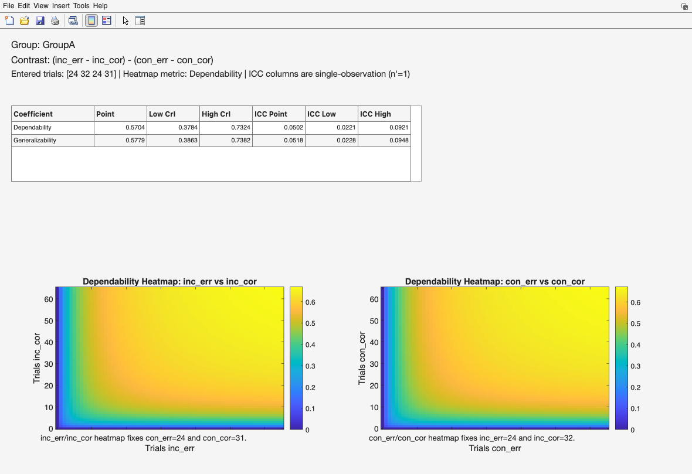
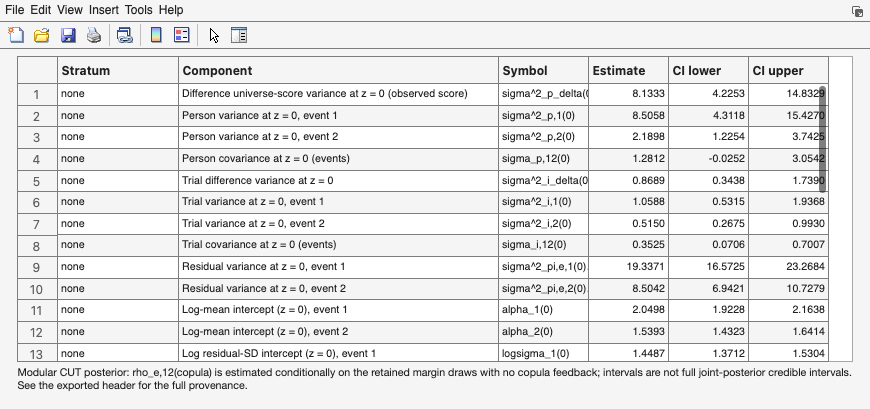
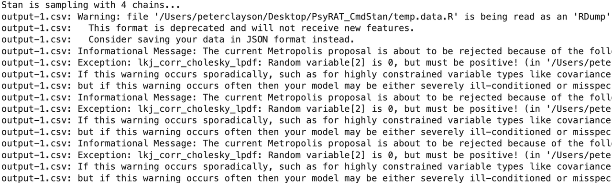

# 15. Advanced designs

Six settings change what PsyRAT estimates rather than how it estimates it. Five
of them live on the Specify Inputs and Specify Processing Preferences screens
described in [Chapter 7](07_processing.md), and one of them is not a screen
control at all. Each section below is a delta from the standard workflow: the
design in plain terms, the controls to set, the output it produces, and how to
read that output.

Read the section you need. None of these designs is a prerequisite for another,
and none is required for a conventional internal-consistency or test-retest
analysis. [Chapter 16](16_analysis-reference.md) records which combinations are
implemented, and the toolbox refuses an unimplemented one before it starts
sampling rather than after.

Two things apply throughout. Every design here estimates more parameters than its
standard counterpart, so it samples more slowly and needs more iterations to
converge; budget for that before you start a run you cannot interrupt. And
several carry a status caveat or a disclosure that is printed in the exported
table headers. Where a design carries one, this chapter says so on the page
rather than leaving you to find it in a file header.

## 15.1 Subject-level error variances

Group-level internal consistency yields a single coefficient for a sample: the
ratio of between-person variance to the precision with which those persons'
scores were measured. That coefficient is a property of the group, and it can
conceal wide differences among the individuals who compose it. A participant who
contributes few artifact-free trials, or unusually variable ones, may hold a
score far less precise than the sample estimate implies (Clayson, Brush, &
Hajcak, 2021).

Subject-level estimation models the residual variance separately for each
participant. Every participant receives their own residual standard deviation,
and their coefficient combines that residual variance, divided by their own
retained trial count, with the between-person variance shared across the sample.
The result is one estimate per participant rather than one estimate per group.
A researcher can then ask which participants were measured precisely enough for
a given purpose, instead of assuming that the sample-level answer describes each
of them.

The estimand follows the same absolute-versus-relative distinction as the
group-level analysis. Selecting Dependability gives each participant an absolute
coefficient, whose error term keeps the trial main effect. Selecting
Generalizability gives a relative coefficient, whose error term excludes it. The
choice is made in the viewer, not at processing time, so one saved run answers
both questions.

| Control (Chapter 7) | Value |
|---|---|
| Estimate subject-specific error variances | Yes |
| Estimate internal consistency of difference scores | No, or Yes: 2-event difference |
| Occasion ID | (none), or an occasion column for the test-retest design |
| Dimension 1 (dynamic) | (none) for the static subject-level design |
| Observation likelihood family | Gaussian, or Gamma for strictly positive scores (Section 15.4) |

An occasion column narrows what is available. With one selected, subject-specific
error variances are supported for the non-difference test-retest design and for
the dynamic designs of Section 15.2. They are not supported for non-dynamic
difference scores in a test-retest workflow, and PsyRAT refuses that combination
when you click Analyze, with a dialog naming difference scores and the
occasion/time facet. Set Estimate subject-specific error variances to No, or
drop the occasion column, if you meet that message.


The x axis is participants ordered by their own coefficient, lowest first, with
the tick labels suppressed because the ordering rather than the identity is the
point. The y axis runs from 0 to 1 and carries whichever coefficient you
selected. The black horizontal line is the group-level estimate computed at the
mean retained trial count. Markers in red are the participants whose credible
interval lies entirely above or entirely below that line, which is the plot's way
of saying that the group number does not describe them (the remaining markers
turn blue when at least one participant is flagged; a fully clean sample draws
in a single default color). A well-behaved sample gives a gently rising band of
markers straddling the line; a long red tail on the left is the result the
analysis exists to find.

Choosing Yes here also relabels the viewer, which is worth knowing before you go
looking for a control that is no longer there. On the View Results Setup screen,
Plot: Trials vs Reliability becomes Plot: Subject-Level Reliability, Plot: ICC
Estimates becomes Plot: Subject-Level ICC Estimates, and Table: Trial Cutoffs at
Reliability Threshold becomes Table: Subject-Level Reliability. The Criterion
Score Outputs button is not offered, because the cut score coefficient is built
from the group-level universe-score mean and has no per-participant form. Table:
Overall Reliability Summary and Table: Sources of Variance are unchanged. On
the difference-score variant the trial-cutoff table itself still opens, and
this screen offers no control over it (the relabeled checkbox governs the
subject-level table instead); [Chapter 9](09_viewing-results.md) describes what
its rows report on that route.

The subject-level table is where participant inclusion is decided. The window
itself shows the group-level summary; the per-participant rows are written by
its Save Subject Coefficients button, one row per participant with the
coefficient, the intraclass correlation, the standard error of measurement,
each with a credible interval, the retained trial count, the error variance,
and a flag marking whether the participant meets the cutoff. The
flag compares the participant's coefficient against the Reliability Cutoff you
entered, using whichever bound the Estimate to use for trial cutoffs preference
names: the lower limit of the credible interval, the point estimate, or the upper
limit. Selecting the lower limit is the conservative choice and the one I use,
because it excludes a participant unless the data support inclusion; the point
estimate is the more common convention in published work. Whichever you pick,
report it, since the three bounds do not select the same people.

Excluding on a reliability criterion changes who remains in the sample, and in a
clinical sample that change can be systematic: a cutoff of .80 applied to
error-related ERP scores excluded patients who made fewer task errors and
reported fewer symptoms, while cutoffs below .80 shrank both between-group and
within-group effect sizes (Heindorf et al., 2025). Those authors recommend
examining the characteristics of the participants a threshold excludes and
justifying the threshold rather than inheriting it. Decide the rule before you
see the coefficients. And remember that a participant's coefficient depends on
their retained trial count, so a low estimate describes that participant's data
in hand rather than the participant.

Sources: Clayson, Brush, and Hajcak (2021) for the subject-level
internal-consistency metric and its use; Rocha et al. (2026), Table 2, for the one-facet coefficient
whose per-participant form this is.

## 15.2 Dynamic (conditional) reliability

Standard generalizability coefficients assume that residual variance is
homoscedastic: one error variance describes every observation, so one coefficient
describes every person and condition. That assumption is testable and often
false. When residual variance depends on some measured quantity, reliability
depends on it too, and a single coefficient averages over a range within which
measurement precision genuinely differs.

Rast and Clayson (in press, p. 7, "we define a condition-specific
generalizability coefficient") address this by giving the residual variance its
own log-linear submodel, so that residual variance becomes a function of
covariates. The coefficient defined on that model is the usual ratio of
universe-score variance to universe-score variance plus residual variance divided
by the number of replications, evaluated at each value of the covariate rather
than once for the sample. Because the covariate enters the residual variance
smoothly, the coefficient becomes a continuous function rather than a set of
isolated numbers. That coefficient appears as an unnumbered display in the source;
the equation numbered (9) beside it is the scale submodel, not the coefficient.

PsyRAT implements this with between-person dimensions. A dimension is a
continuous covariate with one value per participant, such as an age, a
questionnaire total, or a symptom score. Selecting a Dimension 1 column turns on
the analysis, and the output is reliability as a function of that dimension:
where on the dimension scores are measured precisely, and where they are not.

| Control (Chapter 7) | Value |
|---|---|
| Dimension 1 (dynamic) | the covariate column (this selection enables the analysis) |
| Dimension 2 (dynamic) | (none), or a second covariate column |
| Occasion ID | (none) for the one-facet design; an occasion column for the trial-by-occasion design |
| Estimate subject-specific error variances | No for the population surface; Yes to add per-participant estimates |
| Estimate internal consistency of difference scores | No, or Yes: 2-event difference |
| Items per split (n_i) | (none); splits and dynamic reliability cannot be combined |

PsyRAT standardizes each dimension before fitting, and that step determines what
the axis on the resulting plot means. One value per participant is collapsed out
of the column, those values are z-scored across participants using the sample
standard deviation, and the standardized value is written back to every row
belonging to that participant. Standardization happens ONCE, across the whole
sample, before any splitting by group or event. So z = 0 is the overall sample
mean of the dimension, not the mean of whichever group a panel shows, and the
panels of a multi-group figure share one predictor scale and are directly
comparable.

Section 6.4 lists the three conditions that stop the run: a dimension that is not
constant within a participant, a participant with no finite value, and a column
with no between-participant variance. A fourth only warns. In a multi-group run, a
group with no between-participant variation in the dimension, or with fewer than
two participants, has no identified scale slope; PsyRAT says so before the run
starts rather than after the sampler finishes, and draws that group's surface
across a nominal range. Treat such a panel as undefined rather than flat.

The figure below comes from `test_data/manual_ern_dynrel.csv`, which ships with
the toolbox: two groups, the two incongruent-trial events, and one
questionnaire-style score per participant. Like the other tutorial files it is
simulated, and it was generated so that trial-to-trial noise grows with the
score, which is the pattern the figure is there to show.


The x axis is the standardized dimension, so 0 is the sample mean of the
covariate and 1 is one standard deviation above it. The y axis is the selected
coefficient on a fixed 0 to 1 scale, the solid line is the posterior point
estimate across the grid, and the shaded band is the credible interval at the
width you set. A curve that falls as the dimension rises says that participants
higher on the dimension were measured less precisely, which is a measurement
finding in its own right and a confound for any correlation between that
dimension and the ERP score. If you entered a Reference cutoff, it is drawn as a
horizontal dotted line, and the point where the curve crosses it is the value of
the dimension beyond which scores stop meeting your threshold. The axis, the
viewer's Dimensions line, and the variance-component tables label the dimension
`dim1` (and `dim2`): those are the toolbox's names for the Dimension 1 and 2
columns you selected, not your column headers.

With two dimensions the panel becomes a filled contour instead of a curve. The x
axis is the standardized Dimension 1, the y axis is the standardized Dimension 2,
and color is the coefficient, with a reference cutoff drawn as a dashed white
contour. A second dimension adds its own slope AND the interaction of the two, so
the model gains three scale terms rather than two, and the surface can bend rather
than tilt. Add a second dimension when you have a reason to expect the two to
interact. Otherwise two separate one-dimension runs are easier to read and easier
to sample.

Four controls on the Dynamic Reliability: View Results screen shape the figure.
Coefficient switches between Generalizability G(z) and Dependability D(z).
Credible interval (0-1) sets the band width, and Reference cutoff (blank = none)
draws the threshold line. Trials n' (blank = per-group median) sets the
replication count the coefficient is evaluated at; blank uses each stratum's own
median retained trial count, which describes the data in hand, and a number
projects the surface to a design you are contemplating. The grid itself is fixed
at 25 points per axis, spanning the observed range of the dimension within each
stratum.

The Estimand popup chooses between Typical person (delta_p = 0), a participant
with no residual deviation of their own, and Population average (lognormal),
which averages over the person-level residual scale. The two differ whenever
participants vary in residual variance, so say which one you report. The popup is
disabled for the difference-score variants, which compute the typical-person
surface only. A trial-by-occasion run adds two further controls. Reliability
coefficient offers Equivalence (occasion fixed), Stability (trial fixed), or
Equivalence + stability (both random) and defaults to the third. Occasions n'
offers 1 occasion or Observed occasions and defaults to one, which is the
coefficient for a score measured on a single occasion rather than a composite.

Turning on Estimate subject-specific error variances adds a per-participant layer.
Each participant's own conditional coefficient is computed at their own position
on the dimension, scattered over the population surface, and tabulated alongside
it. The surface then serves as a reference against which individuals are read.

Availability, as implemented: dynamic reliability runs on the one-facet design
and, with an Occasion ID column, on the trial-by-occasion two-facet design; for
single scores and for two-event difference scores; at the group level and the
subject level; and for the four-event contrast of Section 15.3 in its
person-specific form only. It cannot be combined with data splits. The gamma
family of Section 15.4 covers a subset of these, and [Chapter 16](16_analysis-reference.md)
gives the cell-by-cell picture.

Sources: Rast and Clayson (in press), pp. 7 to 8, for the condition-specific
generalizability and dependability coefficients and the log-linear scale submodel
they are evaluated on.

## 15.3 Difference-of-differences

An interaction contrast is a difference between two difference scores. A
researcher comparing the congruency effect between two blocks, or an
error-minus-correct difference between two tasks, is asking about the quantity
(ERP_1 - ERP_2) - (ERP_3 - ERP_4), and the psychometric properties of that quantity are
not those of any of its four constituents. Difference scores inherit the error of
both terms while cancelling the shared variance that made each term reliable, and
a difference of differences applies that arithmetic twice.

PsyRAT estimates the four constituent scores jointly and forms the contrast from
their posterior draws, so the reliability of the contrast is computed from a model
of the four events rather than from four separate models. Dependability of the
contrast keeps the between-trial variance of the contrast in the error term;
generalizability excludes that whole block. Because the contrast weights sum to
zero, a trial effect common to all four events cancels out of it, so what
dependability retains is trial variance that differs across the four events.
The two intraclass correlations reported alongside them are single-observation
quantities, computed at one trial rather than at the trial counts you entered.

| Control (Chapter 7) | Value |
|---|---|
| Estimate internal consistency of difference scores | Yes: 4-event DoD |
| Event Type | the column holding the four condition labels |
| Select Events | exactly four events |
| DoD Contrast... | assign ERP_1 through ERP_4 (required) |
| Occasion ID | (none), unless Dimension 1 and subject-specific error variances are both set |
| Estimate residual covariance for co-occurring events | No (a concurrent request is rejected, not ignored) |
| Estimate subject-specific error variances | No, unless Dimension 1 is also set |

The contrast mapping is not optional and has no default that PsyRAT will guess
for you. Click DoD Contrast... on the Specify Inputs screen and assign each of
the four selected events to a slot: ERP_1 (first minuend), ERP_2 (first
subtrahend), ERP_3 (second minuend), and ERP_4 (second subtrahend). Each event
must appear once. Clicking Analyze without a valid mapping stops with a dialog
telling you to configure the contrast first, and changing the event selection
afterward clears the mapping so that a stale assignment cannot survive into a run.
Set the events FIRST, then the mapping.

Coverage requirements differ between the two forms of this design, and the
difference matters when you are deciding whom to drop. The group-level contrast
requires exactly four event types in the data but does not require any individual
participant to have all four, because its D-study divisors are group-level trial
counts. The person-specific dynamic form of Section 15.2 does require every
participant to have trials in all four events, because each participant's own
per-cell counts are that design's divisors and a missing cell leaves their
coefficient undefined. PsyRAT checks that before fitting and names the
participants who fail, which spares you a completed multi-hour run whose results
cannot be viewed.

Viewing a saved DoD run opens the DoD Reliability Setup screen rather than the
usual View Results Setup. Choose the group, set Heatmap metric to Dependability
or Generalizability, confirm the four event assignments, enter a trial count for
each of ERP_1 through ERP_4, set Heatmap trial grid max, and click Generate DoD
Outputs.



The contrast is printed at the top, then the coefficient table for the trial
counts you entered, then two heatmaps. In the left heatmap the x axis is the
trial count for ERP_1 and the y axis the trial count for ERP_2, with ERP_3 and
ERP_4 held at their entered values; the right heatmap does the same for ERP_3 and
ERP_4 with the first pair held fixed. Color is the selected coefficient, clipped
to the 0 to 1 range. Read the captions beneath each panel, which name the counts
held fixed, because the same contrast produces different surfaces at different
fixed counts. What the pair of panels answers is where additional trials would buy
the most reliability: a steep gradient along one axis is an argument for
collecting more of that condition.

Two expectations about output size. The heatmaps evaluate the coefficient at
every point of a square grid running from 0 to Heatmap trial grid max, which
defaults to the largest observed trial count in the selected group plus 25. They
are computed at the posterior MEAN of the variance components rather than over
the draws, which is why they render quickly while the summary table above them,
which does use the draws, does not. Raising the grid maximum raises the cost
quadratically, so a maximum of 400 is four times the work of one at 200. The
exported variance-component table is small by comparison, nine rows per group
covering the contrast variances and the four coefficients, and outputs are
produced one group at a time, so a multi-group dataset means one pass through
Generate DoD Outputs per group.

Three estimand choices in this design are the toolbox's conventions rather than
entries in any published table, and they should be reported as such. First, the
four constituents are treated as measured on distinct trials, so all six pairwise
residual covariances are fixed to exactly zero; the contrast's residual variance
is the weighted sum of the four event residual variances. A concurrent variant
does not exist and a request for one is refused rather than silently ignored.
Second, the off-diagonal entries of the between-trial covariance block are scaled
by the harmonic mean of the two trial counts involved, since the four events
rarely share a trial count. Third, the intraclass correlations are
single-observation quantities and are labeled as such in the table and in the
window; they are not the coefficients at your entered trial counts. Where the
person-specific dynamic form is used, the viewer prints the nonconcurrent
assumption beneath its variance-component table, and the exported header repeats
it, so the assumption travels with the numbers.

Sources: Rocha et al. (2026), Table 6, for the two-event difference-score
coefficients this contrast generalizes; the four-event contrast and its scaling
conventions are the toolbox's, and are derived rather than tabulated there.

## 15.4 The gamma (scaled chi-square) likelihood family

The Gaussian likelihood is the right default for ERP amplitudes, which are
signed, roughly symmetric, and routinely negative. It is the wrong model for
quantities that are strictly positive and right-skewed, where the variance grows
with the mean. Single-trial time-frequency power is the clearest case: a normal
model placed on it puts probability mass below zero and misstates the variance at
both ends of the distribution.

The gamma family, in its scaled chi-square form, models such scores on their own
support with a log link, so that the conditional variance scales with the square
of the mean. Its parameters are estimated on that scale and converted back to the
observed scale for reporting, so the reliability coefficients remain comparable
in meaning to their Gaussian counterparts even though the model underneath is
different.

| Control (Chapter 7) | Value |
|---|---|
| Observation likelihood family | Gamma |
| Gamma scale parameterization | Automatic (recommended) |
| Estimation engine: | Automatic (recommended); gamma runs on CmdStan whatever this says |

Every score in the measurement column must be strictly positive. PsyRAT checks
this before estimation and stops on any value at or below zero, naming the
column. Shift or transform the scores, or switch back to Gaussian, if your data
include zeros or negatives. Do not shift a distribution to clear the check
without a reason to defend, since the amount you add changes the mean-variance
relationship the family is there to represent.

Gamma scale parameterization decides which quantity the dispersion submodel is
built on, and its two named options are different estimands rather than two
views of one fit. Log-nu models RELATIVE dispersion, a constant coefficient of variation, so a
contrast on it blends amplitude with error. Location-scale models the absolute
residual standard deviation directly, which is what you want when the output will
be read as precision, as individual error variance, or against a Gaussian analysis
of the same data. Leave the control on Automatic unless you have a specific reason
not to. Automatic selects location-scale on every design that supports it and
log-nu on the rest, and it is the only setting that does not require you to know
which designs are which. Under the Gaussian family Automatic and Log-nu are
ignored, but Location-scale is rejected and stops the run, so leave it on
Automatic there too.

> CAUTION. The default changed on August 7, 2026. Before that date, gamma runs
> used the log-nu parameterization everywhere. They now default to location-scale
> on every design that supports it. A script or a saved configuration that did not
> name a gamma scale parameterization therefore fits a DIFFERENT estimand today
> than it did before that date, and the two results are not comparable. Runs from
> August 3, 2026 onward stamp the resolved setting into the saved result and into the
> `*_runconfig.json` sidecar, so replaying one of those reproduces its own run.
> A sidecar written before that date carries no gamma scale parameterization at
> all, and replaying it takes the CURRENT default, silently. To reproduce an older
> gamma run, pass `'gammascale', 1` explicitly to `psyrat_run` (see
> [Chapter 14](14_scripting.md)) or select Log-nu (relative dispersion / CV) in the
> GUI. The exceptions are the location-scale-only designs, which reject an
> explicit log-nu request: the subject-level dynamic difference score, the
> subject-level dynamic concurrent difference scores of Section 15.5, and the
> person-specific dynamic difference of differences. Only the static concurrent
> difference designs still default to log-nu and are unaffected.

The provenance block below is the one written into the variance-table export
of a gamma run of the dynamic one-facet design (Section 15.2) on
`test_data/manual_power_concurrent.csv`, a simulated single-trial power dataset
that ships with the toolbox. The lines are as the export wrote them; the CSV
form wraps a line that contains a comma in quotation marks, and those are
omitted here.

```text
Seed: 12345
Analysis: ic_dynrel
Estimation engine: cmdstan
Likelihood family: Gamma / scaled chi-square (observed-score-scale variance components)
Gamma scale parameterization: LOCATION-SCALE (log residual SD). The residual is modeled directly as sigma(z) rather than through the dispersion nu, so the dimension slope b_sigma is a pure residual-SD effect. This is a DIFFERENT ESTIMAND from the log-nu parameterization (gammascale=1); results from the two are not comparable.
Gamma dispersion (person log residual-SD SD, s_sd): median 0.216
Gamma mean-scale correlation (rho_p,sigma): median 0.376 - estimated and reported, but it does NOT enter the observed-scale conversion, because the residual is independent of the mean under this parameterization
Marginal residual correction factor F = exp(2*s_sd^2): median 1.098 (F = 1 is the homogeneous-residual plug-in)
Gamma dynamic reliability (location-scale): every signal component carries exp(2*alpha(z)), but the residual also carries an amplitude-FREE term exp(2*log sigma(z) + 2*s_sd^2) that the signal side has no counterpart for, so BOTH the mean slope (b) and the residual-SD slope (b_sigma) move the conditional coefficient. The mean-slope cancellation that holds under the log-nu parameterization does not hold here; report both slope posteriors.
Priors: PsyRAT defaults
Converged: Yes
Divergent transitions: 0
```

Read the header of any exported table to confirm what actually ran. The seed,
engine, prior line, and convergence verdict appear on every export; the family
line appears for non-Gaussian runs, and a scale line appears when
location-scale was resolved (a run resolved to log-nu carries no scale line,
so consult the sidecar's design block for that case). The header is the record
to quote in a methods section, and what it prints is what the model used, not
what you requested, which is the distinction that matters when Automatic did
the choosing.

One convention of the gamma subject-level designs belongs here, because it
decides what a participant's own coefficient means. A person-specific
coefficient needs a person-specific residual, and under the log link that
residual has two parts: the participant's own conditional variance, which the
model evaluates at their own mean and dispersion effects, and the person-by-trial
term of the mean surface, which the model carries once for the population. PsyRAT
pools the population form of that second term into every participant's residual
rather than rescaling it by the participant's own mean effect (audit item S20,
owner ruling, September 2026). The choice keeps the per-participant residual on
the same footing as the group residual, which carries the same term, at a known
price: the pooled term understates the residual, and so overstates the
coefficient, for a participant whose mean effect lies above the population
value, and does the reverse below it. The export header of a run that pools
records the convention in a line marked POOLED, so it travels with the numbers
(the two-facet subject-level design carries the person-by-trial term as its own
component and pools nothing); report it when you report per-participant gamma
coefficients.

Status: gamma is shipped and supported, on CmdStan only, for a subset of the
designs in this chapter. The native MATLAB engines are family-blind, so the
toolbox pins every gamma run to CmdStan rather than risk fitting a gamma request
as a Gaussian model; a gamma run fails on a machine without CmdStan instead of
falling back. Gamma is permanently unavailable for the split designs, because a
split score is the mean of several items and the scaled chi-square mean-variance
relationship does not hold on a mean. It is also unavailable for some of the
two-facet dynamic difference designs, where the work is simply unfinished.
[Chapter 16](16_analysis-reference.md) lists the combinations, and a request for
one that is not implemented is refused before sampling starts, with a message
naming the design.

Sources: Rast and Clayson (in press) for the location-scale formulation the gamma
scale submodel follows; the observed-scale conversions and the parameterization
defaults are the toolbox's conventions.

## 15.5 Residual coupling for co-occurring events

Two events recorded on the same trials are not independent at the residual level.
Ipsilateral and contralateral measurements from one epoch, or two components
scored from one waveform, share whatever trial-level noise the epoch carried, so
the residual for one is informative about the residual for the other. A difference
score built from such a pair has less error variance than the sum of its parts
implies, because part of the noise cancels in the subtraction.

Fixing that covariance at zero when the events genuinely co-occur therefore biases
the difference-score coefficient downward, while estimating it lets the model use
the cancellation the design provides. The opposite error is available too:
estimating a residual covariance for events measured on separate trials fits a
parameter that should be zero and spends sampling effort on it.

| Control (Chapter 7) | Value |
|---|---|
| Estimate internal consistency of difference scores | Yes: 2-event difference |
| Estimate residual covariance for co-occurring events | Yes |
| Residual correlation: | Population (shared), or Per-subject |
| Estimate subject-specific error variances | No, or Yes |
| Dimension 1 (dynamic) | (none), or a covariate column |

Set Estimate residual covariance for co-occurring events to Yes only when the two
events were scored from the same trials. If you set it to No the within-person
residual covariance is fixed to zero, which is the correct model for events
measured on separate trials and the default. A four-event contrast (Section 15.3)
rejects a request for residual covariance outright rather than ignoring it.

Residual correlation: on the Specify Inputs screen chooses between one residual
correlation shared across participants and a separate residual correlation per
participant. It has an effect on two designs, the one-facet and two-facet
subject-level concurrent dynamic differences, which require four things at
once: difference scores on, subject-specific error variances on, residual
covariance on, and a Dimension 1 column selected (the two-facet form also
requires an Occasion ID column). The popup stays disabled until the first three
of those are set in Specify Processing Preferences, and a Per-subject selection left over from an
earlier configuration is reset to Population for any run that does not qualify,
so the setting cannot leak into a design with no per-participant correlation to
estimate. Population (shared) is the default and the one to use unless each
participant contributes enough paired trials to identify a correlation on their
own.

The window below is from a run of that two-stage design under the gamma family
on `test_data/manual_power_concurrent.csv`, a simulated dataset that ships with
the toolbox: theta-band and alpha-band power scored from the same trials, with
one questionnaire-style score per participant as the dimension.



The variance-component window lists one row per component with its name, its
symbol, a point estimate, and a credible interval. The coupling appears as
Residual correlation (events), symbol rho_e,12, alongside the residual covariance
it implies at the mean of the dimension. The per-subject variant reports the
population-average correlation in that row and adds SD(rho_e,s) for the spread
across participants. A run fitted by the two-stage procedure described below
renames the row Copula residual correlation (events), symbol rho_e,12(copula),
omits the implied-covariance row, and a note sits beneath the table saying what
that means; the exported header carries the full provenance the note points at.
Read the correlation against the residual standard deviations in the same table
rather than on its own, since a
large correlation between two small residuals moves the coefficient very little.
The per-subject variant reports SD(rho_e,s), the between-person spread of the
correlation, rather than a single value.

Two disclosures belong on this page.

> EXPERIMENTAL. Convergence for this design has not been validated in this
> release; exported tables carry an EXPERIMENTAL flag in their headers.

That admonition applies to the concurrent difference designs under the gamma
family when the residual dispersion is modeled per participant. The per-person
dispersion term gives the posterior a geometry the sampler handles poorly. The one
check run against this design did not reach acceptable convergence diagnostics,
and it did not improve when the simulated sample and trial counts were raised.
That is a single fit rather than a proven property of the model, so judge your own
run on its own convergence verdict, its divergent-transition count, and the
per-parameter diagnostics before interpreting anything. Long warmup helps. The
subject-level form has no non-experimental alternative, because a per-participant
coefficient requires a per-participant dispersion term. The group-level forms
default instead to a single shared dispersion parameter, which samples well enough
to be usable but has itself been checked on one simulated dataset at one choice of
sampler settings, with divergent transitions still appearing in the two-facet
check. Neither status carries an on-screen label, which is a reason to export the
tables rather than read numbers off the screen.

The second disclosure concerns how the coupling is estimated for the subject-level
dynamic concurrent designs under the gamma family. Those runs are fitted in two
stages: the first fits the per-event models with no coupling term at all, and the
second estimates the residual correlation conditionally on the draws the first
retained. Nothing from the second stage feeds back into the first. The consequence
is specific. The residual correlation is estimated conditionally on the
retained first-stage draws, so it inherits their uncertainty, but the copula
stage cannot inform the margins in return: the margins' posteriors are those
of an uncoupled fit, and no interval in the table is a full joint-posterior
credible interval. The recorded provenance also notes that the correlation is
known to attenuate at moderate designs, so read its point estimate as
conservative. The viewer prints a short note beneath the variance-component
table and points at the exported header for the full statement. The two-facet member
of the pair has no completed external reference fit behind it, unlike its
one-facet sibling, so treat its results as provisional and check them against a
one-facet run on the same data where that is possible.

Sources: Rocha et al. (2026), Table 6, for the two-event difference-score
coefficients; the residual-coupling parameterizations, the two-stage procedure,
and the status flags are the toolbox's conventions.

## 15.6 Priors, and what they assume about your scale

Bayesian variance-component estimation needs priors, and PsyRAT supplies a set of
weakly informative ones so that a first run needs no decisions about them. Those
defaults for the Gaussian family are weakly informative ON THE MICROVOLT
SCALE. They are not scale-free. The shipped between-person prior is a
half-Cauchy with scale 40, generous for standard deviations of a few
microvolts but informative for a quantity measured in thousands of units, and
informative in the wrong direction for one measured in thousandths. (The gamma
family's priors live on log scales of their own, and the dynamic-reliability
slope priors on the standardized-predictor scale; the microvolt caution
belongs to the Gaussian block.)

The practical rule follows from that. If your scores are ERP amplitudes in
microvolts, the defaults are appropriate and you can leave them alone. If they
are on any other scale (standardized values, time-frequency power, pupil
diameter, or an ERP measure expressed in other units), compare the scale of your
data against the scale the defaults assume before you trust a posterior. The
check is quick: if the between-person standard deviation you expect is more than
roughly an order of magnitude away from a few units, the defaults are doing work
you did not intend.

No screen control sets priors, so the settings for this section are arguments
rather than menu selections.

| Setting | Value |
|---|---|
| GUI control | none; priors are set programmatically |
| `psyrat_default_priors` | returns the documented defaults as a struct |
| `'priors'` name-value | the edited struct, passed to `psyrat_run` or `psyrat_computevarcomp` |

The recipe is three steps. Call `psyrat_default_priors` to get the defaults as a
struct, edit the fields you want to change, and pass the result as the `'priors'`
name-value to `psyrat_run` (or to a direct `psyrat_computevarcomp` call).
Supplied values are merged OVER the defaults, so a partial override is
safe and any family you leave out keeps its default:

```matlab
pr = psyrat_default_priors;      % the documented defaults, as a struct
pr.single.sig_u = 200;           % wider half-Cauchy scale for a larger measure
psyrat_run('file', 'mydata.csv', 'priors', pr, ...
    'savepath', pwd, 'savename', 'wide_priors.psyrat');
```

A run started this way records the merged prior set in its run-config sidecar,
so replaying the sidecar reproduces the same model.

With the defaults untouched, the generated Stan model is byte-identical to the
hard-coded models of earlier releases, so leaving them alone changes nothing
about your results. What is exposed is the population-level scales: the intercepts and means
and the variance-component standard deviations. The structural priors of the
non-centered reparameterization are not exposed, and the Gaussian-family LKJ
correlation priors are fixed (the Gaussian difference model's
residual-correlation location and scale are exposed, and the four-event
difference of differences exposes its correlation-prior shape as
`priors.dod.lkj` alongside its cell-mean, cell-residual, person, and trial
scales, which until this release were fixed inside the model). The gamma family
exposes its two correlation-prior shapes.



Two families of console message appear during estimation, and both are expected.
They print only when Verbose Stan output is set to Yes, which is the default,
so most users will see them. The first is a run of Informational Message lines
mentioning `lkj_corr_cholesky_lpdf` and a random variable that is zero but must
be positive.
Designs that estimate a correlation matrix do so through its Cholesky factor, and
an occasional early-warmup draw pushes a diagonal element of that factor to
underflow; the sampler discards that proposal and continues. Sporadic rejections
confined to early warmup are normal. Rejections that persist throughout sampling
are not, and would point at an ill-conditioned model. The second is a warning that
a `temp.data.R` file is being read as an RDump file and that the format is
deprecated. The bundled interface writes data in that legacy format, CmdStan still
reads it across the supported version range, and the results are identical.
Neither message affects the reported estimates or the convergence diagnostics,
which are computed from the retained post-warmup draws.

One prior change is worth knowing about because it moved published-looking
numbers. The test-retest occasion priors were widened after their earlier
values were found to force the occasion main effect toward zero. Since that
effect enters the ABSOLUTE error term, pinning it near zero removed a real
source of measurement error and inflated the dependability coefficients that
include it, while the generalizability coefficients, which use relative error,
changed very little. The sensitivity analysis, the component-by-component
comparison, and the full list of configurable prior fields are in
[priors_and_sensitivity.md](../priors_and_sensitivity.md).

Report your priors. The exported table header records whether a run used the
PsyRAT defaults or a custom set, and the run-config sidecar carries the full
specification, so the information needed for a methods section is already written
next to your results.

Sources: Rast and Clayson (in press), p. 10, "The priors adopted here are weakly
informative", for weakly informative prior specification in the location-scale
model; the microvolt-scale defaults, the sensitivity analysis, and the merge
behavior are the toolbox's own.
