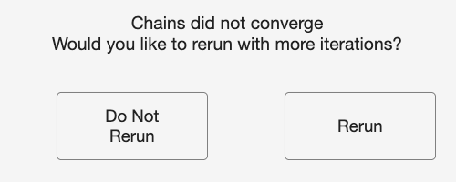

# 18. Troubleshooting and FAQ

Most problems announce themselves in a dialog box or in the MATLAB console, and
most of those messages carry a "How to fix:" line. Section 18.1 lists the
messages by the point in the workflow where they appear. Section 18.2 covers the
situations that produce no message at all, which are the ones that waste the
most time. Section 18.3 deals with convergence, and 18.4 answers the questions
that come up most often.

If a run failed and you want to reproduce the problem for someone else, keep the
`*_runconfig.json` sidecar written next to the output file. It records the seed
and every estimation setting.

## 18.1 Error-message lookup

Find the message by when it appeared. Each entry quotes the message, or the
fragment of it that identifies the case, then says what the toolbox found and
what to change. Where a message contains a name in quotes, the toolbox
substitutes your column, participant, or file name there.

In viewer output, figures, and exported tables, messages that mention trials
say "splits" instead when the run analyzes data splits; the loading and
validation messages below keep the word "trials" regardless.

### While the data file is loading and prepared

The first three rows appear at file selection. The rest fire when the table is
prepared, which happens after you click Analyze and name the output file; in a
batch, a failure there writes a `.txt` error report and moves to the next
measurement.

| Message | What it means | What to do |
|---|---|---|
| WARNING: File type not supported | The file extension is not one MATLAB's `readtable` handles. The accepted extensions are `.txt`, `.dat`, `.csv`, `.xls`, `.xlsx`, `.xlsb`, `.xlsm`, `.xltm`, `.xltx`, and `.ods`. | Re-export the data with one of those extensions. |
| WARNING: File type not successfully loaded | The file has a supported extension, but no delimiter the toolbox tried (comma, space, tab, semicolon, vertical bar) split it into more than one column. | Re-export as comma-separated or tab-separated text, or as a spreadsheet. |
| No data file was selected. | The file picker was cancelled. | Click Process New Data again and choose an input file. |
| Error: Column headers not properly specified / Please specify the headers for | One or more of the roles you assigned points at a header the file does not contain. The message names the roles that failed (Subject ID, Measurement, Group, Event, Occasion, Dimension 1, Dimension 2, Split Weight (n_i)). | Correct the header spelling in the file, or reassign that role on the input screen. |
| Error: The data in the measurement column is not numeric | The column assigned to Measurement holds text. This usually means a measurement column was assigned to the wrong header, or the exported file carries a units string or a placeholder such as `NA` in that column. | Assign a numeric column (ERP amplitudes or latencies) and reload. |
| Error: The Dimension 1 header matches more than one column | Two columns in the file share the header you selected for Dimension 1. The same message exists for Dimension 2 and for Split Weight (n_i). | Give every column in the input file a unique header. |
| Error: The data in the Dimension 1 column is not numeric | A dimension predictor is a continuous between-person covariate and must be numeric. The same check runs on Dimension 2. | Convert the covariate to numeric, or select a different column. |
| Error: The Split Weight (n_i) column must contain positive whole numbers | The items-per-split column holds a zero, a negative value, a fraction, or a non-finite value. | Supply the number of items averaged into each split mean as a positive integer. |
| Error: Specified groups to process do not exist in data | The group selection carried over from an earlier file, or the group column changed. The same message exists for events and for occasions. | Reopen Select Groups (or Select Events, or Select Occasions) and choose from the labels the current file contains. |
| Error: Participants differ in the number of distinct events | The count of distinct event labels is not the same for every participant. The table of ids and counts printed above the error names the participants to check. This compares counts; it does not check that every participant has every event. | Drop the affected participants, or restrict the run to events every participant has. |
| Error: Participants differ in the number of distinct occasion cells | The same check applied to occasions, or to event-by-occasion cells when both facets are present. | Drop the affected participants, or restrict the run to the occasions every participant completed. |
| The '...' column contains missing values | A label column (id, group, event, or time) has a blank, `NaN`, `<missing>`, or `<undefined>` entry. Filling one in is not safe: every missing entry would collapse into a single level and pool observations from different participants, groups, events, or occasions. | Supply a label for every row, or drop the affected rows before loading. |
| has numeric values that convert to the SAME text label | Two distinct numeric label values render as the same text, which would merge two levels into one. MATLAB renders numbers with about five significant digits, so values that differ only past that point become indistinguishable. | Supply the label column as text, rounding or naming the levels the way you want them reported. |

### After clicking Analyze

Most of the checks below run when you click Analyze, before the save dialog
appears (the whitespace check and the DoD single-measurement notice come just
after it), and a failure returns you to the setup screen. The rows drawn from
the Select buttons, the DoD Contrast screen, and the Preferences screen fire
on those screens instead.

| Message (dialog title) | What it means | What to do |
|---|---|---|
| No measurement columns were selected. (Measurement Not Defined) | Nothing is selected for Measurement. | Select one or more numeric data columns for Measurement. |
| The same source column was assigned to multiple PsyRAT inputs: (Unique variable names not provided) | One column is doing two jobs, for example serving as both Event and Occasion. The dialog names the columns involved. | Assign a unique column to each of ID, Group, Event, Occasion, Dimension, and Items per split. |
| Measurement columns must be unique from ID, Group, Event, Occasion, Dimension, and Items-per-split columns. (Measurement column conflict) | A column selected as Measurement is also assigned to a facet or dimension role. | Remove the overlapping column from the Measurement selection. |
| The following selected measurement columns are not numeric: (Measurement data not numeric) | At least one selected measurement column holds text. The dialog names each one. | Select only numeric columns for Measurement. |
| No group column is selected. (Group Column Not Defined) | Select Groups was clicked while Group is set to none. The event twin reads "No event column is selected." (Event Column Not Defined) and the occasion twin "No occasion/time column is selected." (Occasion Column Not Defined). | Assign the column first, then open the selection screen. |
| Dimension 2 was selected without Dimension 1. (Dynamic reliability) | The dynamic-reliability model requires Dimension 1; Dimension 2 is optional and cannot stand alone. | Select a Dimension 1 column, or set both dimension pickers to none. |
| Dynamic reliability supports difference-of-differences (DoD) scores only as the person-specific nonconcurrent design: subject-level reliability must be Yes. (Dynamic reliability) | A four-event difference-of-differences run was requested with dimension predictors but without subject-level error variances. | Set Estimate subject-specific error variances to Yes, switch to a two-event difference score, or clear the Dimension columns. |
| Reliability with data splits cannot be combined with dynamic reliability. (Reliability with splits) | An items-per-split column and a Dimension 1 column were both selected. | Clear the Dimension columns, or set Items per split (n_i) to none. |
| Reliability with data splits does not support difference scores. (Reliability with splits) | Difference-score estimation is on for a splits run. | Set difference scores to No, or set Items per split (n_i) to none. |
| Reliability with data splits does not support subject-level error variances. (Reliability with splits) | Subject-level error variances are on for a splits run. | Set Estimate subject-specific error variances to No, or set Items per split (n_i) to none. |
| Single-subject error variance estimation is not supported for DIFFERENCE scores when an occasion/time facet is present (Single-subject error variance not supported for retest) | Subject-level error variances were requested for a difference score in a test-retest design, without dimension predictors. | Turn off subject-level error variances, remove the Occasion column, or turn off difference scores. Non-difference subject-level test-retest runs are supported and are not blocked here. |
| This difference-score configuration is not supported when an occasion/time facet is present (test-retest workflow). (Difference score reliability is not supported for retest) | A difference-of-differences contrast was requested alongside an Occasion column in a non-dynamic run. Two-event difference scores with an Occasion column are supported. | Use a two-event difference score, turn off difference-score estimation, or remove the Occasion column and run the single-session DoD mode. |
| Difference-score reliability requires an event/condition column. (Event column not specified) | Difference scores need two conditions to subtract, and no Event column is assigned. The DoD Contrast... button raises the same title with the body "DoD contrast setup requires an event column." | Assign the column that stores event labels. |
| DoD contrast setup requires exactly 4 selected events; current selection has N. (Need exactly 4 selected events) | The DoD Contrast... button was clicked with fewer or more than four events selected. | Click Select Events and choose exactly four, then configure the contrast. |
| Difference-score reliability requires exactly two event types. (Only 1 event / Only 2 events for difference score) | Fewer or more than two event types are selected. | Click Select Events and choose exactly two. |
| Difference-of-differences reliability requires exactly four event types. (Need 4 events for difference-of-differences / Need exactly 4 events for difference-of-differences) | Fewer or more than four event types are selected for a four-event contrast; the first title covers too few, the second too many. | Click Select Events and choose exactly four. |
| Residual covariance is not available for difference-of-differences. (Residual covariance not supported for DoD) | The four-event contrast is estimated with the within-person residual covariance defined to be zero, in every likelihood family. | In Preferences, set Estimate residual covariance for co-occurring events to No. Co-occurring events are supported for the two-event difference score, so you can instead switch to the two-event mode. |
| Difference-of-differences reliability requires an explicit contrast mapping. (Configure DoD contrast before Analyze) | The four selected events have not been assigned to the ERP_1 through ERP_4 slots, or the event column changed after they were. | Click DoD Contrast... and assign each slot before clicking Analyze. |
| ERP_1 to ERP_4 must map to four unique events. (DoD mapping requires unique events) | Two slots point at the same event label. | Set each ERP slot to a different event. |
| The event selection or event column changed, so the configured difference-of-differences contrast was cleared. (DoD contrast cleared) | This is a warning, not a failure. Changing the events invalidates a saved slot mapping. | Reconfigure the contrast with the DoD Contrast button before running. |
| Number of chains is invalid. (Invalid Number of Chains) | The Number of Chains field on the Preferences screen holds a value below 3 or text that does not parse as a real number; this and the five rows below fire when you click Save on that screen. | Set it to an integer of 3 or higher. The default is 4. |
| Warmup iterations are invalid. (Invalid Warmup Iterations) | Warmup iterations must be a whole number of 0 or higher. | Correct the field. |
| Sampling iterations are invalid. (Invalid Sampling Iterations) | Sampling iterations must be a whole number greater than 0. | Correct the field. |
| Random seed is invalid. (Invalid Random Seed) | The seed must be a whole number of 0 or higher. | Correct the field. The default is 12345. |
| Adapt delta is invalid. (Invalid Adapt Delta) | Adapt delta was supplied but is not strictly between 0 and 1. | Leave the field blank to use the model's default (a per-model tuned value, or CmdStan's 0.80 for the plain one-facet designs), or enter something like 0.95. |
| Max tree depth is invalid. (Invalid Max Tree Depth) | Max tree depth was supplied but is not a positive whole number. | Leave the field blank to use CmdStan's default of 10, or enter a positive integer such as 12. |
| Test-retest workflows usually require at least 10,000 iterations. (Recommended Iteration Increase) | This is advice, not a rejection. It appears when the Preferences screen opens with an Occasion column assigned and the total iteration count below 10,000. | Raise warmup and sampling in Preferences, or proceed and watch the convergence report. |
| Output file location was not selected. (File Error) | The save dialog was cancelled. | Choose a filename and folder. |
| The selected filename/path contains whitespace. (Whitespace detected) | CmdStan does not accept spaces in filenames or paths. | Choose a filename and folder with no spaces. The dialog reopens so you can pick again. |
| Difference-of-differences mode currently processes one measurement at a time. (DoD mode: single measurement only) | This is a warning that must be acknowledged before the run begins. More than one measurement column was selected, and only the first will be analyzed. The dialog names it. | Dismiss the dialog to continue with the first column, or cancel and select a single measurement. |

### During estimation

These checks run after the data file is loaded and before CmdStan starts. In a
multi-measurement run, a failure here stops that measurement, writes a `.txt`
error report next to the output, and the run continues with the next
measurement.

| Message | What it means | What to do |
|---|---|---|
| The dataset is a table with column headers but no data rows. | The file has headers and nothing else. A headers-only export loads without complaint, so the emptiness surfaces here. | Check that the file was exported with its single-trial rows, then reload. |
| Dataset is missing required column header(s): | The prepared table lacks `id` or `meas`. | Confirm the ID and Measurement assignments on the input screen. |
| Measurement column '...' is not numeric. | The prepared measurement column is not numeric. | Assign a numeric column. |
| Input data include missing cells, which CmdStan cannot process. | At least one cell anywhere in the prepared table is missing. | Remove or impute the affected rows so every row has id, measurement, and facet values. |
| Column '...' is a logical (true/false) array, which cannot be used as a label column. | A label column (id, group, event, or time) was supplied as a MATLAB logical array. Left alone, its downstream behavior depends on the analysis, so the type is rejected outright. | Convert the column to numeric codes, a categorical, or text labels, then rerun. |
| Measurement column '...' contains non-positive values, which the Gamma / scaled-chi-square family does not support. | The Gamma family has strictly positive support. ERP amplitudes are routinely negative, which is why the default Gaussian family is unaffected. | Use the Gamma family only with strictly positive scores such as single-trial time-frequency power, or switch back to Gaussian. |
| Output filename contains whitespace / Output save path contains whitespace / Output save path does not exist | The save location fails the CmdStan filename rules, or the folder was removed between selection and the run. | Choose a space-free filename and an existing folder. |
| Reliability with data splits requires an items-per-split (n_i) column, but none was found. | A splits analysis was requested without the weight column. Both the parallel and the nonparallel model need it. | Select the split-weight column on the input screen. |
| Nonparallel splits were requested, but every split has the same items-per-split (n_i) count. | The nonparallel model identifies the per-item residual and the person-by-split interaction only through differences in the 1/n_i precision weights. Equal counts leave them confounded. | Supply splits with unequal n_i, or declare the splits parallel. |
| Items-per-split (n_i) variation is low (coefficient of variation ...) | A warning. The run proceeds. Below a coefficient of variation of 0.25 the per-item residual and the person-by-split interaction may be weakly identified. | Interpret the nonparallel estimates with caution, or build splits with more variable n_i. |
| Parallel splits were declared, but the items-per-split (n_i) counts are unequal across splits. | A warning. Your declaration is honored. Parallel splits assume equal n_i. | Consider declaring the splits nonparallel so the unequal weights are modeled. |
| Person-specific dynamic difference-of-differences requires every participant to have trials in all four events | Each participant's own per-cell counts are the divisors for this design, so a participant with an empty cell has an undefined coefficient. The message names up to five participants. | Exclude those participants, or choose events every participant completed. |
| Difference-score reliability found N event type(s); exactly 2 are required. | The prepared table, after subsetting, does not carry exactly two event labels. | Restrict the event selection to two. |
| Difference-of-differences reliability found N event type(s); exactly 4 are required. | The prepared table does not carry exactly four event labels. | Restrict the event selection to four. |
| No pairable observations were found for residual covariance estimation. | Residual-covariance estimation needs at least one within-participant paired observation for the two events in each modeled group. | Turn off residual covariance, or supply paired trials. |
| Correlated residual estimation for difference scores requires paired observations. Event counts differ for at least one | The stricter check applied once estimation reshapes events into paired rows: the two events must have equal trial counts within each participant, not merely one pairable trial. | Equalize the per-participant trial counts across the two events, or turn off residual covariance. |
| The dataset has only N participant(s), fewer than the recommended minimum of 20. | A warning. Variance-component estimates, especially interaction terms, are unstable and prior-dominated at small N. With a group column, the count is evaluated per group. | Proceed with added caution about the intervals, or collect more participants. |
| Median trials per cell is X, fewer than the recommended minimum of 10 | A warning. Within-person measurement error is poorly estimated when cells are thin. | Judge whether the trial counts are adequate for the scored component. |
| The observed event x occasion grid is incomplete: | A warning. Some participant-by-event-by-occasion cells contain no observations. Estimation is valid with an incomplete design, but quantities for the empty cells are model-based rather than observed. | Verify the empty cells reflect intended exclusions, such as artifact rejection, rather than a data-preparation error. |
| The dimension column '...' was not found in the data table. | A dynamic-reliability run reached the standardization step without its covariate. | Reassign Dimension 1 on the input screen. |
| Participant '...' has no finite value for dimension '...'. | A dimension predictor is blank or non-finite for that participant. | Supply the covariate for every participant, or drop the participant. |
| Dimension '...' is not constant within participant '...'. | Dimension predictors are between-person covariates and must carry one value per participant, repeated on every row. | Correct the column so each participant has a single value. |
| Dimension '...' has a non-positive between-participant standard deviation | Every participant has the same covariate value, so there is nothing to standardize and no slope to estimate. | Use a covariate that varies across participants. |
| Detected CmdStan X, but PsyRAT requires CmdStan Y or newer. | The generated models use array declaration syntax introduced in Stan 2.26. | Install a newer CmdStan (`psyrat_installdependents` installs the tested version) and restart MATLAB. |
| CmdStan is unavailable (...). Falling back to the native HMC engine | A warning, not a failure. CmdStan could not be found, and a native MATLAB engine implements this design. Native HMC results are Bayesian but are not bit-identical to CmdStan; native fitlme intervals are a frequentist parametric bootstrap rather than credible intervals. | Install CmdStan for the reference path, or accept the approximation and say which engine you used when reporting. |
| No estimation engine can run this analysis (design '...'). | CmdStan is unavailable and no installed native engine implements this design. | Install CmdStan, or install the Statistics and Machine Learning Toolbox for the designs the native engines cover. |
| Warning: N divergent transition(s) detected. | Sampling produced divergences. This never triggers a rerun on its own and never changes the convergence flag, but it signals possible bias even when R-hat looks acceptable. | See Section 18.3. |
| Preflight warning (preflight:fewParticipants): The dataset has only N participant(s), fewer than the recommended minimum of 20. | Non-fatal. Fewer than 20 participants in the dataset, or in one group. The fit proceeds; in the GUI the line also appears in the modal Preflight warnings dialog before the fit. | Expect wide intervals on every between-person component; report the interval, and treat a cutoff from so few participants with caution. |
| Preflight warning (preflight:lowMedianTrials): Median trials per cell is X, fewer than the recommended minimum of 10. | Non-fatal. The median trial count per participant, or per participant-by-event cell, is below 10. | Read the reliability-versus-trials curve and the cutoff before reporting; the design may need more trials than most participants supplied. |
| Preflight warning (preflight:incompleteEventTimeCells): The observed event x occasion grid is incomplete | Non-fatal. Some participant-by-event-by-occasion cells hold no trials ([Chapter 6](06_preparing-data.md), section 6.5); estimates for those cells are model-based. | Verify each empty cell is an intended exclusion and not a data-preparation error. |
| Model did not converge for measurement '...'. | In a multi-measurement run, a non-converged fit stops that measurement rather than prompting. | Raise warmup and sampling and rerun that measurement. |
| No reliability output was generated for measurement '...'. | Estimation returned without a reliability structure. | Review the convergence report and the CmdStan logs for that run. |
| All N selected measurements failed to process. (All Measurements Failed) | Every measurement in a batch failed. The setup screen reopens behind the dialog. | Read the generated `.txt` error reports in the save folder; each names the reason for one measurement. |
| Temporary directory could not be removed. | The run finished and its results were saved. Only the scratch folder CmdStan wrote into could not be deleted, usually because a file in it is still open or locked. | Delete the `psyrat_stan_*` folder inside the save path the message prints. Nothing about the results is affected. |
| Run-config sidecar could not be written: | The results file was saved but the `*_runconfig.json` sidecar was not, usually a permissions problem in the save folder. | Rerun into a writable folder if you want the sidecar. The estimates already saved are unaffected. |

An undefined-function error naming `normcdf` or `gaminv` means the Statistics
and Machine Learning Toolbox is missing. Those functions are used only by the
gamma concurrent-difference designs, and only after sampling has finished, so
the failure arrives at the end of a long run. Install the toolbox before
starting a gamma run with residual covariance turned on.

### While viewing results

| Message (dialog title) | What it means | What to do |
|---|---|---|
| No PsyRAT results file was selected. (File Error) | The file picker was cancelled. | Click View Results again and choose a `.psyrat` file. |
| The estimation model did not converge for at least one measurement. (Estimation diagnostics) | The saved fit failed the convergence criteria and was kept anyway, either because a rerun was declined or because a headless run exhausted its automatic retries. | Treat the coefficients as provisional and rerun with more warmup and sampling. See Section 18.3. |
| Sampling produced N divergent transition(s). (Estimation diagnostics) | The same divergence count reported in the console, repeated here so a viewer-only user sees it. | Rerun with more warmup iterations or stronger priors before reporting the estimates. |
| These results were estimated with the native HMC engine (Native estimation engine) | The fit did not run through CmdStan. The equivalent notice exists for the native fitlme engine. | Record the engine alongside the estimates. Native results are not bit-identical to CmdStan. |
| ERP_1 to ERP_4 must map to four unique events. (DoD mapping requires four unique events) | Two of the four ERP popups on DoD Reliability Setup name the same event. | Set each slot to a different event. |
| Data do not reach reliability threshold after extrapolation / Set a lower reliability threshold (Data do not meet reliability threshold) | No participant retained data meeting the threshold you entered, so there is nothing to summarize and no output is drawn. | Lower the Reliability Cutoff, or accept that this measure does not reach that threshold in this dataset. |
| Trial cutoffs for adequate dependability could not be calculated / Data are too variable or there are not enough trials (Cutoff not calculable) | The projected dependability never reaches the threshold at any trial count the toolbox evaluated. The corresponding cell in the cutoff table shows -1. | Lower the threshold, or report that no cutoff exists at this threshold for these scores. |
| Not enough trials are present in the current data / Cutoffs represent an extrapolation beyond the data (Extrapolation beyond data) | A cutoff was found, but it lies above the largest trial count actually observed. The projection is a model-based extrapolation. | Report the cutoff as an extrapolation, or collect more trials before treating it as an inclusion rule. |
| NOT INTERPRETABLE AS A RELIABILITY: one or more quantities that must be variances came out negative. (Coefficient is not interpretable as a reliability) | A difference-score quantity that must be a variance is negative in part of the posterior. Nothing was clipped; the coefficient shown is the formula evaluated exactly. The dialog lays out the two possible causes; which one applies depends on whether the two conditions were evaluated at equal trial counts, which you know and it does not. | Follow the instruction in the dialog. If the two conditions were evaluated at different trial counts, re-evaluate at equal counts. If they were already equal, treat the estimated components themselves as suspect. |

A trial cutoff printed as -1 is not a count. It records that no cutoff could be
found at the reliability threshold you specified.

## 18.2 Operational traps

### MATLAB looks hung after a fit finishes

SYMPTOM: sampling completes, the console goes quiet, and no results window
appears.

The viewer raises a blocking dialog before it builds anything; it is not
modal (it does not stay in front of other windows), which is exactly why other
windows can cover it. When the fit failed
its convergence criteria or produced divergent transitions, that dialog is
titled Estimation diagnostics; when the fit used a native engine, it is titled
Native estimation engine. Execution waits until the dialog is dismissed. The
dialog can end up behind the MATLAB desktop or on another display, which leaves
nothing visible to click.

Bring every MATLAB window forward and look for the dialog, then dismiss it. The
viewer opens immediately afterward.

### MATLAB reports Busy while the processor is idle

SYMPTOM: the status bar says Busy, but the machine is doing no work.

This is the same cause as above, seen from a different angle. Several points in
the workflow block until a dialog is dismissed: the two viewer notices, the
Rerun prompt raised when chains fail to converge, and the acknowledgment that a
difference-of-differences run will process only the first selected measurement.
A blocked dialog uses no processor time, which is what distinguishes this from a
genuinely slow fit.

Check for a hidden dialog before assuming a run is stuck. A real CmdStan fit
keeps one processor core busy per chain (more with within-chain
parallelization on).

### Ctrl+C does not stop a run

SYMPTOM: interrupting MATLAB returns the prompt, but the machine stays loaded
and the sampler keeps running.

The models are compiled to C++ and run as separate operating-system processes,
one per chain. Interrupting MATLAB stops MATLAB's own execution; it does not
signal those processes.

To stop a run, end the CmdStan processes yourself. On macOS, open Activity
Monitor and quit each process whose name matches the model being fit. On
Windows, do the same in Task Manager. You will find one process per chain, so
expect four of them at the default setting. Delete the leftover
`psyrat_stan_*` temporary folder in your save directory afterward; a run that
is killed never reaches the cleanup step.

### A small dataset sits a long time before sampling starts

SYMPTOM: the console announces the run, then nothing happens for a while, and
only afterward do iteration counts appear.

Every fit writes generated Stan source and compiles it to a native executable
before sampling. Each run writes that model under a new, timestamped name into
the CmdStan artifact folder, so the compile is repeated rather than reused from
a previous run. Compilation cost does not depend on how much data you have
(about 8 s per generated model was measured on the capture machine), so on a
small dataset it is a noticeable share of the run. With
Verbose Stan output enabled the console announces the compile step; with it
disabled the wait is silent.

The artifact folder is named `PsyRAT_CmdStan` and sits on your Desktop, or in
MATLAB's current folder if you have no Desktop folder.

Wait it out, and count the compile into your estimate of how long a run takes.
That folder accumulates one model and one executable per run. It holds build
artifacts, not results, and nothing in the toolbox reads it back after a run
finishes, so you can clear it when it grows.

### Console messages that look like errors and are not

SYMPTOM: with Verbose Stan output enabled, the console fills with exception
text early in sampling.

Two message families are expected and neither reflects a problem with the model
or the reported estimates. The first is a series of informational messages
saying a Metropolis proposal is about to be rejected, naming
`lkj_corr_cholesky_lpdf` and a random variable that is 0 but must be positive.
Designs that estimate a correlation matrix through its Cholesky factor produce
these when an early warmup draw pushes a diagonal element to underflow. The
sampler discards that proposal and continues, and adaptation moves
initialization away from the boundary. Rejections confined to early warmup mean
the sampler is working; rejections that persist throughout sampling would point
to an ill-conditioned model instead.

The second is a warning that a `temp.data.R` file is being read as an RDump
file, and that the format is deprecated. The bundled MatlabStan writes each
model's data in that legacy format. CmdStan still reads it across the supported
version range and returns identical results.

Neither message appears unless Verbose Stan output is selected. The full
discussion is in [priors_and_sensitivity.md](../priors_and_sensitivity.md).

### A .psyrat file is enormous

SYMPTOM: a subject-level, dynamic-reliability, or difference-of-differences run
writes an output file of hundreds of megabytes or more.

The output file is a MATLAB data file holding the whole analysis state: the raw
input table as read from disk, the prepared analysis table, and the retained
posterior draws for every stored quantity. Designs that report a quantity for
each participant store one draw array per participant, so the file grows with
the number of participants multiplied by the number of retained draws. Doubling
sampling iterations doubles that part of the file.

Nothing inside the file can be removed selectively; it is one saved structure.
For long-term storage, keep the `*_runconfig.json` sidecar and the tables you
exported from the viewer. The sidecar records the seed and every setting, and
`psyrat_run` can replay it, so the fit is reproducible without the file itself
(see [Chapter 14](14_scripting.md)). Keep the `.psyrat` file only while you
still want to reopen the viewer.

### Replaying a gamma run configuration saved before August 3, 2026

SYMPTOM: replaying an old gamma-family configuration produces different variance
components from the run it came from.

Two dates matter. On August 7, 2026 the default scale parameterization for the
Gamma family changed from log-nu to location-scale on every design that
supports location-scale. Sidecars written from August 3, 2026 onward record
the resolved value, so replaying one of those reproduces its own run. A sidecar written before that
date carries no value at all and replays under the current default, which for a
movable design is now the other estimand. The two are not comparable.

Pass `'gammascale', 1` explicitly when replaying a configuration older than
that date. The exceptions are the five location-scale-only designs (analyses
13, 19, 20, 28, and 29), which reject an explicit 1. Gaussian runs, which is to
say almost all ERP amplitude work, are unaffected.
The option reference in `help psyrat_run` lists which designs accept which
parameterization.

### The startup release check reports a problem

SYMPTOM: `psyrat_start` prints a warning about GitHub releases before the home
screen opens.

The startup banner checks the installed version against the published releases.
Several outcomes produce a warning rather than a failure. A message saying the
installed version is newer than the latest stable release means you are running
a beta or development build. A message saying no official stable releases were
found and only prerelease (beta) versions have been published is the expected
state while the project is in beta, and means the check worked. A message that
the releases interface returned 404 means the check could not reach release
metadata. A message that the check could not be completed at all names a
network or firewall problem.

None of these prevents an analysis from running or changes any result. The
toolbox loads and the home screen opens as usual. Installation problems announce
themselves differently, through the dependency messages printed above the
version banner (see [Chapter 3](03_installation.md)).

## 18.3 Convergence clinic

Every fit is checked before its results are kept, and the check is automatic. It
reads two diagnostics for every monitored parameter. The first is R-hat, the
potential scale reduction factor, which compares variation between chains with
variation within them; a fit fails when any parameter's R-hat is 1.1 or higher.
The second is the effective sample size, which counts how many independent draws
the correlated chain is worth; a fit fails when any parameter's effective sample
size falls below ten times the number of chains, which is 40 at the default of
four chains. A fit passes only when every parameter clears both.

Divergent transitions are counted and reported separately. They never change the
pass or fail decision and never trigger a rerun. A divergence means the sampler
could not follow the posterior geometry accurately at that point, so a nonzero
count signals that variance components and coefficients may be biased even
though R-hat looks acceptable. Treat a run with divergences as one to repeat
with more warmup or stronger priors before its numbers are reported.

When the check fails in an interactive run, a dialog appears reading "Chains did
not converge" and asking whether to rerun with more iterations.

Clicking Rerun doubles the warmup count and doubles the sampling count, then
fits the model again from the start with the same seed and data. If the doubled
total still falls below 1,000 iterations, the toolbox uses 500 warmup and 500
sampling instead. The loop repeats for as long as you keep choosing Rerun.
Clicking Do Not Rerun keeps the fit as it stands; the file is saved, and the
viewer raises the Estimation diagnostics notice every time it is opened. Closing
the dialog with the window's close box counts as Do Not Rerun.

Doubling is convenient rather than efficient. If a design is failing repeatedly,
step out of the loop and work through the following in order.

Raise the iteration counts outright first, in Preferences, rather than doubling
from a low starting point. The defaults are 5,000 warmup and 5,000 sampling. For
test-retest designs I would not start below 10,000 total, and the toolbox says
so when Preferences opens with an Occasion column assigned and fewer than
10,000 total iterations set. Use as many iterations as the model needs to
converge.

If more iterations alone do not settle it, and especially if divergences are
present, raise Adapt delta next. Leaving the field blank keeps each model's
tuned value; a value such as 0.95 or 0.99 makes the sampler take smaller steps
and accept fewer divergences, at the cost of a slower run. Raise Max tree depth
only after that, and only if the console reports that the maximum tree depth was
exceeded. The default is 10; 12 is a reasonable next value. Raising it when the
problem is not tree depth buys nothing but run time.

If the sampler still struggles, reconsider the priors. The defaults are weakly
informative on the ERP microvolt scale and are not scale-free, so scores on a
different scale can make them either informative or far too loose, and either
can produce a hard posterior geometry. [Chapter 15](15_advanced-designs.md)
covers how to set them.

If none of that helps, reconsider the design. A model that will not converge is
often estimating components the data cannot identify: an occasion variance from
two occasions, an interaction from thin cells, or a nonparallel splits model
from near-equal split sizes. The preflight warnings about participant counts,
median trials per cell, and low items-per-split variation are pointing at
exactly this. [Chapter 5](05_choosing-an-analysis.md) covers which designs a
given dataset can support.

### My numbers differ slightly from the manual's

The reference values printed in the tutorials came from real runs on one
machine, at the settings each tutorial states, using the datasets shipped in
`test_data/`. Estimation is bit-reproducible for a fixed seed on a fixed
platform and CmdStan version when within-chain parallelization is off (the
default). With it on, the threaded models use Stan's `reduce_sum`, whose work
partitioning the scheduler chooses at run time, so two runs at the same seed
can differ in the trailing digits even on one machine; the export header and
the sidecar record the thread count so that setting is visible. Across
platforms or CmdStan versions the draws are not reproducible either:
floating-point arithmetic and compiler behavior differ enough between builds to
move the trailing decimals of a posterior summary.

Agreement within about .02 of a printed point estimate is expected and is not a
sign that anything is wrong. A larger gap is worth checking before you conclude
there is a problem. Start with the settings: the seed should be 12345, and the
chain, warmup, and sampling counts should match what the tutorial specifies.
Then confirm the run went through CmdStan rather than a native engine, because a
native fit is a different estimator whose intervals are not credible intervals.
Last, confirm the shipped dataset was loaded unmodified, with the same
measurement column and the same event subset. If the settings and the data check
out and the gap persists, report it (see Section 18.4).

## 18.4 Frequently asked questions

### Why are dependability and generalizability different for the same data?

They answer different questions and use different error terms. Dependability is
the absolute-error coefficient: it asks how well a participant's observed score
estimates that participant's universe score on the measurement scale, so the
error term includes the trial main effect divided by the number of trials.
Generalizability is the relative-error coefficient: it asks how well the ordering
of participants is reproduced, so the trial main effect drops out because it
shifts everyone equally. Dependability is therefore the smaller of the two
whenever the trial main effect is nonzero. Report the one that matches the
decision you are making, and name it.

### Why can a variance component not come out negative?

Every variance component in the estimation model is parameterized as a standard
deviation constrained to be non-negative, and the toolbox squares it. A negative
component of the kind familiar from method-of-moments ANOVA cannot occur. What
can go negative is a derived quantity in a difference-score design, where a
covariance term is subtracted from the variances that form it. The toolbox
reports that value exactly as the formula produces it and raises a notice
explaining what happened, rather than clipping it to zero and handing back a
coefficient that looks ordinary and is not.

### Why is there no progress bar?

Sampling runs in separate CmdStan processes rather than inside MATLAB, and the
toolbox does not translate their output into a MATLAB progress indicator. Turn
on Verbose Stan output in Preferences and CmdStan prints its own iteration
counter to the console, which is the closest thing available. The trade is that
verbose output also prints the warmup messages described in Section 18.2.

### Why do trace plots appear only for some analyses?

Trace plots are rendered for the plain one-facet internal-consistency analysis
only. For every other analysis family the toolbox prints a console line saying
plots are not supported or not rendered, and draws nothing.
Convergence is still checked for every analysis, by the criteria in Section
18.3; the plots are a visual supplement to that check, not a substitute for it.

### Can I analyze scores that are not ERP amplitudes?

Yes. The estimators are general and take a numeric score column, so reaction
times, single-trial power values, and questionnaire item scores all fit the
input format. The caution is the priors: the defaults are weakly informative on
the ERP microvolt scale and are not scale-free, so a measure on a much larger or
much smaller scale can end up with priors that are informative in a way you did
not intend. Set priors appropriate to your scale before trusting the output
([Chapter 15](15_advanced-designs.md)).

### Which viewer will open for my file?

The toolbox reads the analysis recorded in the results file and routes to the
viewer for that analysis family, so the choice is not yours to make and does not
depend on what you were doing when you opened the file. One-facet analyses open
the single-session viewer, test-retest analyses the test-retest viewer,
four-event difference-of-differences the DoD viewer, nonparallel splits the
splits viewer, and every dynamic-reliability variant the dynamic-reliability
viewer. [Chapter 9](09_viewing-results.md) describes each one.

### Where is the guidance on citing the toolbox?

In [Chapter 17](17_reporting.md), together with what to report about the
estimation settings and the design. Full references are in
[Appendix B](appendix-b_references.md).

### How do I report a bug?

Open an issue on the project's GitHub issue tracker at
`https://github.com/peclayson/PsyRAT/issues`. Include the version string
printed in the startup banner, which is also written into the header of every
exported table, and attach the `*_runconfig.json` sidecar saved next to the
analysis output. The sidecar records the seed, the estimation settings, and the
design, which together are usually enough to reproduce the problem without your
data. If the failure produced a `.txt` error report in the save folder, include
that too.

### Why does the version say beta?

The label is deliberate. It marks a release whose interfaces and defaults may
still change, and it flags that some designs are documented as experimental.
`CHANGELOG.md` records what the current label covers, including which designs
carry that status. Nothing about the label limits what the toolbox will run.

### Can estimation run without CmdStan?

From a script, for a subset of designs, yes. The GUI, no. `psyrat_start` stops
at its dependency check when CmdStan cannot be located, prints that the
dependencies were not found, and offers the guided installer of
[Chapter 3](03_installation.md), so without CmdStan there is no Specify Inputs
screen, no Estimation engine popup, and no viewer. Two native MATLAB engines
are available through `psyrat_run` ([Chapter 14](14_scripting.md)): Native
fitlme, a frequentist restricted maximum likelihood (REML) fitter for the plain
one-facet, test-retest, and nonparallel splits designs, and Native HMC, a
Hamiltonian Monte Carlo sampler for many of the location-scale and
difference-score designs. Leave the `engine` option at its automatic default
and `psyrat_run` falls back to whichever native engine implements the design
and says so in a console banner; the exported tables from `psyrat_report`
carry the same statement in their header. The results are not equivalent.
Native HMC is Bayesian but not bit-identical to CmdStan, and the fitlme
engine's intervals come from a parametric bootstrap rather than a posterior,
so they are not credible intervals. Both native engines require the Statistics
and Machine Learning Toolbox. [Chapter 5](05_choosing-an-analysis.md) lists
which designs each engine covers. Install CmdStan for the reference path and
for the GUI.

### Why can the save path not contain spaces?

CmdStan does not accept whitespace in filenames or paths, and a run that reaches
it with a space in either fails in a way that is hard to read. The toolbox
checks for whitespace three times rather than letting that happen: at the save
dialog, at the shared preflight before estimation starts, and again in the
estimation setup. Choose a folder with no spaces in any part of its path. The
same restriction applies to the folder holding CmdStan build artifacts; a
whitespace path there is replaced with a temporary folder and a warning.

### What does the weight column mean for a splits analysis?

It is n_i, the number of items or trials averaged into that split's mean score,
and it must be a positive whole number on every row. A splits input has one row
per split rather than one row per trial, so the toolbox has no other way to know
how many observations each score summarizes. The weight enters the model as the
sampling variance of a mean: a split of n_i items carries the per-item residual
variance divided by n_i. For nonparallel splits it does more than that. Variation
in n_i across splits is the only thing that separates the per-item residual from
the person-by-split interaction, which is why equal weights are rejected outright
in that mode and low variation raises a warning. [Chapter 13](13_tutorial-splits.md)
works through a splits analysis end to end.
